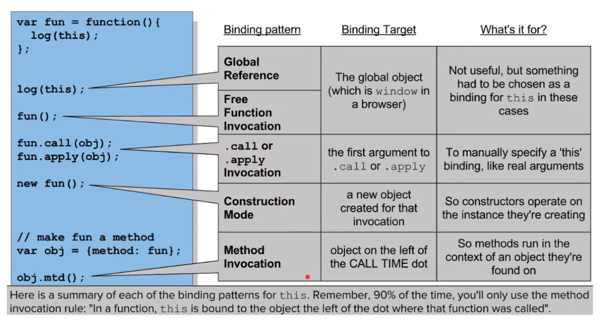

# [CODESTATES im16] this (Pre Course 복습)

**'this' keyword**

- 모든 함수 scope 내에서 자동으로 설정되는 특수한 식별자
- execution context의 구성 요소 중 하나로, 함수가 실행되는 동안 이용할 수 있다.


## - this의 종류

*외워둬야 함*



---

## 1. global this

**: window**

```js
this //=> Window {...}
```


---

## 2. function invocation(호출)

**: window**

```js
function foo() {
    console.log(this);
}
foo() //=> Window {...}
```


---

## 3. method invocation

**: 부모 object**

```js
var obj = {
    fn: function() { console.log(this); }
}
obj.fn() //=> {fn: f}
```

* ```js
  var obj2 = {
      hello: {
          fn: function() { console.log(this); }
      }
  }
  obj.hello.fn() //=> {fn: f}
  //method invocation의 this: 바로 자기 위의 부모만 가져옴
  ```

*3, 4는 사실상 같은 의미*


---

## 4. construction mode(new 연산자로 생성된 function 영역의 this)

**: 새로 생성된 객체**

```js
function Car(brand, name, color) {
    this.brand = brand;
    this.name = name;
    this.color = color;
}
Car.prototype.drive = function() {
    console.log(this.name + '가 운전을 시작합니다');
}
let myCar = new Car('chrysler', '300c', 'black');
myCar.color; //'black'
myCar.drive; //'300c가 운전을 시작합니다'
```


---

## 5. `.call()` or `.apply()` invocation

**: `.call()`, `.apply()`의 첫번째 인자로 명시된 객체**

```js
function identify() {
    return this.name.toUpperCase();
}
function speak() {
    var greeting = "Hello, I'm " + identify.call(this);
    console.log(greeting);
}
var me = { name: "Rami" };
var you = { name: "Reader" };

identify.call( me ); // RAMI
identify.call( you ); // READER
speak.call( me ); // Hello, I'm RAMI
speak.call( you ; // Hello, I'm READER
```


### 1) `.call()`과 `.apply()`의 차이

```js
var add = functrion (x, y) {
    this.val = x, y;
}
var obj = {
    val: 0
};

add.apply(obj, [2, 8]);
console.log(obj.val); // 10
add.call(obj, 2, 8);
console.log(obj.val); // 10
```


### * `.apply()`를 사용하는 이유

```js
var arr = [2, 10, 1, 0, 4];
Math.max(2, 10, 1, 0, 4); // 10
Math.max.apply(null, arr); //10
```

