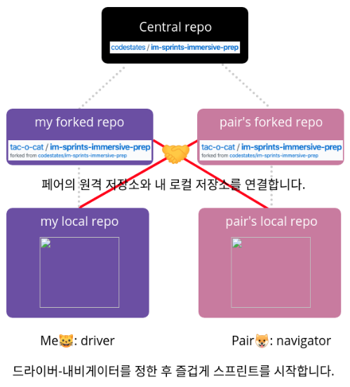
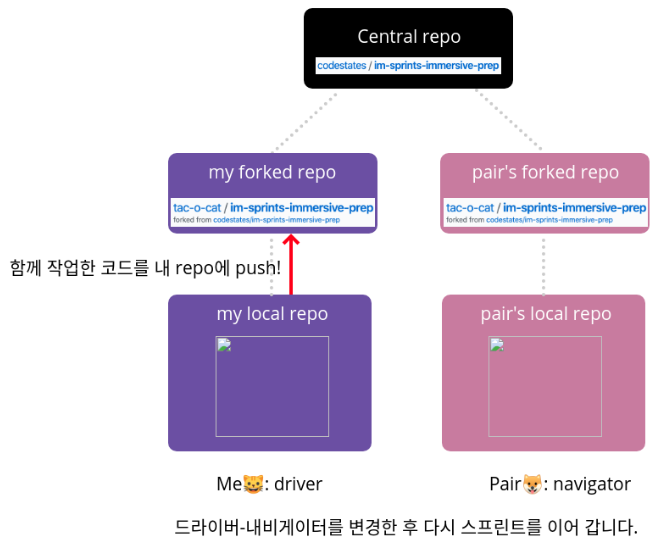
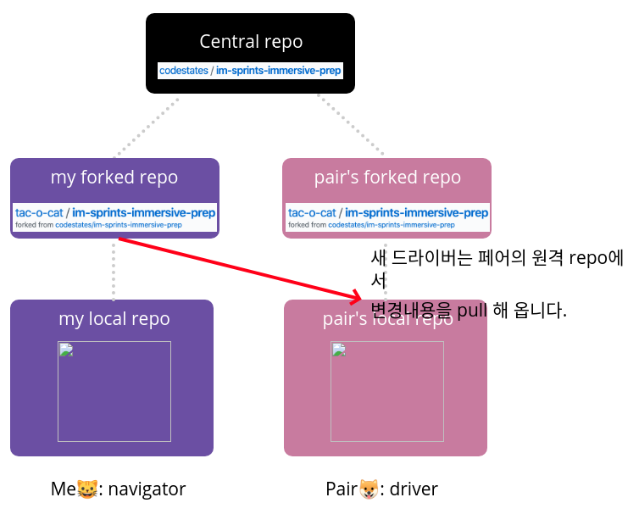
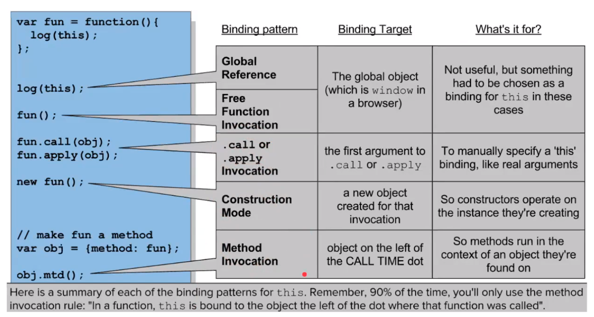

# [CODESTATES im16] 11월 13일 수요일 TIL


## 1. Sprint Office Hour

### 1-1. QnA

**Q. 함수선언부에 있는 변수는 파라미터고 함수호출할때 넣는값을 아규먼트인가요?** 

*A. 네.*

**Q. 크롬의 개발자 도구를 사용하지 않고 간단히 콘솔창을 실행할 수 있는 프로그램?**

*A. runjs*

**Q. 클로저 설명(외부의 context에 접근할 수 있는 함수를 클로저라고 함)에서 변수라고 쓰지 않고 context라고 사용하는 이유?**

*A. context: 변수는 좁은 의미이기 때문에*

- 커링: 함수 하나가 n개의 인자를 받는 대신, n개의 함수를 만들어 각각 인자를 받게 하는 방법. 

- 클로저 단점: 변수가 참조되고 있으면 계속 그 메모리를 유지하게 되어서, 필요하지 않을 때 참조를 끊어줘야 합니다 


---

### 1-2. 깃

#### 1) 깃의 장점

 1. ###### 버전 관리가 편리하다

 2. ###### 백업이 용이하다

 3. ###### 협업하기에 좋다

    * 한 번 보면 좋을 URL: [github에서 설명한 github] https://youtu.be/w3jLJU7DT5E

      

#### 2) 간단한 깃 워크플로우

* 각자 하나의 코드를 포크해오기
  

  
* 페어의 원격 저장소와 내 로컬 저장소 연결
  

  
* 코드를 push

  

* 코드를 pull

  

* 레포지토리의 구조

  

* 더 공부해보기

  * git init

  * branching에 대해 알아보기

  * 자주 쓰이는 git 명령어

    * merge, fetch, stesh ...

    

---

### 1-3. Linting & Testing

##### 1) linter

​	일관적 코딩을 위해.
​	읽기 좋은 코드 = 유지, 보수하기 좋은 코드

##### 2) Tester

​	작성한 코드가 제대로 동작하는지 자동화하여 테스트해주는 툴
​	mocha, jest, ...
​		=> 프로젝트의 의도를 확인할 수 있음

##### 2-1) Jest 사용

* test커맨드 지정

* test명령어 만들기 & 사용하기
  { ...

  "test:recursion": "jest recursion-review",

  "test:watch": "jest --watch",
  ...}

  * ###### "test:recursion": "jest recursion-review"를 사용하는 방법

    1. $npm test recursion
    2. $npm run test:recursion

  * test:watch의 --watch : cli옵션 중 하나.

* toBe : ===
  toEqual : ==

##### 2-2) QnA

**Q. 글로벌에 Jest, 혹은 ESlint가 설치되어 있는지 확인하는 방법**

*A. $npm list -g --depth=0*

**Q. global로 설치한 jest 언인스톨 하는 방법**

*A. $nom uninstall -g jest*


---

### 1-4. Tip

* .eslintrc.js
  * 숨김파일: 터미널에서 ls로 볼 수 없음.
  * ls로 보고싶다면
    * $ls -a

* .eslintrc.json
  * 오류를 무시하는 방법: 마우스 갖다댔을 때 뜨는 부분에서 Quick Fix... 클릭 후 설정하면 됨.

* .gitignore
  * git을 사용할 때 무시할 파일들을 정리해 둠.
* [yarn과 npm의 차이 in 2019] https://www.ryadel.com/en/yarn-vs-npm-pnpm-2019/


---

---

## 2. this (Pre Course 복습)

**'this' keyword**

- 모든 함수 scope 내에서 자동으로 설정되는 특수한 식별자
- execution context의 구성 요소 중 하나로, 함수가 실행되는 동안 이용할 수 있다.


#### - this의 종류

*외워둬야 함*



---

### 2-1. global this

**: window**

```js
this //=> Window {...}
```


---

### 2) function invocation(호출)

**: window**

```js
function foo() {
    console.log(this);
}
foo() //=> Window {...}
```


---

### 2-3. method invocation

**: 부모 object**

```js
var obj = {
    fn: function() { console.log(this); }
}
obj.fn() //=> {fn: f}
```

* ```js
  var obj2 = {
      hello: {
          fn: function() { console.log(this); }
      }
  }
  obj.hello.fn() //=> {fn: f}
  //method invocation의 this: 바로 자기 위의 부모만 가져옴
  ```

*3, 4는 사실상 같은 의미*


---

### 2-4. construction mode(new 연산자로 생성된 function 영역의 this)

**: 새로 생성된 객체**

```js
function Car(brand, name, color) {
    this.brand = brand;
    this.name = name;
    this.color = color;
}
Car.prototype.drive = function() {
    console.log(this.name + '가 운전을 시작합니다');
}
let myCar = new Car('chrysler', '300c', 'black');
myCar.color; //'black'
myCar.drive; //'300c가 운전을 시작합니다'
```


---

### 2-5. `.call()` or `.apply()` invocation

**: `.call()`, `.apply()`의 첫번째 인자로 명시된 객체**

```js
function identify() {
    return this.name.toUpperCase();
}
function speak() {
    var greeting = "Hello, I'm " + identify.call(this);
    console.log(greeting);
}
var me = { name: "Rami" };
var you = { name: "Reader" };

identify.call( me ); // RAMI
identify.call( you ); // READER
speak.call( me ); // Hello, I'm RAMI
speak.call( you ; // Hello, I'm READER
```


#### 1) `.call()`과 `.apply()`의 차이

```js
var add = functrion (x, y) {
    this.val = x, y;
}
var obj = {
    val: 0
};

add.apply(obj, [2, 8]);
console.log(obj.val); // 10
add.call(obj, 2, 8);
console.log(obj.val); // 10
```


#### * `.apply()`를 사용하는 이유

```js
var arr = [2, 10, 1, 0, 4];
Math.max(2, 10, 1, 0, 4); // 10
Math.max.apply(null, arr); //10
```

