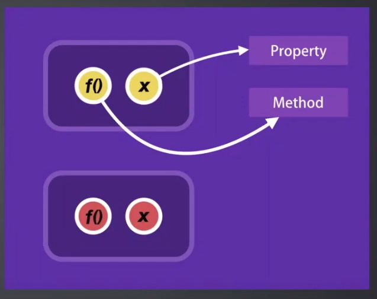

# [CODESTATES im16] JS에서의 OOP

* 자료구조?
  * 데이터를 어떻게 효율적으로 조직, 관리, 저장할 것인지
  * 데이터 값의 모임, 또는 데이터 간의 관계, 데이터에 적용할 수 있는 함수

* 수도 코드(Pseudo Code)?
  * 프로그램을 작성할 때 프로그램이 작동하는 논리를 표현하기 위한 콬드
  * 특정 언어의 문법에 따라 쓰인 것이 아니라, 일반적인 언어로 코드를 흉내 내어 알고리즘을 써놓은 코드

# 1. Procedural Language, Object-Otiented language

## 1-1. 절차지향 언어(Procedural Language)


* 프로그램 안에 있는 것들의 관계를 설정하는 언어.


## 1-2. 객체지향 언어(Object-Otiented Language)



* 프로그램을 유지하는 모든 것이 오브젝트로 이루어지도록 만들어진 언어.
  * 컴퓨터 프로그램을 명령어의 목록으로 보는 시각에서 벗어나 여러 개의 독립된 단위인 객체들의 모임으로 파악하고자 하는 것.
* 유연하고 변경이 용이함.
* 배우기 쉽고, 개발과 보수가 간편하고, 보다 직관적인 코드 분성을 가능하게 함.


### 1) 객체 Object 란?

* 데이터와 기능을 논리적으로 묶어 놓은 것.
* 컨테이너
  * 컨테이너의 내용물은 시간이 지나면서 바뀔 수 있지만, 내용물이 바뀐다고 컨테이너가 바뀌는 건 아님. => 여전히 같은 객체
  * 재사용성이 높음

### 2) OOP?

* 인간이 사물을 이해하는 방식을 반영하도록 설계됨.

* Class를 기반으로 동일한 특성과 기능을 가진 instance 객체를 생성한다.

  * 예

  |                           | 이름   | 데이터(property)                        | 기능(method)                              |
  | ------------------------- | ------ | --------------------------------------- | ----------------------------------------- |
  | **객체<br />(class)**     | 자동차 | 제조사, 모델, 도어 숫자, 차량 번호, ... | 가속, 변속, 문 열기, 헤드라이트 켜기, ... |
  | **객체<br />(instance)**  | 아반떼 | 현대, avante, ...                       | 위와 동일                                 |
  | **객체 <br />(instance)** | 300c   | 크라이슬러, 300c, ...                   | 위와 동일                                 |

  * 인스턴스(instance): 클래스를 기반으로 생성한 객체


---

# 2. OOP Basic Concepts

## 2-1. Encapsulation 캡슐화

* 속성들을 쌓아서 모아두는 것.
* Reduce complexity + increase reusability


## 2-2. Inheritance 상속

* 새로운 클래스가 기존의 클래스의 자료와 연산을 이용할 수 있게 하는 기능.
* 자식 클래스는 부모의 속성을 상속받는다.
* Reduce complexity + isolate impact of change


## 2-3. Abstraction 추상화

* 불필요한 정보는 숨기고 중요한 정보만을 표현함으로써 프로그램을 간단히 만드는 것.
* 추상화: 복잡한 상태이더라도 사용자의 사용은 간편하다.
* Eliminate redundant code


## 2-4. Polymorphism 다형성

* 어떤 한 요소에 여러 개념을 넣어 놓는 것.
  * 일반적으로 [오버라이딩](https://ko.wikipedia.org/w/index.php?title=오버라이딩&action=edit&redlink=1)(같은 이름의 메소드가 여러 클래스에서 다른 기능을 하는 것)이나 [오버로딩](https://ko.wikipedia.org/w/index.php?title=오버로딩&action=edit&redlink=1)(같은 이름의 메소드가 인자의 개수나 자료형에 따라서 다른 기능을 하는 것)을 의미함.
* 여러 형태이다.
* Refactor ugly switch/case statements


---

# 3. JS에서 Object 생성하기

## 3-1. Functional

```js
var Car = function() {
  var someInstance = {};
  someInstance.position = 0;
  someInstance.move = function() {
    this.position += 1;
  }
  return someInstance;
};

var car1 = Car();
var car2 = Car();
car1.move();
console.log(car1); // {position: 1, move: ƒ}
console.log(car2); // {position: 0, move: ƒ}
```


## 3-2.Functional Shared


## 3-3. Prototypal, Preudoclassical

### 1) Prototypal는 {}와 같다.

```js
const obj1 = Object.create(Object.prototype);
const obj2 = {};
```

### 1) Prototypal, Preudoclassical 비교

```js
// Preudoclassical
const Car = function (color) {
    this.color = color;
}

const car1 = new Car('red'); //생성자가 실행됨
const car2 = Object.create(Object.prototype); //생성자가 실행 안됨: Object의 prototype만 가져오는 것.
```

```js
const Car = function (color) {
    this.color = color;
}

Car.prototype = {
    getColor() {
        return this.color;
    }
}

const ToyCar = function() {};

ToyCar.prototype = Object.create(Car.prototype);

const LegoCar = new ToyCar();
```

* object.create로 할 수 있는 것: 생성자의 확장.(상위클래스의 method가 하위클래스에 복사됨)

**더 알아보기: prototype chain**


---

# 4. JS에서의 Prototype


---

# 참고

> 1. CodeStates Immersive Course
> 2. 러닝 자바스크립트 - 이선 브라운 [한빛미디어]
> 3. YOU DON'T KNOW JS(this와 객체 프로토타입, 비동기와 성능) - 카일 심슨 [한빛미디어]
> 4. wikipedia[[객체 지향 프로그래밍]](https://ko.wikipedia.org/wiki/%EA%B0%9D%EC%B2%B4_%EC%A7%80%ED%96%A5_%ED%94%84%EB%A1%9C%EA%B7%B8%EB%9E%98%EB%B0%8D#%EA%B8%B0%EB%B3%B8_%EA%B5%AC%EC%84%B1_%EC%9A%94%EC%86%8C)
> 5. [[Javascript ] 프로토타입 이해하기]([https://medium.com/@bluesh55/javascript-prototype-%EC%9D%B4%ED%95%B4%ED%95%98%EA%B8%B0-f8e67c286b67](https://medium.com/@bluesh55/javascript-prototype-이해하기-f8e67c286b67))