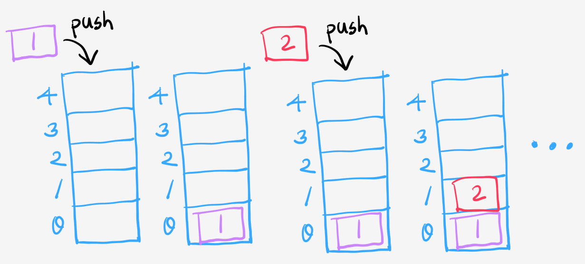
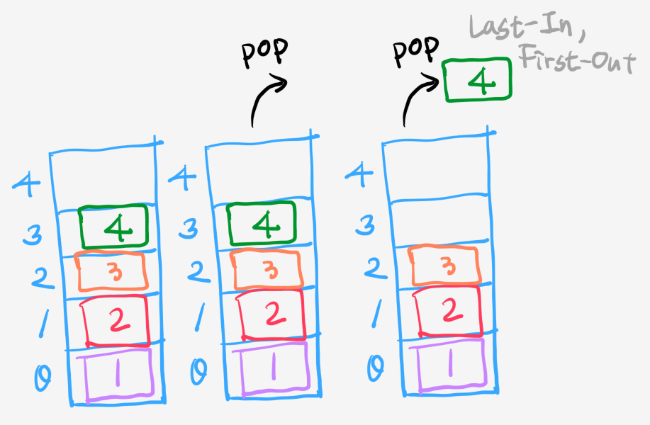
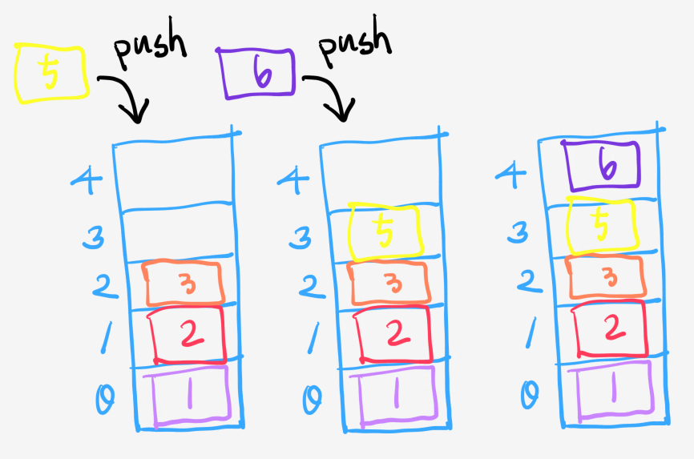
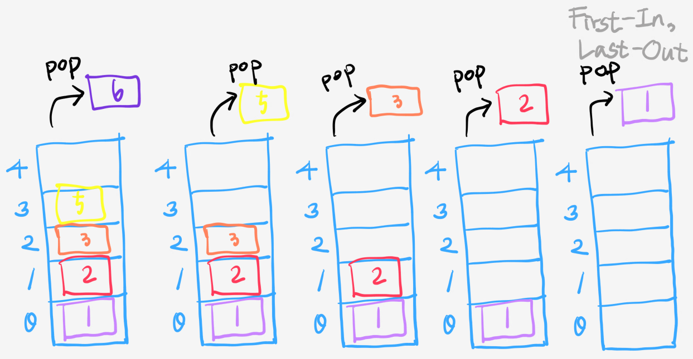
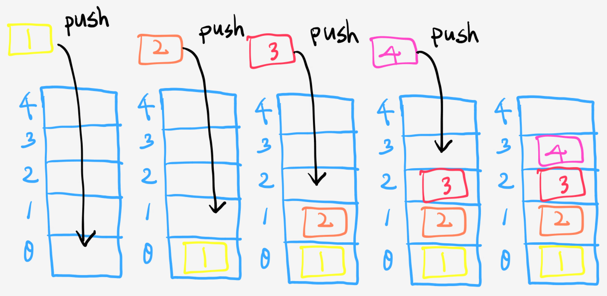
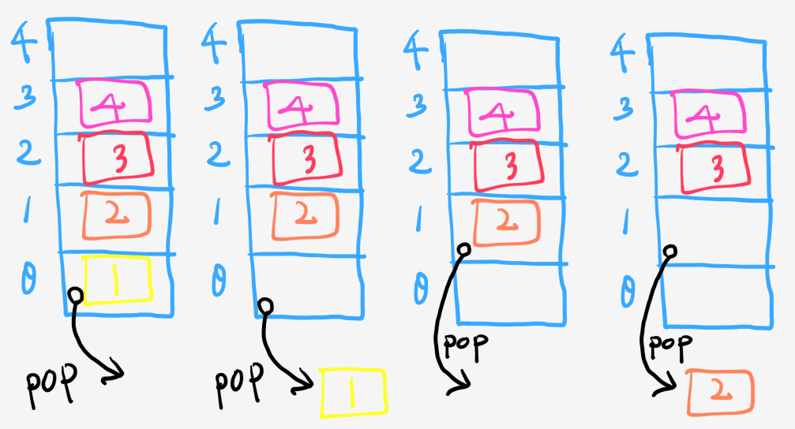
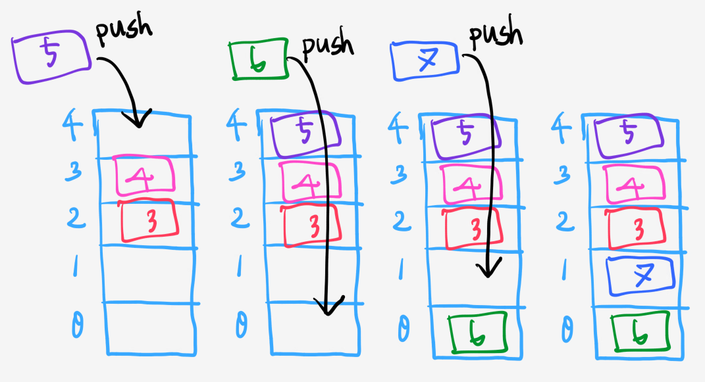
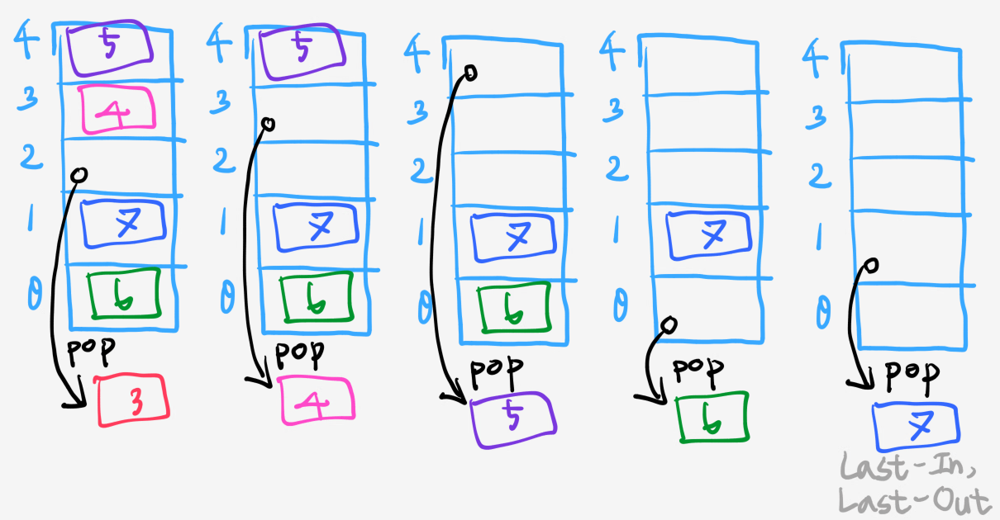

# [CODESTATES im16] Basic Data Structure

# 1. Stack

**상자를 쌓듯이, 먼저 들어간 것이 나중에 나온다. FILO(First-In, Last-Out)**

아래는 stack의 전반적인 진행을 그림으로 표현한 것이다.

---

## 1-1. Property

* `top`: 요소를 삽입/ 삭제하는 위치(index)
* `maxSize`: 저장소의 최대 크기
* `stackArray`: 저장소

## 1-2. Method

* `push()`: 새 요소를 마지막에 추가한다. 반환값 없음.
* `pop()`: 마지막 요소를 삭제한다. 삭제한 요소 출력.
* `empty()`: 저장소가 비어있는지 확인한다. 비어있으면 true, 아니면 false
* `size()`: 저장되어 있는 데이터가 몇 개 인지 반환한다.

---

## 1-2. Pseudo Code

* `top`은 0으로 초기화
* `push()`
  1. `stackArray`를 확인한다.
     1. `stackArray`가 가득 차 있다 > `Overflow`출력 후 method 나가기
     2. `stackArray`가 가득 차 있지 않다 > 다음으로 진행
  2. `top` 의 위치에 해당 요소를 삽입한다.
  3. `top`값을 1 증가시킨다.

* `pop()`
  1. `stackArray`를 확인한다.
     1. `stackArray`가 비어있다 > `Underflow`출력 후 method 나가기
     2. `stackArray`가 비어있지 않다 > 다음으로 진행
  2. `top`의 위치에 있는 요소를 method 내부 변수에 저장하고 삭제한다.
  3. `top`값을 1 감소시킨다
  4. 삭제된 요소(method의 내부 변수에 저장했던 요소)를 반환 후 method를 나간다.
* `empty()`
  1. `stackArray`의 0번째 index부터 `top`까지의 `for`문을 만든다
     1. `stackArray(i)`가 존재하면 `false`를 반환한다.
     2. `for`문을 진행한다
  2. `true`를 반환한다.
* `size()`
  * `empty()`와 유사하게 작성하면 된다.

---

## - 사용 예

* 뒤로가기 버튼
* 콜스택

---

---

----

# 2. Queue

**줄을 섰을 때 먼저 기다린 사람이 먼저 나가는 것과 같은 선입선출 구조. 먼저 들어간 것이 먼저 나온다. FIFO(First-In, First-Out)**

아래는 queue의 전반적인 진행을 그림으로 표현한 것이다.

---

## 2-1. Property

* `front`: 가장 오래된 요소의 index
* `rear`: 새로운 요소가 들어갈 index === 가장 최근 요소 index의 + 1
* `queueArray`: 저장소

## 2-2. Method

* `push()`: 새 요소를 추가한다. 반환값 없음.
* `pop()`: 가장 오래된 요소를 삭제한다. 삭제한 요소 출력.
* `empty()`: 저장소가 비어있는지 확인한다. 비어있으면 true, 아니면 false
* `size()`: 저장되어 있는 데이터가 몇 개 인지 반환한다.

---

## 2-3. Pseudo Code

* `front`와 `rear`는 0으로 초기화.
* `push()`
  1. `queueArray`를 확인한다.
     1. `queueArray`가 가득 차 있다 > `Overflow`출력 후 method 나가기
     2. ``queueArray``가 가득 차 있지 않다 > 다음으로 진행
  2. `rear` 의 위치에 해당 요소를 삽입한다.
  3. `rear`값을 1 증가시킨다.

* `pop()`
  1. `queueArray`를 확인한다.
     1. `queueArray`가 비어있다 > `Underflow`출력 후 method 나가기
     2. `queueArray`가 비어있지 않다 > 다음으로 진행
  2. `front`의 위치에 있는 요소를 method 내부 변수에 저장하고 삭제한다.
  3. `front`값을 1 증가시킨다
  4. 삭제된 요소(method의 내부 변수에 저장했던 요소)를 반환 후 method를 나간다.
* `empty()`
  1. `queueArray`의 0번째 index부터 `queueArray`의 크기까지의 `for`문을 만든다
     1. `queueArray(i)`가 존재하면 `false`를 반환한다.
     2. `for`문을 진행한다
  2. `true`를 반환한다.
* `size()`
  * `empty()`와 유사하게 작성하면 된다.

---

## - 사용 예

* 프린터
* 콘서트 티켓팅 대기열

---

# 참고

> 윤성우의 열혈 자료구조 - 윤성우 [ORANGE MEDIA]