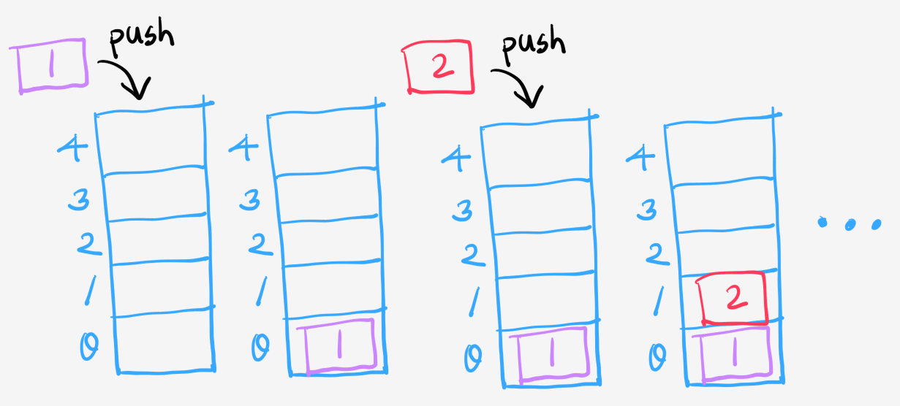
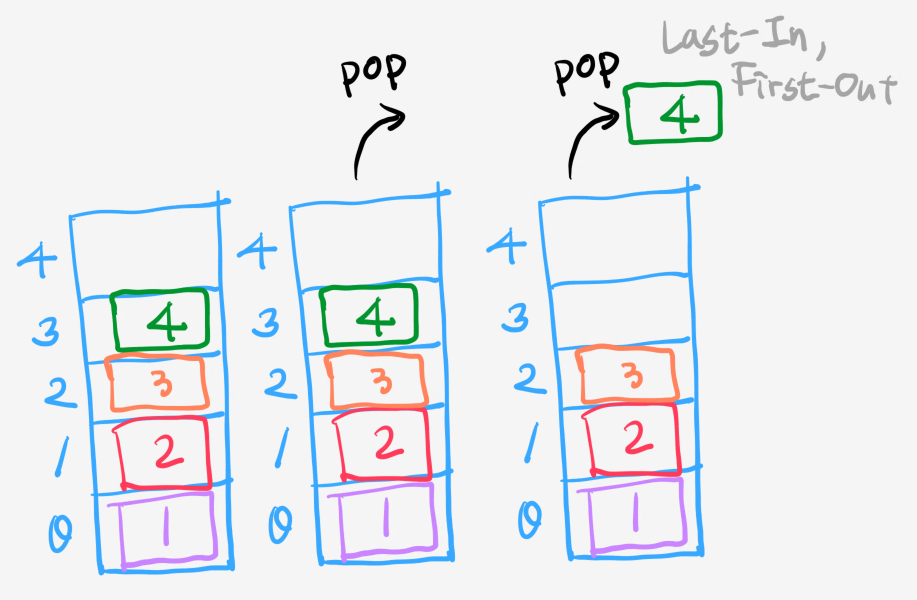
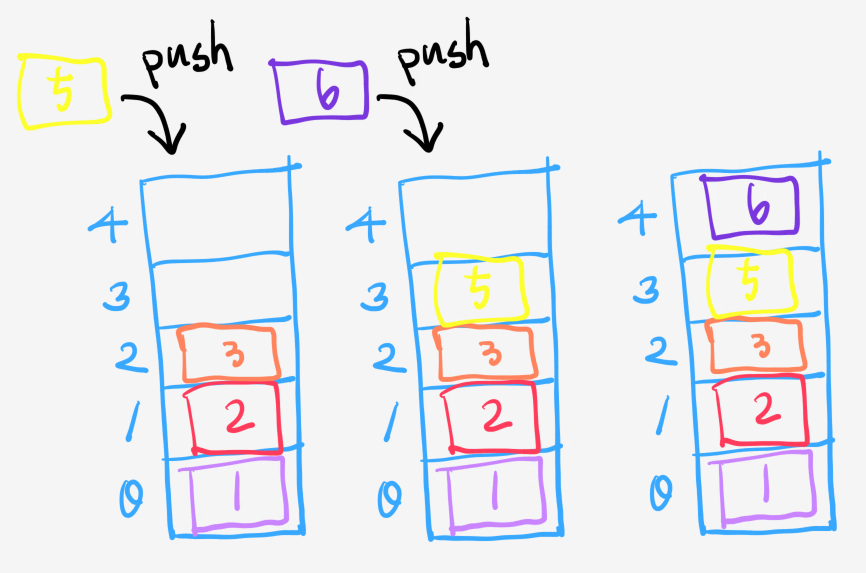
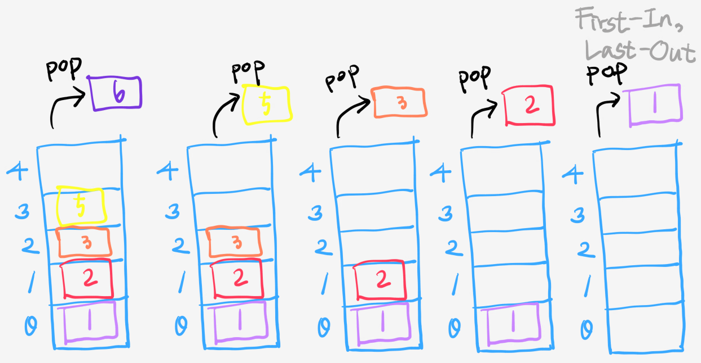
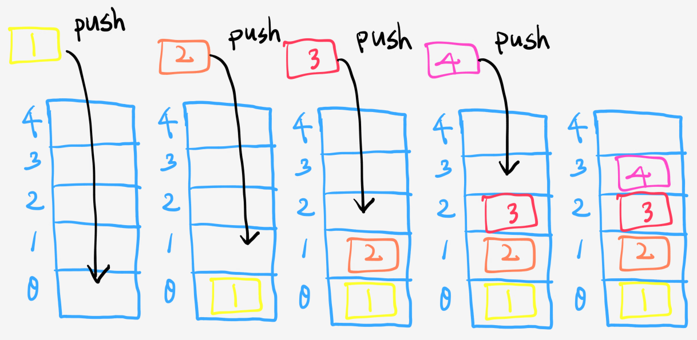
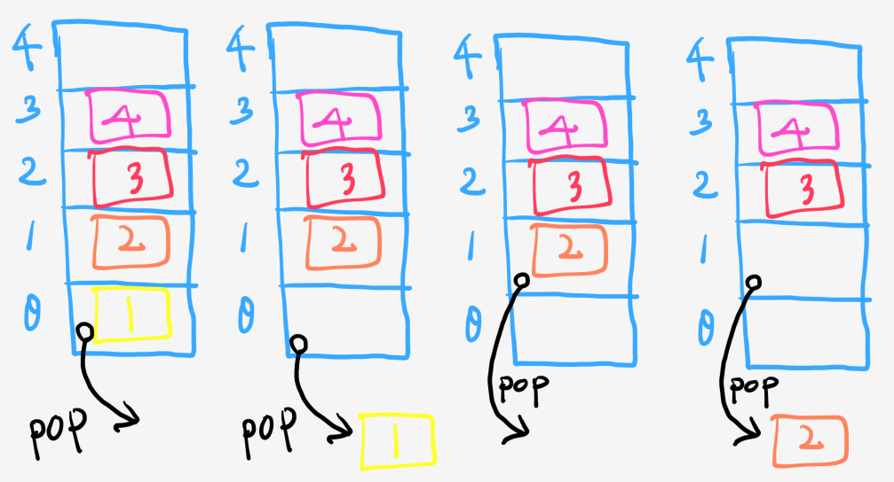
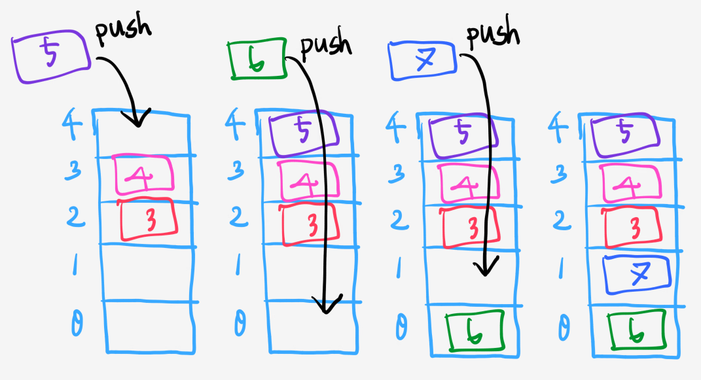
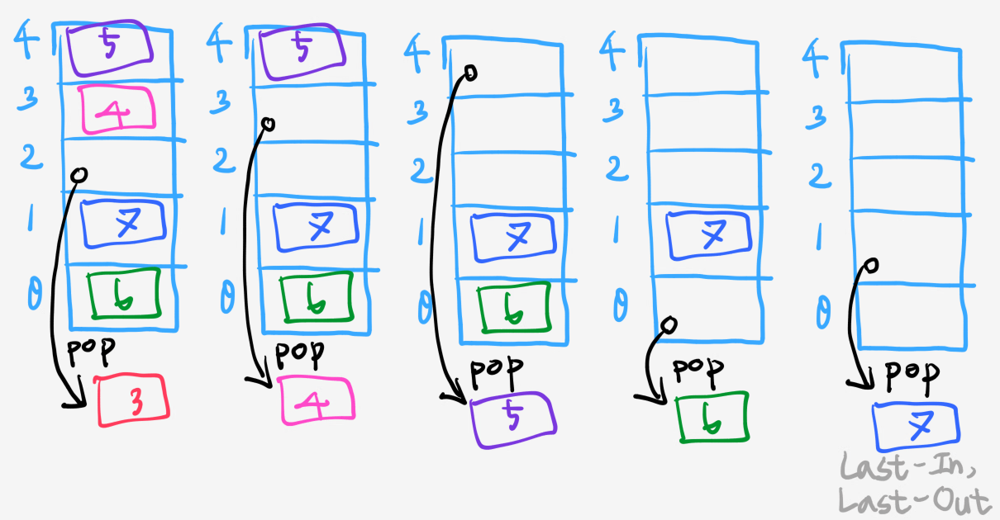

# [CODESTATES im16] Basic Data Structure

# 1. Stack

**상자를 쌓듯이, 먼저 들어간 것이 나중에 나온다. FILO(First-In, Last-Out)**

아래는 stack의 전반적인 진행을 그림으로 표현한 것이다.

---

## 1-1. Property

* 

## 1-2. Method

* `push()`: 새 요소를 마지막에 추가한다. 반환값 없음.
* `pop()`: 마지막 요소를 삭제한다. 반환값 없음.
* `empty()`: 저장소가 비어있는지 확인한다. 비어있으면 true, 아니면 false
* `size()`: 저장되어 있는 데이터가 몇 개 인지 반환한다.
* `top()`: 마지막 요소를 출력한다.

---

## 1-2. Persuedo Code

* `push()`
  1. 

---

## - 사용 예

* 뒤로가기 버튼
* 콜스택

---

---

----

# 2. Queue

**줄을 섰을 때 먼저 기다린 사람이 먼저 나가는 것과 같은 선입선출 구조. 먼저 들어간 것이 먼저 나온다. FIFO(First-In, First-Out)**

아래는 queue의 전반적인 진행을 그림으로 표현한 것이다.

---

## 2-1. Property

## 2-2. Method

---

## 2-3. Presuedo Code

---

## - 사용 예

* 프린터
* 콘서트 티켓팅 대기열

---

# 출처

> 윤성우의 열혈 자료구조 - 윤성우 [ORANGE MEDIA]