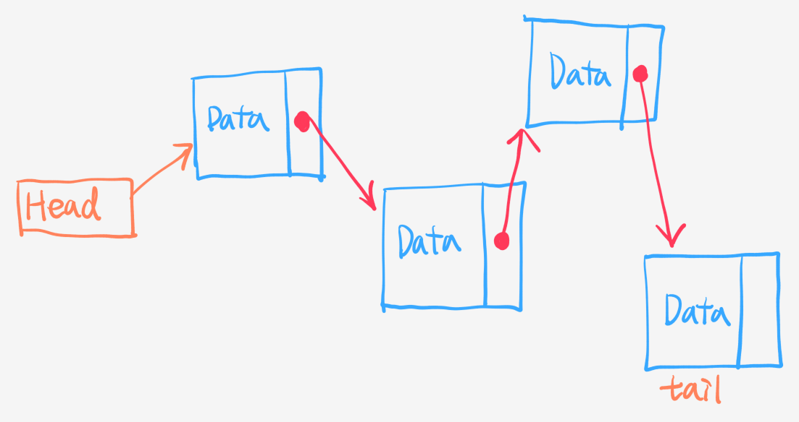
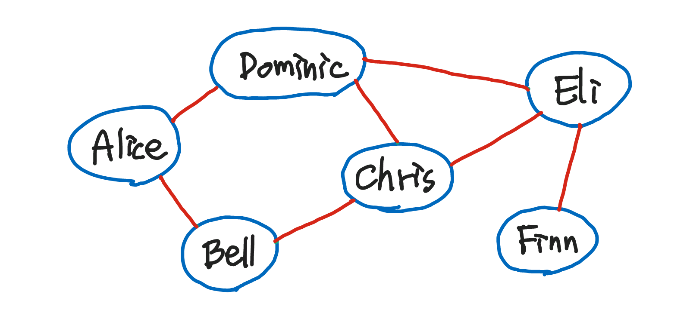
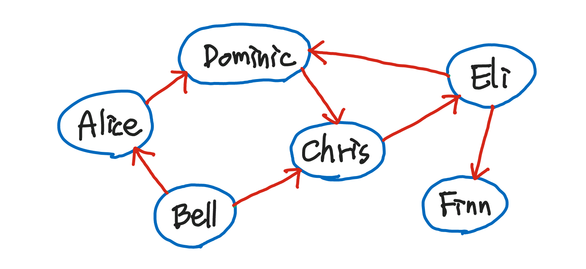
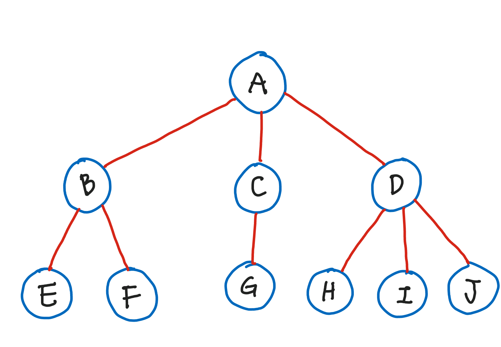
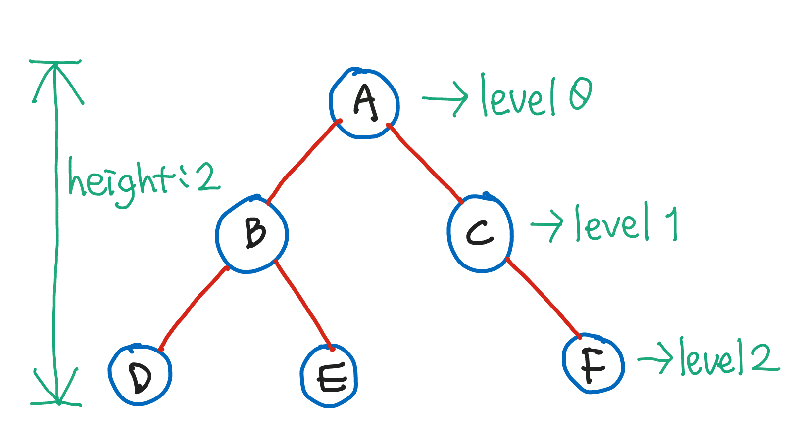

# [CODESTATES im16] Advanced Data Structure

# 1. Linked List

* `node`: 데이터와 다음 링크를 저장하는 변수를 저장하는 `object` 를 뜻함
* `head`: 첫번째 노드를 가리키는 변수
* `tail`: 마지막 노드

* `insert()`: 리스트에 데이터를 저장
  * 원하는 위치에 데이터를 저장할 수 있다.
* `remove()`: 리스트의 데이터를 삭제
  * 원하는 위치에 있는 데이터를 삭제할 수 있다.

## Pseudo Code

---

# 2. Graph

* Alice, Bell, Chris와 같은 사람들(파란 원): **정점(vertex), node**
* 사람들 사이의 연락망(빨간 선): **간선(edge)**

*무방향 그래프: 간선의 방향이 없는 그래프*

* Bell이 Finn에게 연락할 수 있는 방법
  1. Bell - Chris - Dominic - Eli - Finn
  2. Bell - Chris - Eli - Finn
  3. Bell - Alice - Dominic - Eli - Finn
  4. Bell - Alice - Dominic - Chris - Eli - Finn

*방향 그래프: 간선의 방향이 있는 그래프*

* Bell이 Finn에게 연락할 수 있는 방법
  1. Bell - Chris - Eli - Finn
  2. Bell - Alice - Dominic - Chris - Eli - Finn

> **방향그래프가 무방향그래프보다 효율이 더 좋고 구현도 간단하다.**
>
> * 무방향그래프는 방향이 지정되어있지 않기 때문에 edge의 정보를 양방향 모두 저장해줘야 한다.

* `node`: { Alice, Bell, Chris, Dominic, Eli, Finn } 총 6개의 node
* `edge`: { <Alice, Bell>, <Alice, Dominic>, <Bell, Chris>, <Chris, Dominic>, <Chris, Eli>, <Dominic, Eli>, <Eli, Finn> } 총 7개의 edge
* `Graph`: 그래프
* `node`와 관련된 method
  * `addNode()`: 그래프에 노드 추가
  * `contains()`: 그래프의 노드에 전달인자가 존재하는지 확인
  * `removeNode()`: 노드 삭제
* `edge`와 관련된 method
  * `addEdge()`: 그래프에 edge추가
  * `hasEdge()`: 그래프의 노드에 전달인자와 같은 edge가 있는지 확인
  * `removeEdge()`: edge 삭제

## Pseudo Code

---

# 3. Tree

그래프의 종류 중 하나. *node의 수 = edge의 수 + 1* 의 특징을 갖는 그래프이며 가지를 늘려가며 뻗어나기기 때문에 Tree 라는 이름이 붙었다.

---

# 4. Binary Search Tree

---

# 5. Hash Table

---

# 참고

> [[VISUALGO]](https://visualgo.net/ko)
>
> [[Khan Academy: 그래프 설명하기]](https://ko.khanacademy.org/computing/computer-science/algorithms/graph-representation/a/describing-graphs)