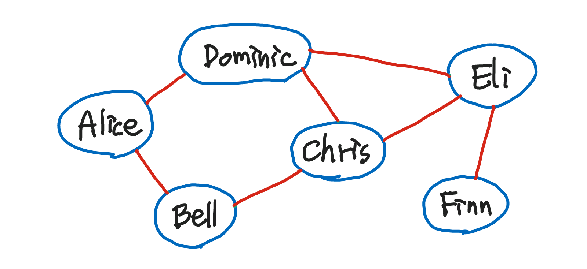
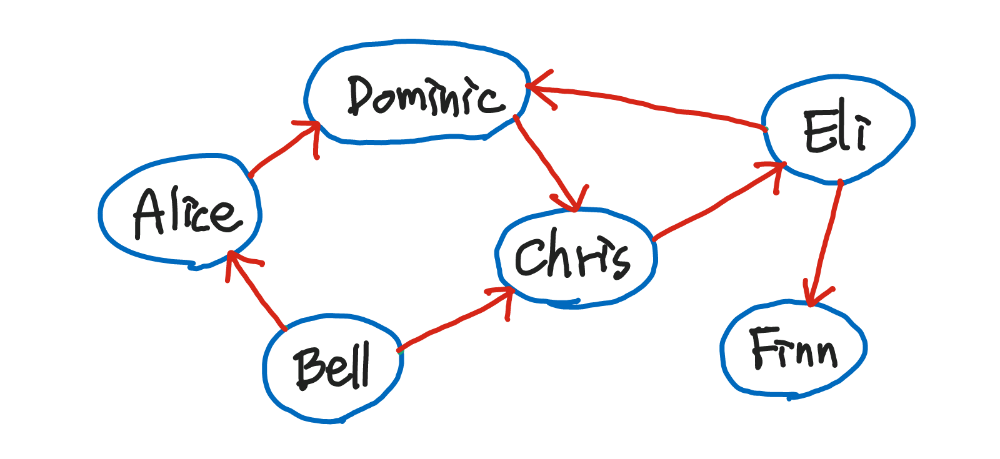
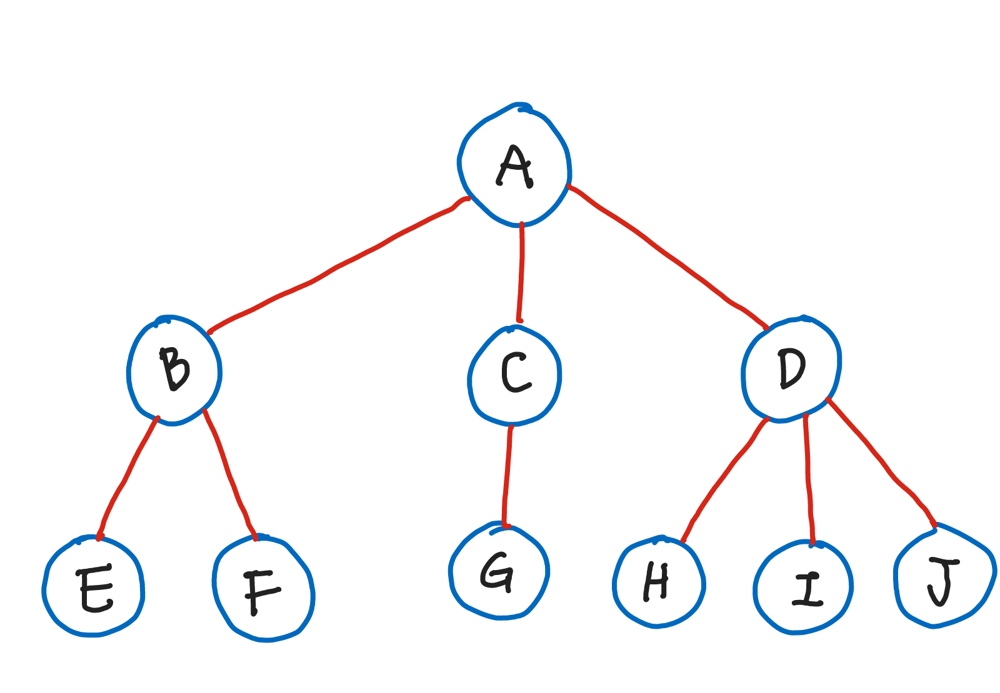

# [CODESTATES im16] Advanced Data Structure

# 1. Linked List

* `node`: 데이터와 다음 링크를 저장하는 변수를 저장하는 `object` 를 뜻함
* `head`: 첫번째 노드를 가리키는 변수
* `tail`: 마지막 노드

* `insert()`: 리스트에 데이터를 저장
  * 원하는 위치에 데이터를 저장할 수 있다.
* `remove()`: 리스트의 데이터를 삭제
  * 원하는 위치에 있는 데이터를 삭제할 수 있다.

---

# 2. Graph

* Alice, Bell, Chris와 같은 사람들(파란 원): **정점(vertex), node**
* 사람들 사이의 연락망(빨간 선): **간선(edge)**

*무방향 그래프: 간선의 방향이 없는 그래프*

* Bell이 Finn에게 연락할 수 있는 방법
  1. Bell - Chris - Dominic - Eli - Finn
  2. Bell - Chris - Eli - Finn
  3. Bell - Alice - Dominic - Eli - Finn
  4. Bell - Alice - Dominic - Chris - Eli - Finn

*방향 그래프: 간선의 방향이 있는 그래프*

* Bell이 Finn에게 연락할 수 있는 방법
  1. Bell - Chris - Eli - Finn
  2. Bell - Alice - Dominic - Chris - Eli - Finn

> **방향그래프가 무방향그래프보다 구현이 더 간단하다.**
>
> * 무방향그래프는 방향이 지정되어있지 않기 때문에 양방향의 edge의 정보를 모두 저장해줘야 한다.

* `node`: { Alice, Bell, Chris, Dominic, Eli, Finn } 총 6개의 node
* `edge`: { <Alice, Bell>, <Alice, Dominic>, <Bell, Chris>, <Chris, Dominic>, <Chris, Eli>, <Dominic, Eli>, <Eli, Finn> } 총 7개의 edge
* `Graph`: 그래프
* `node`와 관련된 method
  * `addNode()`: 그래프에 노드 추가
  * `contains()`: 그래프의 노드에 전달인자가 존재하는지 확인
  * `removeNode()`: 노드 삭제
* `edge`와 관련된 method
  * `addEdge()`: 그래프에 edge추가
  * `hasEdge()`: 그래프의 노드에 전달인자와 같은 edge가 있는지 확인
  * `removeEdge()`: edge 삭제

---

# 3. Tree

**계층적 관계(Hierarchical Relationship)를 표현하는 자료구조**

그래프의 종류 중 하나. *node의 수 = edge의 수 + 1* 의 특징을 갖는 그래프이며 가지를 늘려가며 뻗어나기기 때문에 Tree 라는 이름이 붙었다.

> HTML의 DOM이 대표적인 tree구조이다!

위 그림에서 A는 B, C, D라는 자식을 가지고 있다.

마찬가지로 B는 E, F를 C는 G를 D는 H, I, J를 자식으로 가지고 있다.

이렇게 보면 js Object의 prototype과 비슷한 것 같다는 생각이 든다.

* `root node`(최상위 노드): 트리 구조에서 최상위에 존재하는 노드.
  * 위 그림에서는 A
* `terminal node`(단말 노드) or `leaf node`(잎사귀 노드): 아래로 다른 노드가 연결되어 있지 않은 노드.
  * 위 그림에서는 E, F, G, H, I, J
* `internal node`(내부 노드): 단말 노드를 제외한 모든 노드.
  * 위 그림에서는 B, C, D

* `tree`클래스: `node`(데이터)와 `child`들을 저장할 Object가 필요하다.
* `addChild()`: tree에 자식`node`추가.
* `contains()`: 전달인자가 tree에 존재하는지 확인.

---

# 4. Binary Search Tree

## 4-1.  Binary Tree(이진 트리)

* 루트 노드를 중심으로 두 개의 서브트리로 나눠진다.
* 나눠진 두 서브 트리도 모두 이진 트리여야 한다.

트리는 `level`, `height`, `Sub Tree`(서브 트리)를 가지고 있다.

* `level`: 트리의 깊이. root의 `level`은 0이다.
* `height`: 트리의 높이. 트리의 `level`이 0부터 시작하기 때문에 `height`와 트리의 최대 `level`은 같다.
* `Sub Tree`: 큰 트리에 속하는 작은 트리

*Binary Tree(이진 트리)*

위와 같은 트리도 이진 트리다.

> 노드가 위치할 수 있는 곳에 노드가 존재하지 않는다면, 공집합(empty set) 노드가 존재하는 것으로 간주하기 때문!

*Full Binary Tree(포화 이진 트리)*

**Full Binary Tree(포화 이진 트리)**

* 모든 레벨이 가득 차 있는 트리를 포화 이진 트리라고 한다.

*Complete Binary Tree(완전 이진 트리)*

**Complete Binary Tree(완전 이진 트리)**

* 포화 이진 트리처럼 모든 레벨이 꽉 찬 상태는 아니지만, 빈 틈 없이 노드가 채워진 이진 트리.

## 4-2. Binary Search Tree(이진 탐색 트리)

이진 탐색 트리는 이진 트리와는 조금 다르다.

모양은 같지만 이진 트리와는 달리 데이터 삽입 시 전처리 과정을 거친다.

* 이진 탐색 트리는 `root node` 기준으로 그보다 작은 수는 `left`에, 큰 수는 `right`에 저장된다. *편의상 `root node`를 `root`라고 하겠다.*
  * 위의 그림에서 '9'의 경우를 살펴보자.
    * `root`의 값은 10이다. '9'는 '10'보다 작기 때문에 `left`에 저장되기 위해 `root.left`를 살펴본다.
    * 하지만 `root.left`에는 '8'이라는 노드가 이미 존재한다. 그러므로 '8'과 '9'를 비교한다. '9'는 '8'보다 크기 때문에 '8'에 해당하는 노드의 `right`에 저장된다.
    * `root.left.right`에 '9'가 저장된다.
  * '4'의 경우를 살펴보자.
    * `root`의 값 '10'. '4' < '10' => `left`를 향한다.
    * `root.left`에 노드 존재. `root.left`와 '4'를 비교한다. '4' < '8' => `root.left`의 `left`로!
    * 이럴수가 `root.left.left`에도 노드가 있다! 당황하지 말고 다시 해당 노드와 '4'를 비교해 보자. '4' > '3' => `root.left.left`의 `right`로!
    * `root.left.left.right`에 '4'가 저장된다.

* `tree`클래스
  * `node`: 데이터
  * `left`: `node`보다 작은 값을 저장할 object
  * `fight`: `node`보다 큰 값을 저장할 object
* `insert(value)`: `value`값을 저장한다. 저장 과정은 위를 참고.
* `contains(value)`: `value`값이 `tree`에 포함되어있는지 확인한다.
* `depthFirstLog()`: 깊이 우선 탐색(DFS)을 한 결과를 array형태로 출력한다.

## 4-3. DFS(Depth First Search)

DFS는 Depth First Search로 말 그대로 깊이 우선 탐색을 뜻한다.

이진트리에서는 노드에 적혀 있는 숫자의 오름차순으로 탐색 한다.

---

# 5. Hash Table

Hash Table: 크기가 크거나 숫자가 아닌 데이터를 저장하기 좋은 데이터 구조.

key들(숫자가 아니어도 상관 없음)은 hash function을 거치면 특정한 숫자가 된다. 여기서 A키는 언제 어디서 hash function을 거치더라도 같은 숫자를 출력한다.

hash function을 거친 key의 특정 숫자를 저장소의 사이즈만큼 나머지 연산을 한 결과값에 해당하는 index에 데이터를 저장한다.

여기서 데이터는 linked list의 형식으로 저장된다.

* `storage`: 크기가 변하지 않는 저장소이다. index마다 개별의 linked list가 존재한다.
  * 편의상 `storage`의 크기는 n이라고 하겠다.
* `hash function(key)`: `key`값을 입력하면 hash 알고리즘의 결과를 출력한다. 출력값은 반드시 숫자형이어야 하며 같은 `key`값을 입력했을 때 출력값도 동일해야 한다.
  * 출력값이 골고루 나올수록 좋은 `hash function`이다.
* `insert(key, value)`: `storage( hash function(key)%n )`에 `value`를 저장한다. (linked list 형식)
* `retrieve(key)`: `key`값을 기준으로 해당하는 `value`를 찾는다.
* `remove(key)`: `key`값을 기준으로 해당하는 `value`를 삭제한다.

---

# 참고

> 윤성우의 열혈 자료구조 - 윤성우 [ORANGE MEDIA]
>
> [[VISUALGO]](https://visualgo.net/ko)
>
> [[Khan Academy: 그래프 설명하기]](https://ko.khanacademy.org/computing/computer-science/algorithms/graph-representation/a/describing-graphs)
>
> [[자료구조 알고리즘] 해쉬테이블(Hash Table)에 대해 알아보고 구현하기 - 엔지니어대한민국(YouTube)](https://youtu.be/Vi0hauJemxA)