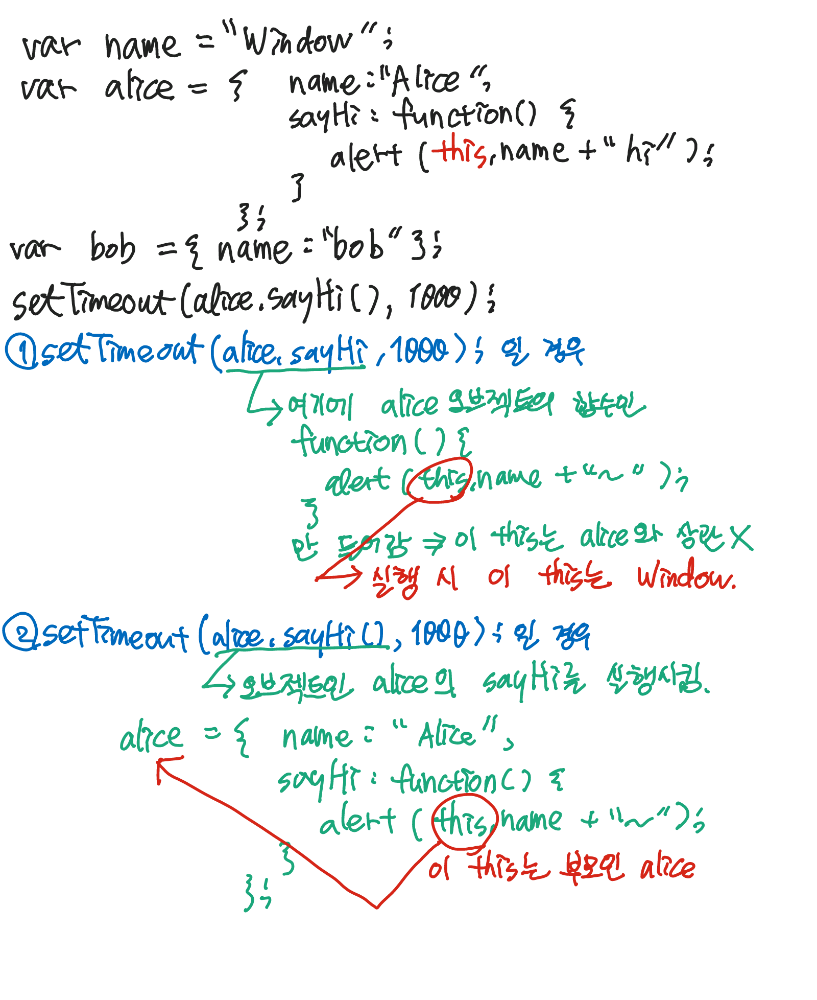
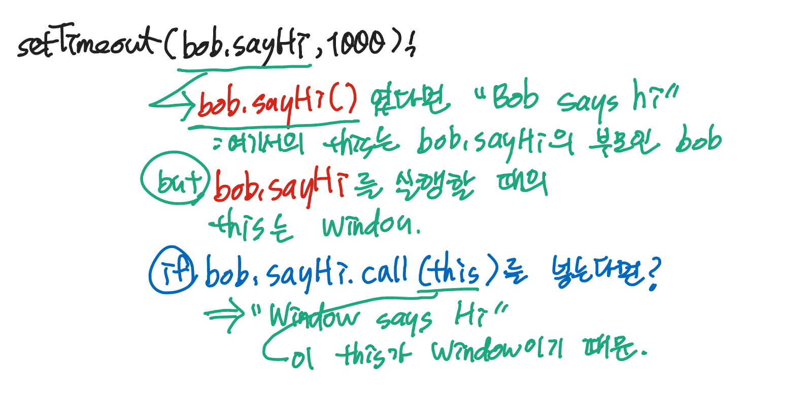
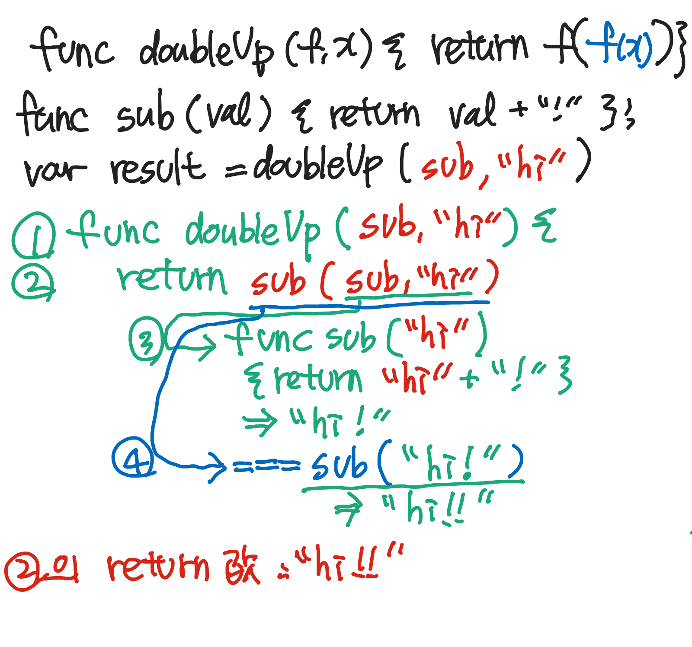
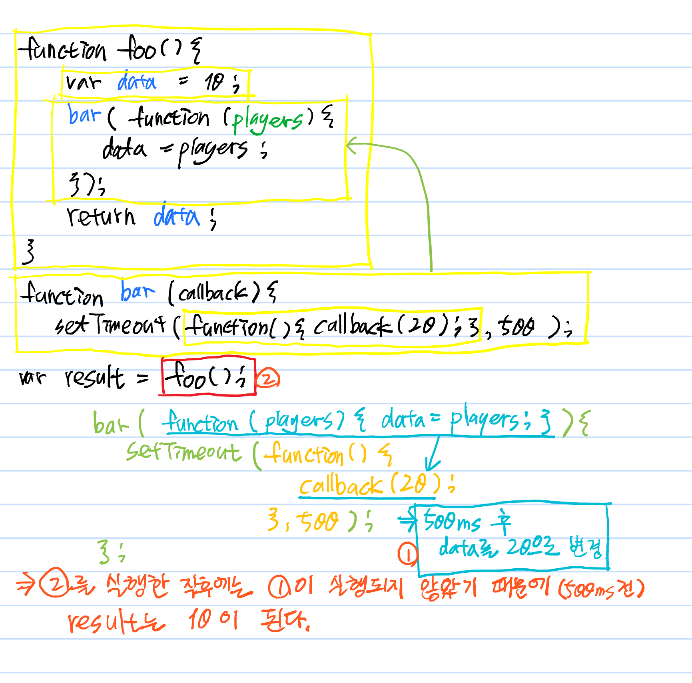

# [CODESTATES im16] Check Point5, 6

# Check Point 5

## Q3. What message will eventually be alerted? After how long?

```js
var name = "Window";
var alice = {
  name: "Alice",
  sayHi: function() {
    alert(this.name + " says hi");
  }
};
var bob = { name: "Bob" };

setTimeout(alice.sayHi.bind(alice), 1000);
```

예상, 결과: Alice says hi, after 1 second

> bind?
>
> *  setTimeout과 함께 사용
>   * 클래스 인스턴스를 참조하는 `this`를 필요로 하는 클래스 메소드로 작업하는 경우, 명시해서 `this`를 콜백 함수에 바인딩할 수 있습니다, 인스턴스를 유지하기 위해.


## Q4. What message will eventually be alerted? After how long?

```js
var name = "Window";
var alice = {
  name: "Alice",
  sayHi: function() {
    alert(this.name + " says hi");
  }
};
var bob = { name: "Bob" };

setTimeout(alice.sayHi(), 1000);
```

예상: Window says hi, immediately

결과: Alice says hi, immediately

> setTimeout의 첫 번째 인자에 함수를 넣을 경우 1000ms이후에 해당 함수가 실행되는데, 이 문제에서는 함수를 넣은 것이 아니고 함수를 바로 실행한것이기 때문에 alice.sayHi()는 즉시 실행될 것이다.
>
> 문제는 this인데..
>
> 


## Q7. What message will eventually be alerted? After how long?

```js
var name = "Window";
var alice = {
  name: "Alice",
  sayHi: function() {
    alert(this.name + " says hi");
  }
};
var bob = { name: "Bob" };

bob.sayHi = alice.sayHi

setTimeout(bob.sayHi, 1000);
```

예상: Bob says hi, after 1 second

결과: Window says hi, after 1 second

> 


---

# Check Point 6

## Q1. After running the following code, what will be the value of result?

```js
function doubleUp (f, x) {
  return f( f(x) );
};

function subject (value) {
  return value + "!";
};

var result = doubleUp(subject, "hi");
```

예상, 결과: "hi!!"

> 


## Q3. After running the following code and all setTimeouts have run their callbacks, what will be the value of result?

```js
var result = 10;

function wait (time, f) {
  setTimeout(function () {
    result = f(result);
  }, time);
}

wait(500, function (x) { return x + 5 })
wait(250, function (x) { return x * 2 })
```

예상: 30

결과: 25

> js의 setTimeout을 여러 개 사용할 경우 먼저 입력된 결과가 먼저 나오는게 아니고 동시진행이 되는 것 같다.
>
> =>	wait(500, function()... ) :실행
>
> ​		wait(250, function()... ) :위의 setTimeout이 끝날때 까지 기다리는것이 아니고 바로 실행.
>
> =>	먼저 실행한 wait(500, ...) 보다 wait(250, ...) 이 먼저 끝난다.


## Q6. After the following code runs and all setTimeout callbacks run, what will be the value of result?

```js
function foo () {

  var data = 10;

  bar(function (players) {
    data = players;
  });

  return data;
}

function bar (callback) {
  setTimeout(function () {
    callback(20);
  }, 500);
}

var result = foo();
```

예상: undefined

결과: 10

> 


## Q7. After the following code runs and all setTimeout callbacks run, what will be the value of result?

```js
function foo () {

  var data = 10;

  bar(function (players) {
    data = players;
  });

  return data;
}

function bar (callback) {
  setTimeout(callback, 0);
}

var result = foo();
```

예상: undefined

결과: 10

> ```js
> function foo () {
> 
>   var data = 10;
> 
>   bar(function (players) {
>     data = players;
> 	console.log("bar in foo's data", data);
>   });
> 			
>   console.log("foo's data", data);			
>   return data;
> }
> 
> function bar (callback) {
>   setTimeout(callback, 0);
> }
> 
> var result = foo();
> console.log('result', result);
> ```
>
> 이 코드를 실행했을 경우
>
> ```
> foo's data 10
> result 10
> bar in foo's data
> ```
>
> 순서로 출력됨.
>
> => setTimeout의 경우 두번째 인자가 0이더라도 나중에 실행되는 것 같다.