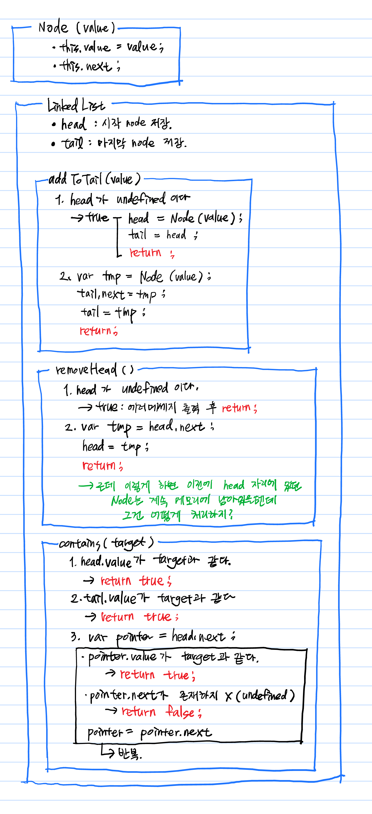
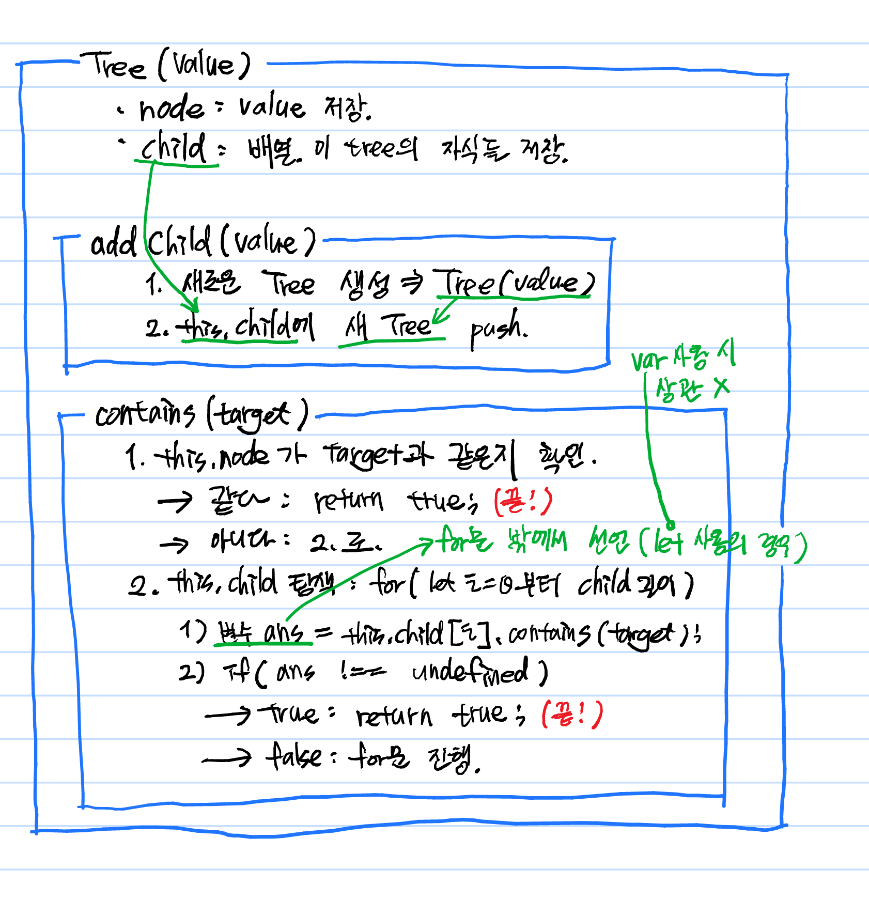

# [CODESTATES im16] Data Structure's Pseudo Code

# 1. Linked List



> **191119(화) 추가**
> removeHead에서 다른 곳에서 참조하는 것이 없는 node는 GC(Garbage Collector)가 처리해 준다.

# 2. Tree

* `Tree` 클래스
  * `node` : 데이터 저장
  * `child` : array
* `.addChild(value)` : tree에 값이 `value` 인 자식 `node` 추가.
  1. 값이 `value` 인 새로운 `Tree` 생성.
  2. `this.child`에 새 `Tree`를  `push`.

- `contains(target)` : `target`이 tree에 존재하는지 확인.

타이핑하다가 손으로 하는 게 더 빠를 것 같아 손으로 썼음.



> **191118(월) 추가**
> constains함수의 child탐색의 경우
> 2.의 2)부분을 저렇게 하면 안된다.
> 저걸 쓸 때는 이상한걸 못느꼈는데 코드를 짜려고 보니 말도 안돼서 그부분은 갈아엎었다.
>
> 
>
> this.child탐색. 
>
> ```js
> for {
>   var ans = this.child[i]
>   if(ans.value === target)
>   { return true; }
> }
> ```