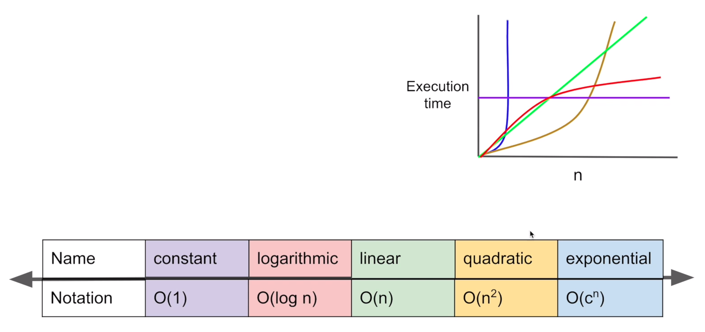

# [CODESTATES im16] Time Complexity

**Compleity Analysis**

알고리즘을 실행하는 것에 있어 시간과 공간을 얼마나 차지하는지 나타내는 지표

시간과 공간의 복잡도: 그 알고리즘의 효율을 나타냄

# 1. 시간복잡도

<- 효율적                                  비효율적 ->

시간복잡도를 알 수 있으면 알고리즘의 실행시간이 얼마나 걸릴지 예상해 볼 수 있다.

# 2. 자료구조별 시간복잡도

해시테이블 추가: O(1)

Binary Search: O(log n)

Linked List: O(n)

재귀함수: O(c^n)

## 2-1. Array

메모리가 정해져있는 배열이라고 가정함.(JS는 아님)

* Lookup (position): 정해져 있는 자리에 저장되어 있는 데이터를 바로 불러오는 것이기 때문에 O(1)
* Assign: Lookup과 마찬가지로 정해져 있는 자리에 있는 값을 변경하면 되는 것이기 때문에 O(1)
* Insert: insert하고 싶은 자리에 insert를 하기 전에 그 자리의 index와 같거나 큰 index를 가진 값들은 다 뒤로 한 칸 씩 물러나야 하기 때문에 O(n)
* Remove: Insert와 비슷하게 삭제하고 싶은 자리의 데이터를 삭제하고 그 자리의 index보다 큰 값을 가진 index의 데이터들을 다 한 칸씩 앞으로 당겨야 하기 때문에 O(1)
* Find(value): 처음부터 원하는 값을 찾을 때 까지 하나씩 비교해나가야 하기 때문에 O(n)

## 2-2. Linked List

* Lookup: 바로 접근을 하지 못하기 때문에 헤드에서부터 원하는 수만큼 next를 타고 들어가야 한다. 그래서 O(n)

* Find, Assign: Lookup과 같이 원하는 값을 찾을 때 까지 next를 타고 찾아야 하기 때문에 O(n)

* Insert (추가하고 싶은 자리의 앞에 해당하는 node의 주소를 알고 있을 경우)

  ​	: 바로 추가할 수 있기 때문에 O(1)

* Remove
  * head, tail:  가장 앞, 뒤의 node를 지워버리면 되기 때문에 O(1)
  * middle: 지우고자 하는 node의 바로 앞에 있는 node를 알 수 없기 때문에 그 node는 head에서부터 찾아나가야 한다. > O(n)

### 1) Doubly-Linked Lists

node가 next node를 가리키는것 뿐만 아니라 pre node도 가리킴.

* Lookup, Find, Assign: O(n)
* Insert: O(1)
* Remove: 지우고자 하는 node의 다음node뿐만 아니라 이전node까지 알 수 있기 때문에 Insert와 같이 O(1)

## 2-3. Tree

### 1) Basic Tree

* find: 일반 tree의 경우 모든 child를 찾아야 하기 때문에 O(n)의 시간복잡도를 가진다.

### 2) Binary Search Tree

* find:
  * 입력 데이터의 분포가 고른 편이다: 
    * 모든 노드가 일정한 규칙을 가지고 데이터가 저장되기 때문에 **O(log n)**
  * 입력 데이터의 분포가 고르지 않다:
    * root보다 작은 수의 값만 입력될 경우 linked list와 다를 것이 없기 때문에 **O(n)**
  * 해결 방법
    * 추가할 때 마다 밸런스를 확인하고 그걸 맞춰가면 **O(log n)**
    * 이진트리 root깊이가 2이상 차이가 날 경우 트리를 비틀어서 밸런스를 맞추면 됨.

* array를 사용하지 않고 BST를 사용할 경우 그 이유는?
  * array는 메모리에서 연속적인 블락을 차지
  * BST의 경우 구성 시 Linked List를 쓰기도 하는 등 메모리 사용을 효율적으로 할 수 있음.

## 2-4. Hash Table

* 추가: O(1) 해시 테이블은 for나 while등의 루프를 도는 자료구조가 아니기 때문에 constante한 시간 복잡도를 가진다.