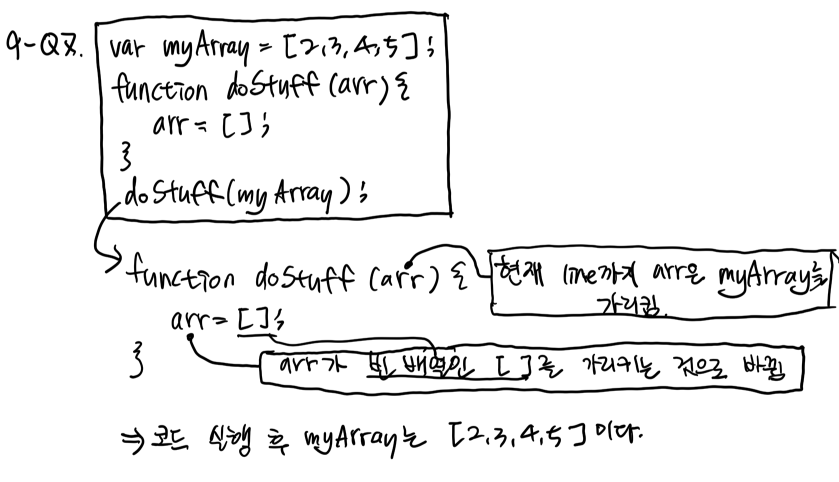
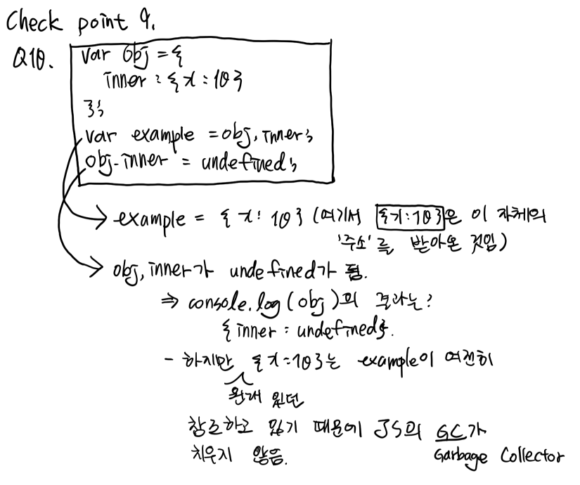
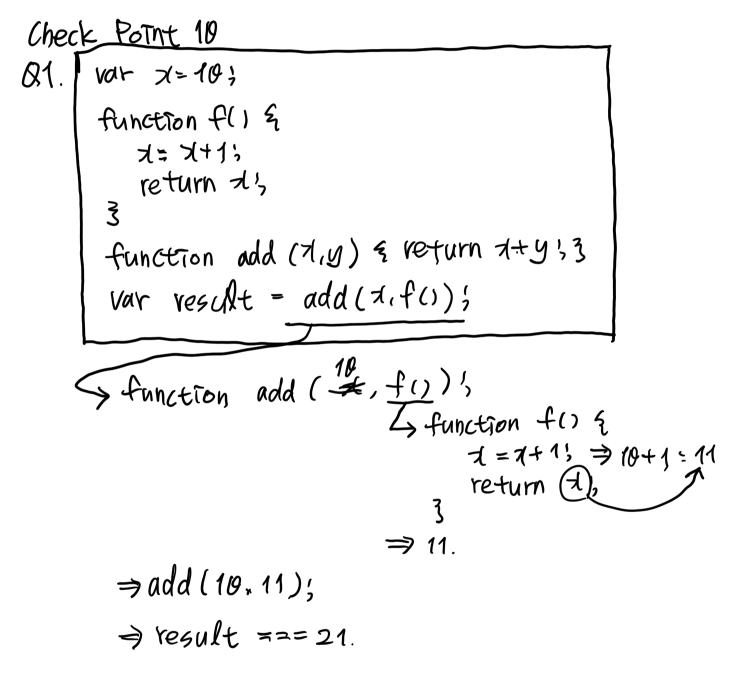
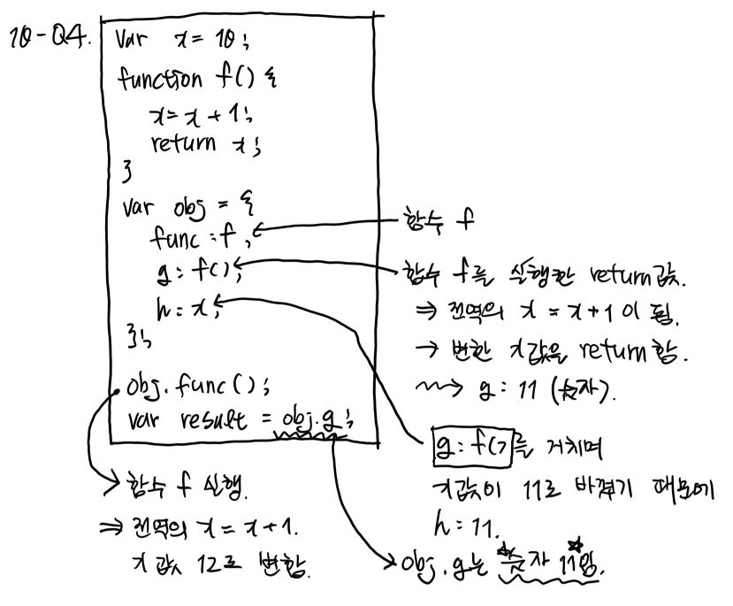
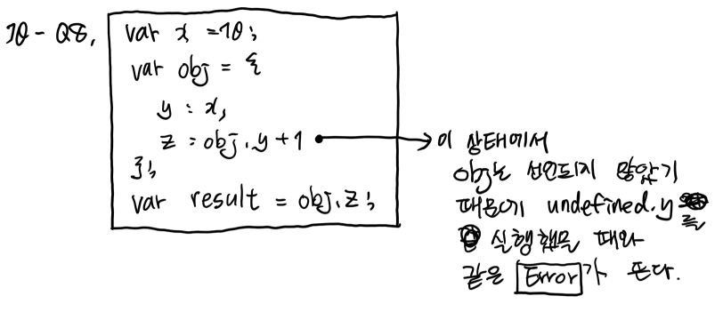

# [CODESTATES im16] Check Point 9-10

# 1. Checkpoint 9

## Q7. After the following code runs, what will be the value of myArray?

```js
var myArray = [2, 3, 4, 5];
function doStuff(arr) {
  arr = [ ];
}

doStuff(myArray);
```

예상: []

정답: [2, 3, 4, 5]




## Q9. After the following code runs, what will be the value of player?

```js
var player = { score: 3 };

function doStuff(obj) {
  obj = {};
}

player = doStuff(player);
```

예상: {score:3}

정답: undefined

> Q7은 []로 안바꼈으면서 Q9는 왜 undefined인지 모르겠다.
>
> 왜냐?? object는 array와는 다르냐????? array도 object기반인데 왜?
>
> ---
>
> **191120(수) 추가**
>
> doStuff의 return값이 명시되어 있지 않기 때문에 `undefined`가 return된다.
>
> 그래서 위 코드를 거치게 되면 player의 값이 `undefined`가 됨.


## Q10. After the following code runs, what will be the value of example?

```js
var obj = { 
  inner: { x: 10 }
};
var example = obj.inner;
obj.inner   = undefined;
```

예상, 정답: { x: 10 }




---

# 2. Checkpoint 10

## Q1.  After the following code runs, what will be the value of result?

```js
var x = 10;

function f () {
  x = x + 1;
  return x;
}

function add (x, y) { return x + y; }

var result = add(x, f());
```

예상, 정답: 21




## Q4. After the following code runs, what will be the value of result?

```js
var x = 10;

function f () {
  x = x + 1;
  return x;
}

var obj = {
  func: f,
  g: f(),
  h: x,
};

obj.func();
var result = obj.g;
```

예상: 12

정답: 11




## Q8. After the following code runs, what will be the value of result?

```js
var x = 10;

var obj = {
  y: x,
  z: obj.y + 1
};

var result = obj.z;
```

예상: 11

정답: Throws an error



