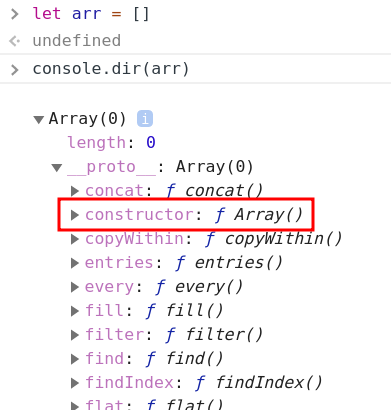

# [CODESTATES im16] Start Inheritance patterns

# 1. Prototype

자바스크립트는 Java, C++과 같은 클래스 기반 객체지향 프로그램이 아니고 프로토타입기반의 객체지향 언어이기 때문에 프로토타입이 매우 중요하다.

ES5까지는 class가 없었음. > class구현을 위해 sudo-classical 등장

ES6부터 calss를 지원하기는 하지만 모양만 class같은것 뿐이지 다른 언어의 class들과는 작동 방식이 다르다.(JS는 prototype기반의 언어이기 때문에!)

---

* 자바스크립트의 모든 객체는 [[Prototype]]이라는 인터널 슬롯(internal slot)를 가진다. [Prototype]]의 값은 null 또는 객체이며 상속을 구현하는데 사용된다. [[Prototype]] 객체의 데이터 프로퍼티는 get 액세스를 위해 상속되어 자식 객체의 프로퍼티처럼 사용할 수 있다. 하지만 set 액세스는 허용되지 않는다.
* [[Prototype]]의 값은 Prototype(프로토타입) 객체이며 [`__proto__`](https://tc39.github.io/ecma262/#sec-object.prototype.__proto__) accessor property로 접근할 수 있다. `__proto__` 프로퍼티에 접근하면 내부적으로 [Object.getPrototypeOf](https://developer.mozilla.org/ko/docs/Web/JavaScript/Reference/Global_Objects/Object/getPrototypeOf)가 호출되어 프로토타입 객체를 반환한다.

## 1-2. [[Prototype]] vs prototype 프로퍼티

prototype 프로퍼티는 프로토타입 객체를 가리키는 [[Prototype]] 인터널 슬롯은 다르다. prototype 프로퍼티와 [[Prototype]]은 모두 프로토타입 객체를 가리키지만 관점의 차이가 있다.

* [[Prototype]]
  * 함수를 포함한 모든 객체가 가지고 있는 인터널 슬롯
  * `__proto__`로 접근이 가능하며 객체의 입장에서 자신의 부모 역할을 하는 프로토타입 객체를 가리키며 함수 객체의 경우 `Function.prototype`를 가리킨다.
* prototype 프로퍼티
  * 함수 객체만 가지고 있는 프로퍼티이다.
  * 함수 객체가 생성자로 사용될 때 이 함수를 통해 생성될 객체의 부모 역할을 하는 객체(프로토타입 객체)를 가리킨다.

# 2. constructor 프로퍼티

프로토타입 객체는 constructor 프로퍼티를 갖는다. 인스턴스의 프로토타입을 만든 [`Object`](https://developer.mozilla.org/ko/docs/Web/JavaScript/Reference/Global_Objects/Object) 함수의 참조를 반환한다.

---

# 참고

> YOU DON'T KNOW JS(this와 객체 프로토타입, 비동기와 성능) - 카일 심슨 [한빛미디어]
>
> [[Poiemaweb] 프로토타입](https://poiemaweb.com/js-prototype)
>
> [[MDN] Object.prototype.constructor](https://developer.mozilla.org/ko/docs/Web/JavaScript/Reference/Global_Objects/Object/constructor)

