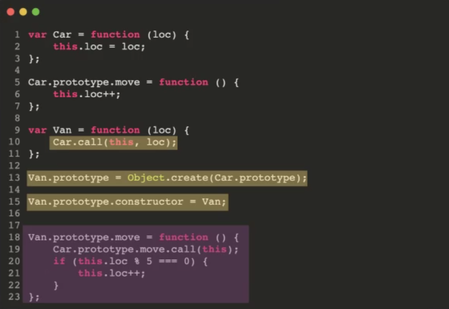
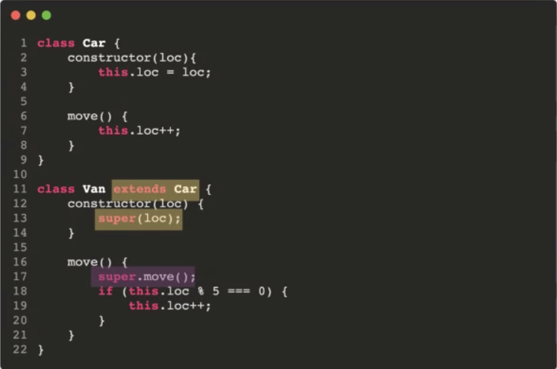

# [CODESTATES im16] Sprint Office Hour

# 1. Inheritance & Polymorphism

* Inheritance(상속): 상위 객체의 특징을 하위 객체에게 넘겨주는 것
* Polymorphism(다형성): 동일한 조작방법으로 동작을 시키지만, 작동 결과는 다른 것

# 2. Prototype

## 2-1. Prototype Object

* prototype 객체:
  * constructor에 의해 생성될 각각의 인스턴스에게 공유. 프로퍼티를 제공하기 위해 사용
  * `함수.prototype`, `객체.__proto__`(dunder proto)로 접근 가능하다.
* dunder proto덕분에 프로토타입 체이닝이 가능해짐

프로토타입 객체가 뭔지.

프로토타입 

프로토타입 체이닝, 왜 가능해지는지

## 2-2. Prototype chaining

scope chaining처럼, 메서드 혹은 속성을 찾지 못했을 경우 상위 프로토 타입을 참조하는 것.

# 3. Subclassing patterns

## 3-1. Functional Subclassing

```js
var car = function (loc) {
    var obj = { loc: loc };
    obj.move = function () {obj,loc++ };
    return obj;
}

var Van = function (loc) {
    //super class의 instance에 이 subclass만의 method를 할당.
    var obj = Car(loc);
    obj.grab = function () { ... };
	return obj;
}

var Cop = function (loc) {
    var obj = Car(loc);
    obj.cal = function () { ... };
    return obj;
}
```

쓸모없는 메모리 소모가 많아짐. > 각 function마다 함수들을 다 만들기 때문이다.

## 3-2. Pseudoclassical Subclassing

ES6에서 class가 생기기 전에 subclass를 구현하기 위해 만들었던 방법



## 3-3. ES6 class Subclassing



# 3. Subclass Dance party

line up: 반드시 상속을 이용하여 구현해야 함.

hint: 무조건 그대로 사용하기보다는 필요하다면 자식클래스에서 메서드 확장을 통해 


# 4. QnA

## Q1. 

화살표 함수와 무명함수는 this바인딩이 다르기 때문에 사용되는 부분이 다르다.