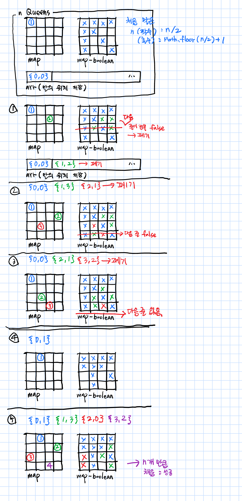

일단 백본 활용을 안하고 구현하기에 대한 전략

# n Rooks

전역 arr(rooks를 저장): [ {x: column, y:row}, ... ]

새 rook를 놓을 때 rooks를 저장한 전역 arr를 확인

1. newRook.x / newRook.y : 0~n까지 for loop으로 순회하며 재귀.
   * newRook.x와 rooks[i].x와 겹치는 x는 순회에서 제외
   * newRook.y와 rooks[i].y가 겹치는 값은 제외
     1. arr.push(newRook)
     2. 재귀
     3. arr.pop();
2. 재귀를 계속 도는 중 arr의 크기가 n과 같으면 종료

# n Queens

# hasMagorDiagonalConflictAt()

메이저 대각선이 시작되는 행의 위치

> index가 0~n 사이면 nXn 보드의 최대 절반밖에 검사하지 못하기 때문에? 

메이저는 \ 대각선, 마이너는 / 대각선

