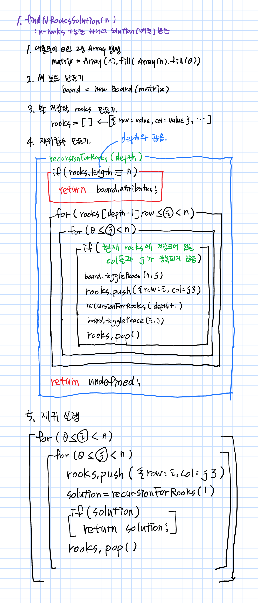
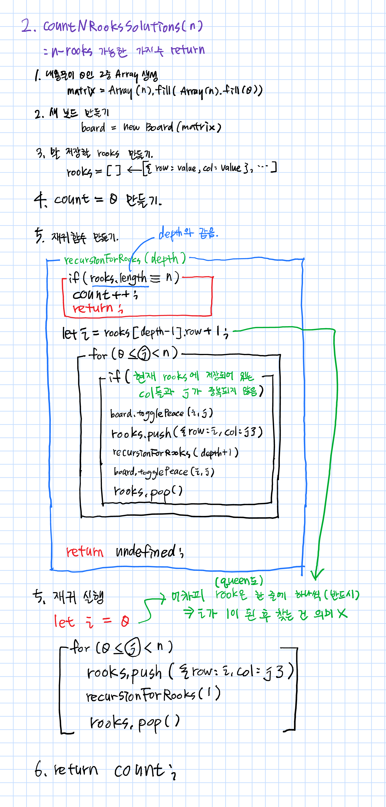
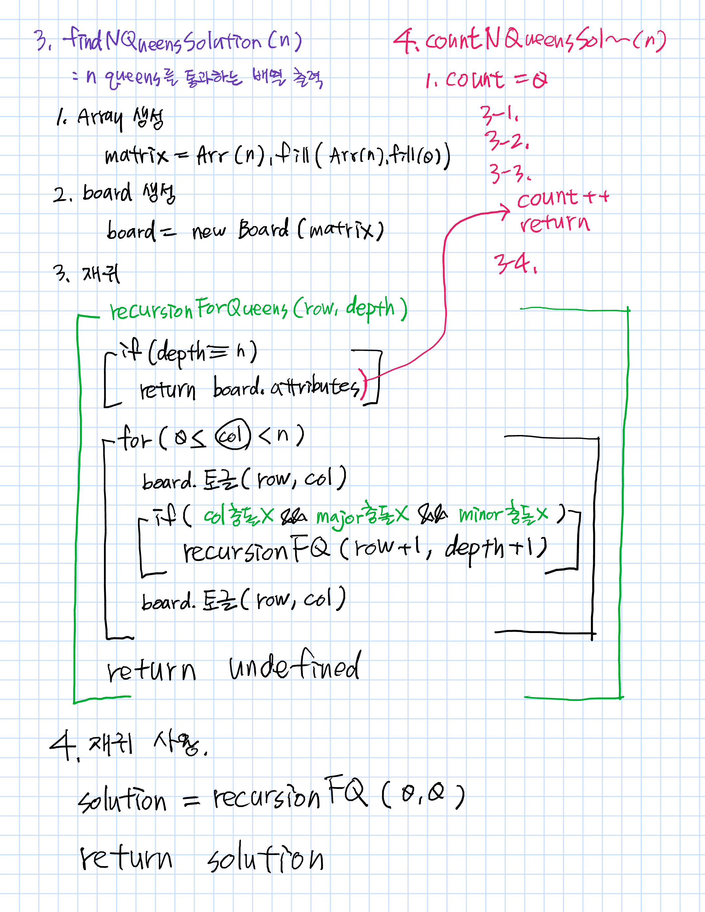

숫자 오름차순 순서로 수도코드를 짰음.

정리하다 보니 더 나은 방법이 떠올랐기 때문에 현재로써는 n queens가 가장 효율적임.(n rooks도 그 방법으로 할 예정)

# 1. findNRooksSolution()

**: returns a single solution to the n-rooks problem**

# 2. countNRooksSolutions()

**: returns a count of the total number of solutions to the n-rooks problem**

# 3. findNQueensSolution()

**: returns a single solution to the n-queens problem**

# 4. countNQueensSolutions()

**: returns a count of the total number of solutions to the n-queens problem**

