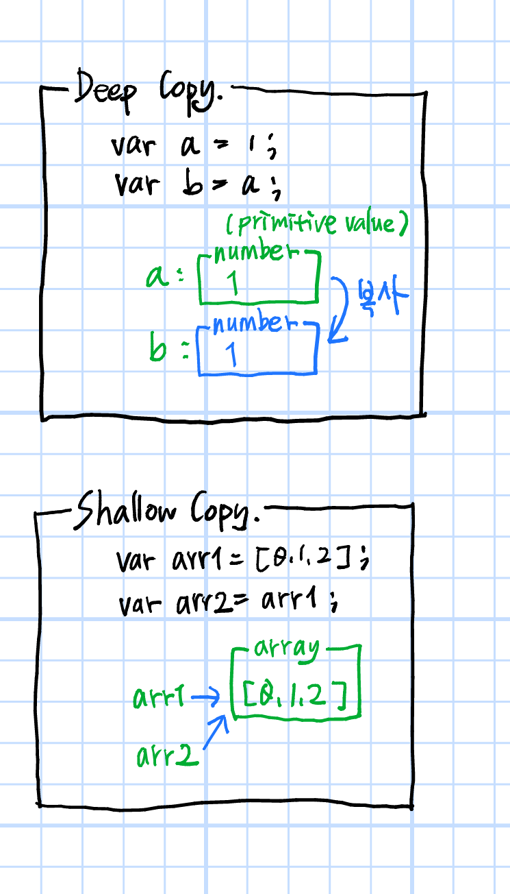

# [JS] Object(객체)의 깊은 복사

# 1. JS에서의 복사

다른 언어에서 값은 사용하는 구문에 따라 값-복사(Value-Copy) 또는 레퍼런스-복사(Reference-Copy)의 형태로 할당/전달한다.  

  

C++을 예로 들자면,

```c++
#include <iostream>
using namespace std;

void foo(int& myNum) {
	myNum = 100;
	return;
}

int main() {
	int x = 10;
	cout << x << endl; //10
	foo(x);
	cout << x << endl; //100
	
	return 0;
}
```

어떤 함수에 전달한 숫자 인자 값을 그 함수 내에서 수정하려면 `int& myNum`형태로 함수 인자를 선언하고, 호출하는 쪽에서 변수 `x`를 넘기면 `myNum`은 `x`를 참조한다.

레퍼런스 인자를 선언(`int& myNum`처럼)하지 않으면 어떤 복잡한 객체를 선언할지라도 언제나 값을 복사한다.

```c++
#include <iostream>
using namespace std;

class Bar {
private:
	int x = 10;
public:
	void print() {
		cout << x << endl;
	}
	void change(int x) {
		this->x = x;
	}
};

void foo(Bar myBar) {
	cout << "in foo: ";
	myBar.change(100);
	myBar.print(); //100
	return;
}

int main() {
	Bar bar;
	bar.print(); //10
	foo(bar);
	bar.print(); //10
	
	return 0;
}

/** 출력되는 값
* 10
* in foo: 100
* 10
*/
```

위와 같이, 받아올 인자가 `class`라 할지라도 `Bar& myBar`라고 쓰지 않는 이상 무조건 값을 복사해 온다.  

  

자바스크립트는 포인터라는 개념 자체가 없고 참조하는 방법도 다르다. 그리고 값 또는 레퍼런스의 할당 및 전달을 제어하는 구문 암시(Syntactic Hint)가 전혀 없다. 타입만으로 값-복사, 레퍼런스-복사 둘 중 한쪽이 결정된다.  

  

값-복사는 Deep Copy, 레퍼런스-복사는 Shallow Copy라 불린다.

## 1-1. Deep copy 깊은 복사

* 원시 타입(primitive type, primitive value, primitive data type)
  * **null, undefined, string, boolean, number, bigint, (ES6)symbol**의 7가지 원시 자료형이 존재함.
  * 원시값이란 객체도 아니고 메서드도 아닌 데이터
* 복사가 일어날 때 독립적이고 새로운 메모리 공간을 확보하여 값을 저장.

## 1-2. Shallow copy 얕은 복사

참조타입이 독립적인 값을 저장하지 않는 이유: 비효율을 방지하기 위해서

* 참조 타입(reference type)
  * **Object, Array, Function** 등 구조가 비교적 복잡한 타입
* 복사가 일어날 때, 메모리 어딘가에 객체 그 자체가 아닌 객체의 **위치 값**을 저장

  


---

# 2. JS에서 Object를 Deep copy 하기

자바스크립트에서 객체나 함수 등은 할당하거나 전달할 시 반드시 레퍼런스 사본을 생성한다.

```js
let obj1 = {a:1, b:2};
let obj2 = obj1; //얕은 복사
console.log(obj2); //{a: 1, b: 2}
console.log(obj1); //{a: 1, b: 2}

obj2.a = 10;
console.log(obj2); //{a: 10, b: 2}
console.log(obj1); //{a: 10, b: 2}
```

위 예제에서 `obj1`과 `obj2`는 모두 객체이자 동일한 공유 값 `{a:1, b:2}`에 대한 개별 레퍼런스다.

중요한 점은 `obj1`과 `obj2`가 `{a:1, b:2}`를 소유하는 것이 아닌 그 값을 **동등하게 참조**한다는 사실이다. (매우 중요함)

그렇기 때문에 레퍼런스로 공유한 값의 내용이 변경되면(`.a = 10`) 그것은 한 곳을 변경하는 것이기 때문에 `obj1`과 `obj2`는 갱신된 값인 `{a: 10, b: 2}`를 동시에 바라보게 되는 것이다.  

  

`array`의 경우 `.slice()`를 사용하면 깊은 복사라고 생각하기 쉬운데(경험담), 사실 `.slice()`는 원본 배열에서 요소의 얕은 복사본을 반환한다.

이게 무슨 뜻인가 하면,

```js
var arr1 = [{a:1}, [2, 3], 4];
var arr2 = arr1.slice();
arr2[0].a = 0;
arr2[1][0] = 0;
arr2[2] = 0;
console.log(arr1); // [{{a:0}, [0, 3], 4]
console.log(arr2); // [{{a:0}, [0, 3], 0]
```

`arr1.slice()`는 새 배열에다가 `arr1[0]`, `arr1[1]`, `arr[2]`를 각각 `.push()`한 것과 유사한 동작을 한다는 것이다.

여기서 `arr1[0]`과 `arr1[1]`은 각각 object와 array이기 때문에 얕은 복사를 하고, `arr1[2]`는 number이기 때문에 깊은 복사를 한다.  

  

원시값이 아닌 이상 레퍼런스 참조를 하는 것은 자바스크립트의 기본적인 특징이지만, 때에 따라서 참조 타입의 깊은 복사가 필요할 경우도 있다.

그 경우, 자바스크립트의 표준 내장 객체인 `JSON`을 사용하면 된다.

`JSON`에 대한 상세 내용은 아래의 [참고](#참고)링크에서 볼 수 있다.

```js
let obj1 = {a:1, b:2};
let obj2 = JSON.parse(JSON.stringify(obj1)); //깊은 복사
console.log(obj2); //{a: 1, b: 2}
console.log(obj1); //{a: 1, b: 2}
deepCp.a = 10;
console.log(obj2); //{a: 10, b: 2}
console.log(obj1); //{a: 1, b: 2}
```

위 예제에서 깊은 복사를 실행하는 이유는 `JSON`의 메서드를 보면 알 수 있다.

`JSON.stringify()`: 주어진 값에 해당하는 JSON **문자열**을 반환.

`JSON.parse()`: 문자열을 JSON으로서 구문 분석하고, 선택적으로 분석 결과의 값과 속성을 변환해 반환.

1. `JSON.stringify()`을 통해 `obj1`의 내용을 원시타입인 문자열의 형태로 반환하고 (`{a:1, b:2}`를 건드리지 않는다)
2. 그 결과를 `JSON.parse()`에 넣어 JSON 문자열을 분석한 결과의 값과 속성을 변환해서 `obj2`로 받는것이기 때문에 (`{a:1, b:2}`라는 내용을 가진 객체를 새로 생성해서 `obj2`에 할당한 것이다)
3. `obj1`과 `obj2`는 서로 다른 값을 참조하게 된다.  

  

  

---

# 참고

> Codestates Immersive Course
>
> YOU DON'T KNOW JS(타입과 문법, 스코프와 클로저) - 카일 심슨 [한빛미디어]
>
> [[MDN]원시값](https://developer.mozilla.org/ko/docs/Glossary/Primitive) (한 번 읽어보는 것을 추천)
>
> [[MDN]Array.prototype.slice()](https://developer.mozilla.org/ko/docs/Web/JavaScript/Reference/Global_Objects/Array/slice)
>
> [json.org](https://www.json.org/json-ko.html)
>
> [[MDN] JSON](https://developer.mozilla.org/ko/docs/Web/JavaScript/Reference/Global_Objects/JSON)