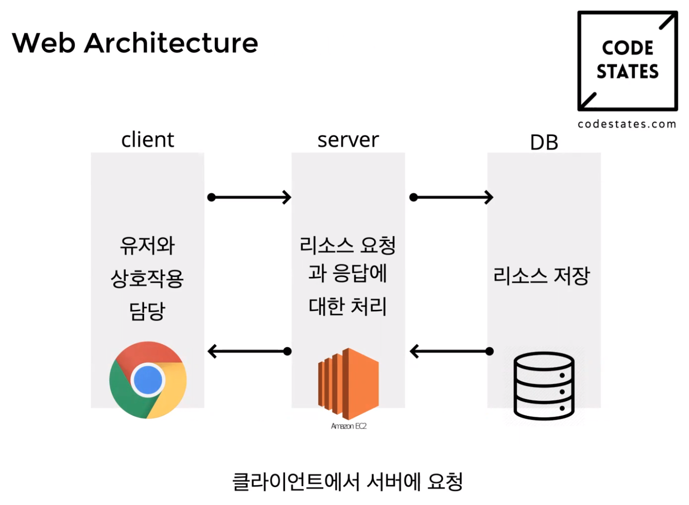
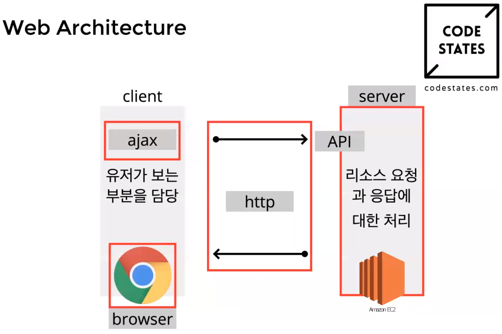

# [CODESTATES im16] Interaction With Server

API를 활용해서 UI를 만드는 스프린트

웹개발을 하는 것에 대한 기본적인 flow를 익히는 스프린트

# 1. Web Architecture

* API: Application Programming Interface
  * 프로그래밍되어있는 애플리케이션과 의사소통 가능한 매개체
* UI: User Interface
  * 유저와 의사소통 가능한 매개체

## 1-1. Interface

사물과 사물, 사물과 인간간의 의사소통이 가능하도록 만든 객체

> [[wiki] 인터페이스(컴퓨팅)](https://ko.wikipedia.org/wiki/인터페이스_(컴퓨팅))
>
> 사용자가 기기를 쉽게 동작시키는데 도움을 주는 시스템

* client: 서버에 데이터를 요청하고 받아서 보여줌
  * Ajax: 서버에 필요한 정보를 요청. JS로 DOM만 바꿈.
* server: 클라이언트의 요청을 처리하고 데이터를 관리함
  * API: 서버자원을 잘 쓸 수 있게 하는 도구
* http: 클라이언트와 서버의 통신 시 치켜야 할 정해둔 규약

---

# 2. 웹 아키텍처에서 각 키워드의 의미

## 2-1. browser

> [How does web browsers work?](https://medium.com/@monica1109/how-does-web-browsers-work-c95ad628a509)
>
> [[wiki]웹 브라우저]([https://ko.wikipedia.org/wiki/%EC%9B%B9_%EB%B8%8C%EB%9D%BC%EC%9A%B0%EC%A0%80](https://ko.wikipedia.org/wiki/웹_브라우저))

* **웹 브라우저** 또는 **브라우저**([영어](https://ko.wikipedia.org/wiki/영어): web browser 또는 browser, [문화어](https://ko.wikipedia.org/wiki/문화어): 열람기)는 [웹 서버](https://ko.wikipedia.org/wiki/웹_서버)에서 이동하며(navigate) 쌍방향으로 통신하고 [HTML](https://ko.wikipedia.org/wiki/HTML) 문서나 파일을 출력하는 [그래픽 사용자 인터페이스](https://ko.wikipedia.org/wiki/그래픽_사용자_인터페이스) 기반의 [응용 소프트웨어](https://ko.wikipedia.org/wiki/응용_소프트웨어)
* 대표적인 [HTTP](https://ko.wikipedia.org/wiki/HTTP) [사용자 에이전트](https://ko.wikipedia.org/wiki/사용자_에이전트)의 하나
* 주요 웹 브라우저로는 [모질라 파이어폭스](https://ko.wikipedia.org/wiki/모질라_파이어폭스), [구글 크롬](https://ko.wikipedia.org/wiki/구글_크롬), [인터넷 익스플로러](https://ko.wikipedia.org/wiki/인터넷_익스플로러)/[마이크로소프트 엣지](https://ko.wikipedia.org/wiki/마이크로소프트_엣지),[[1\]](https://ko.wikipedia.org/wiki/웹_브라우저#cite_note-1)[[2\]](https://ko.wikipedia.org/wiki/웹_브라우저#cite_note-2)[[3\]](https://ko.wikipedia.org/wiki/웹_브라우저#cite_note-3) [오페라](https://ko.wikipedia.org/wiki/오페라_(웹_브라우저)), [사파리](https://ko.wikipedia.org/wiki/사파리_(웹_브라우저))가 있다.

> 1. SKT, LG, KT등의 통신사와 같이 클라이언트와 서버가 통신할 수 있도록 도와주는 매개체
> 2. 개개인이 가지고 있는 하나의 스마트폰(스마트폰의 운영체제가 안드로이드, 맥 등 다양하듯 브라우저도 다양함)

html, js, css로 작성한 코드를 컴퓨터가 알 수 있게 한다.

1. html, js, css를 해독하는 엔진이 브라우저 내부에 존재함.
2. 그 코드를 해석해서 컴퓨터에 2진데이터를 넘겨줌
3. 그리고 데이터 처리의 결과를 브라우저에 보여줌

* 브라우저가 어떻게 작동하는지 알 필요가 있음

  > [브라우저는 어떻게 동작하는가?](https://d2.naver.com/helloworld/59361)

* 브라우저의 주요 기능
  * 사용자가 선택한 자원을 서버에 요청하고 브라우저에 표시하는 것.
  * 브라우저는 HTML과 CSS 명세에 따라 HTML 파일을 해석해서 표시하는데 이 명세는 웹 표준화 기구인 W3C(World Wide Web Consortium)에서 정함.

## 2-2. HTTP

> [[wiki]HTTP](https://ko.wikipedia.org/wiki/HTTP)

대부분의 [웹 서버](https://ko.wikipedia.org/wiki/웹_서버)가 사용하는 [HTTP](https://ko.wikipedia.org/wiki/HTTP)**(Hyper-Text Transfer Protocol)**

* **HTTP**(**H**yper**T**ext **T**ransfer **P**rotocol, [문화어](https://ko.wikipedia.org/wiki/문화어): 초본문전송규약, 하이퍼본문전송규약)는 [WWW](https://ko.wikipedia.org/wiki/WWW) 상에서 정보를 주고받을 수 있는 [프로토콜](https://ko.wikipedia.org/wiki/통신_프로토콜)이다. 주로 [HTML](https://ko.wikipedia.org/wiki/HTML) 문서를 주고받는 데에 쓰인다.
* HTTP는 [클라이언트](https://ko.wikipedia.org/wiki/클라이언트)와 [서버](https://ko.wikipedia.org/wiki/서버) 사이에 이루어지는 요청/응답(request/response) 프로토콜이다. 예를 들면, 클라이언트인 [웹 브라우저](https://ko.wikipedia.org/wiki/웹_브라우저)가 HTTP를 통하여 서버로부터 웹페이지나 그림 정보를 요청하면, 서버는 이 요청에 응답하여 필요한 정보를 해당 사용자에게 전달하게 된다. 이 정보가 모니터와 같은 출력 장치를 통해 사용자에게 나타나는 것

* 규약, 규칙. 서버 및 클라이언트가 통신을 하기 위한 **규칙 및 규약**.
  * TCP/IP

### 1) 작동방식

1. 항상 요청과 응답으로 이루어짐.

2. 메세지를 달라고 하면 메세지를 줌

3. 없으면 없다고 응답을 줌
   * 요청을 무시하면 오류가 남.(반드시 응답을 줘야함)

### 2) 구성

* 기본적으로 헤더와 바디를 가짐

* Request: Header / Body

  * Header

    * 어디서 보내는 요청인가(origin)
    * 컨텐츠 타입(content-type)
    * 어떤 클라이언트를 이용해 보냈는가(user-agent)
    * ...

    > [알아둬야 할 HTTP 공통 & 요청 헤더](https://www.zerocho.com/category/HTTP/post/5b3ba2d0b3dabd001b53b9db)

  * Body

    > [[MDN] HTTP request methods](https://developer.mozilla.org/en-US/docs/Web/HTTP/Methods)

* Response: Header / Body

### 3) 속성

* stateless: http의 각 요청은 모두 독립적

> 더 상세히 공부하고 싶다면
>
> [HTTP vs HTTPS](https://seopressor.com/blog/http-vs-https/)
>
> [What is an SSL certificate](https://www.digicert.com/ssl/)

## 2-3. server

> [https://ko.wikipedia.org/wiki/%EC%84%9C%EB%B2%84](https://ko.wikipedia.org/wiki/서버)

하나만 존재

* **서버**([영어](https://ko.wikipedia.org/wiki/영어): server)는 [클라이언트](https://ko.wikipedia.org/wiki/클라이언트_(컴퓨팅))에게 [네트워크](https://ko.wikipedia.org/wiki/네트워크)를 통해 [정보](https://ko.wikipedia.org/wiki/정보)나 서비스를 제공하는 [컴퓨터 시스템](https://ko.wikipedia.org/wiki/컴퓨터_시스템)으로 **컴퓨터 프로그램**(server program) 또는 **장치**(device)를 의미한다. 특히, 서버에서 동작하는 소프트웨어를 **서버 소프트웨어**(server software)라 한다.

**자원을 serve하는 주체**

DB(데이터 저장소)와 client(유저가 사용하는 부분)를 연결해서 client의 요청에 응답해줌.

DB를 처리하는 과정도 함.

## 2-4. API

> https://ko.wikipedia.org/wiki/API

* **API**(Application Programming Interface, 응용 프로그램 프로그래밍 인터페이스)는 [응용 프로그램](https://ko.wikipedia.org/wiki/응용_프로그램)에서 사용할 수 있도록, [운영 체제](https://ko.wikipedia.org/wiki/운영_체제)나 [프로그래밍 언어](https://ko.wikipedia.org/wiki/프로그래밍_언어)가 제공하는 기능을 제어할 수 있게 만든 [인터페이스](https://ko.wikipedia.org/wiki/인터페이스_(컴퓨팅))를 뜻한다. 주로 파일 제어, 창 제어, 화상 처리, 문자 제어 등을 위한 인터페이스를 제공한다.

서버 자원을 잘 가져다 쓸 수 있게 만들어 놓은 **Interface**

예) 메뉴판

특정 명령어를 통해 해당 데이터나 기능을 사용할 수 있게 하는 인터페이스

## 2-5. Ajax

> [Ajax](https://coding-factory.tistory.com/143)

JavaScript의 라이브러리중 하나이며 **Asynchronous Javascript And Xml(비동기식 자바스크립트와 xml)**의 약자

현재 상태와 이후의 상태에서 겹치는 부분을 계속 사용할 수 있게 된 것. fetch, ajax가 공통으로 XHR을 사용하는 방식

Old way

* `<form>`태크: 페이지 전환. (새 페이지가 리로딩이 되며)시간이 오래 걸림

지금은?

* 페이지 전체를 렌더하는것이 아닌 필요한 부분만 렌더함, 이것이 Dynamic web page

Dynamir web page

* 서버와 자유롭게 통신: XMLHttpRequest(XHR)

* 페이지 깜빡임 없이 seamless하게 작동: JavaScript와 DOM

  => 위 둘을 합친 것이 Ajax (위 둘을 합친 개념, 기술 그 자체)

비동기(async)실행.

먼저 실행된것이 끝나지 않더라도 다음의 구문을 비동기적으로 실행하는 기술: Ajax

## 2-6. fetch()

서버 자원을 가져오기 위한 메소드

HTTP 규칙을 지켜서 서버에 요청을 보내서 응답을 받아오는 것

---

# 3. Discussion

## 3-1. 알아둬야 할 것

Node.js : JS런타임(서버에 있음) JS로 컴퓨터를 사용할 수 있도록 도와주는 소프트웨어(서버를 구동하게 하기위한 소프트웨어)

* JS 구동중

브라우저: JS런타임을 가지고 있음. HTML, CSS를 인간에게 보여주는 기능을 담당함.

* JS가 구동중

서버: 원재료인 DB를 가공하고 전달해주는 부분 - 매개체, 중간관리자의 역할

API: 서버 자체는 아니고 특정 기능을 구동하기 위한 일종의 함수

Ajax: 서버로부터 html문서를 받는 것이 아니라, 필요한 부분의 데이터 응답만 받고 html문서는 그대로 유지되는 상태로 필요한 부분만 업데이트 하는 기술.

* 일종의 개념

## 3-2. 해야할 것

1. fetch
2. 응답
3. DOM 변경

> 서버 뒤는 어떻게 되어있을까: 를 고민해보기
>
> 웹아키텍처에 대한것을 정리해보기.

---

# QnA

## Q. api, 라이브러리, 함수의 차이?

api: 프로그래밍 되어있는, 서버가 가지고 있는 기능들을 모아둔 인터페이스

함수: 어떤 실행이 적혀있는 코드의 동작이 실행되는 것

라이브러리: 쓸만한 도구들을 모아둔 것

* 유저 인터페이스를 잘 사용할 수 있게 하는 도구들의 집합: 리액트라는 라이브러리

## Q. 응답이 온 것이 일종의 event여서, 응답이 오면 미리 설정한 동작이 발생하는 것인가?

요청을 하는 함수, 응답이 올 때 실행되는 함수 이 두가지를 실행할 것인데

그것을 event라고 생각한다면 그렇게 봐도 괜찮을 듯

## Q. fetch는 메서드인가?

fetch는 브라우저 api라고 보는 것이 맞을 듯.

## Q. ajax를 fetch api를 사용해서 구현하는 건가?

ajax를 사용해서 구현 X, ajax 프로그래밍으로 구현 O 