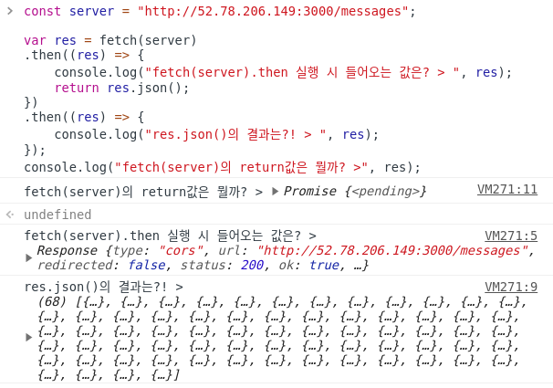

# [CODESTATES im16] Chatterbox-2

# 1.  fetch로 POST하기

**json**을 전송하는 POST 요청을 보내기.

```js
const body = { name: 'zerocho' };
fetch('https://www.zerocho.com/api/post/json', {
  method: 'POST',
  body,
  headers: new Headers(), // 이 부분은 따로 설정하고싶은 header가 있다면 넣으세요
}).then((res) => {
  if (res.status === 200 || res.status === 201) { // 성공을 알리는 HTTP 상태 코드
    res.json().then(json => console.log(json));
  } else {
    console.error(res.statusText);
  }
}).catch(err => console.error(err));
```


# 2. Sprint Office Hour

## 2-1. HTTP

http as protocol

method(GET/POST/PUT/DELETE)

```js
const options = {
    method: 'POST'.
    body: {...}
}
```


## 2-2. Fetch api

> [[MDN] Fetch API](https://developer.mozilla.org/en-US/docs/Web/API/Fetch_API)


`fetch` 의 경우 기본은 `'GET'`

```js
const server = "http://특정 서버 주소";

var res = fetch(server)
.then((res) => {
    console.log(res); //Response {...}
    return res.json();
})
.then((res) => {
    console.log(res); //{...}
    //위의 res와 지금 res는 뭐가 다를까?
    //그 둘은 다른 스코프상에 존재하기 때문에 이름만 같을 뿐 아예 다름!
    //위 then의 res는 Response형태
});
console.log(res); //Promise {<pending>}
//이 res 또한 위 둘의 res와는 다름: 다른 스코프라서~~
```

`Promise <pending>` :  데이터가 아직 처리되지 않았다.




## 2-3. chattetbox-sprint

test case를 잘 살펴야 한다.

**(정말 중요) !!코드를 짜기 전, test case에서 요구하는 것이 뭔지 먼저 보고 작업에 들어갈 것!! (매우 중요)**


### 1) init: init이 있는지

### 2) app behavior

* fetching
* sending
* chatroom behavior
  * clearMessage
  * renderMessage: fetching을 기반으로 렌더를 해라.


엑시오스axios(fetch와 비슷한 JS라이브러리)

tdd: 테스트 기반 개발

-> 단 하나의 일만 하는 함수를 만들어라.(유지보수면에서 좋음)