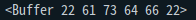

# [CODESTATES im16] server intro

1. 역할을 바꿔서 생각해보기.
2. 런타임이 OS.


* react: 변경점만 찾아서 반영해주는 기능이 있음.
  * 가상의 dom 환경을 만들어서 실제 dom과 차이가 있을 때에 그것만 반영해주는 기능이 있음.


프로퍼티로 저장 -> 불러올때 빠르지만 dom이 무거워짐

매번 호출 -> 불러올때마다 시간소요가 있지만 dom이 가벼워짐 


# 1. Event Loop

> [**[youyube. SconfEU] What the heck is the event loop anyway?**](https://youtu.be/8aGhZQkoFbQ)
>
> 이벤트 루프에 대해 이해하기 좋은 유튜브 동영상. 한글자막도 있다! 시간 날 때 다시 보고 정리할 것임.

event loop

callback queue

JS: single thread 언어 => 하나에 하나만 실행

## call stack

## blocking

## Event Loop


# 2. Intro CORS

Cross Origin Resource Sharing

cross origin에서 리소스(서버자원)을 요청하여 사용한다.

> 서버가 허용한 부분에 대해서 크로스 오리진을 허용함.

## OPTIONS

> [[MDN] OPTIONS](https://developer.mozilla.org/ko/docs/Web/HTTP/Methods/OPTIONS)


# 3. Node.js

* V8: JS를 기계어로 컴파일 해줌
* 런타임: 프로그래밍 언어가 구동되고 있는 환경
* Node.js: JS를 컴파일해주는 엔진으로 빌드된 JS가 구동중인 환경

## 이벤트 기반 및 논블로킹 I/O 모델

* 이벤트: 유저의 버튼 클릭이나 네트워크에 리소스를 요청 하는 것 등

논블로킹 vs 블로킹

- 블로킹 - 다음 함수의 실행이 현재 함수의 종료 이후에 이루어 지는 것.
  - 동기적

- 논블로킹 - 다음 함수의 실행이 현재 함수의 종료를 기다리지 않음.
  - 비동기적

I/O model 

* Input을 주면 Output을 반환하는 모델


**이벤트 기반 및 논블로킹 I/O 모델**

유저의 클릭이나 네트워크에 리소스를 요청 하는 이벤트가

논블로킹으로 이루어지는 Input Output model


# 4. My Server Intro

> https://nodejs.org/ko/docs/guides/anatomy-of-an-http-transaction/

## 서버 생성

모든 node 웹 서버 애플리케이션은 웹 서버 객체를 만들어야 합니다. 이 때 [`createServer`](https://nodejs.org/api/http.html#http_http_createserver_requestlistener)를 이용합니다.

```js
const http = require('http');

const server = http.createServer((request, response) => {
  // 여기서 작업이 진행됩니다!
});
```

이 서버로 오는 HTTP 요청마다 [`createServer`](https://nodejs.org/api/http.html#http_http_createserver_requestlistener)에 전달된 함수가 한 번씩 호출됨.

[`createServer`](https://nodejs.org/api/http.html#http_http_createserver_requestlistener)가 반환한 [`Server`](https://nodejs.org/api/http.html#http_class_http_server) 객체는 [`EventEmitter`](https://nodejs.org/api/events.html#events_class_eventemitter)이고 여기서는 `server` 객체를 생성하고 리스너를 추가하는 축약 문법을 사용한 것


```js
const server = http.createServer();
server.on('request', (request, response) => {
  // 여기서 작업이 진행됩니다!
});
```


## body 받아오기

```js
let body = [];
request.on('data', (chunk) => {
  body.push(chunk);
  console.log(chunk); //어떻게 나올까??
}).on('end', () => {
  body = Buffer.concat(body).toString();
  // 여기서 `body`에 전체 요청 바디가 문자열로 담겨있습니다.
});
```

> 
>
> 위 코드에서 `chunk`의 내용(ASKII코드 형식의 데이터가 입력된다.)

`.on()` : 이벤트리스너.

`.on('이벤트', ()=>{} )` >> 이 이벤트가 왔을 때 콜백 실행하기.

