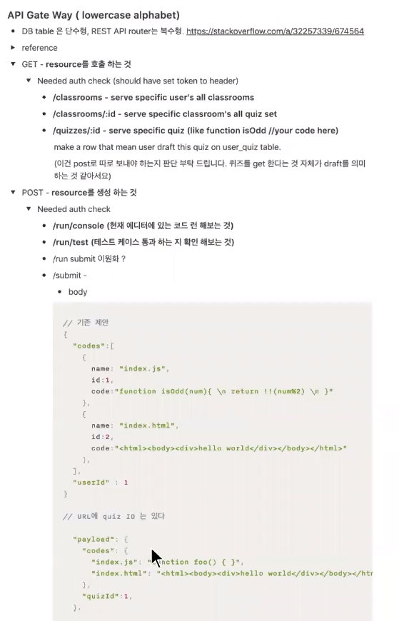
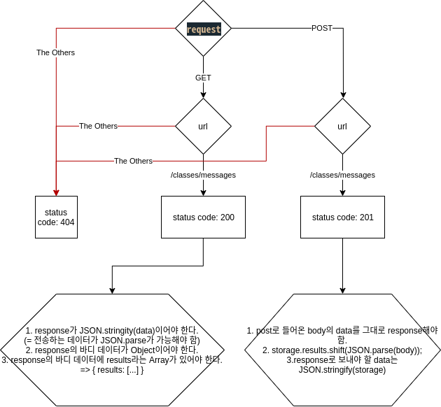

# [CODESTATES im16] Chatterbox-server

# 1. Intro Chatterbox-Server

## 1-1. http 서버 만들기

서버: 무엇인가를 제공하는 주체

http 서버: http protocol을 통해 통신해서 API를 제공하는 주체


## 1-2. 각 요청 분기하고 분기에 따른 API제공하기

### 라우팅routing

### 데이터의 저장

일단 DB를 배우지 않은 상태이기 때문에 JS의 오브젝트에 저장할 수 있다.

하지만 이럴 경우 서버가 재시작되면 사라짐.

* node.js의 file system을 활용하기(Advanced)
  * POST: `fs.writeFile`
  * GET: `fs.readFile`


## 1-3. API문서 제공하기

꼭 들어가야 할 것.

1. API 사용법(method, router, etc..)
2. 기대되는 return data 형식 및 예제




# 2. Pakage.json

nodemon 설치

```
$npm install --save nodemon
```

변경사항을 캐치해서 자동으로 재시작하는 코드.


# 3. Server

1. 한번의 요청에 한번의 응답
2. response.end()는 한번만

## option응답

* 정책에 부합: 200번대

* 부합하지 않음: 400번대

* ```js
  // - 1XX : 정보
  // - 100 : 서버가 요청의 일부를 받아들였으며, 나머지 요청을 더 기다리고있다.
  // - 101 : http에서 https같이 프로토콜 전환이 일어났을 때 전환이 승인되었음을 알려줌
  
  // - 2XX : 성공
  // - 200 : 요청 성공
  // - 201 : 새로운 컨텐츠 만들기 성공(Post의 응답으로 적절)
  // - 204 : 요청은 성공했지만, 응답할 컨텐츠 없음
  // - 206 : 요청에 대한 응답으로 일부만 먼저 전송한 경우 보냄
  
  // - 3XX : 리다이렉션
  // - 301 : 영구적으로 주소가 바뀌었을 경우, 301코드와 함께 새로운 주소로 이동시킴( 주소는 캐싱됨)
  // - 302 : 임시적으로 주소가 바뀌었을 경우(로그인 후 메인페이지로 이동 등) -> 대다수의 경우임
  // - 304 : 이전 방문 페이지와 다르지 않음_캐쉬된 페이지 그대로 사용
  // - 307 : 임시로 페이지 리다이렉트
  
  // - 4XX : 클라이언트 오류(에러)_서버가 요청을 이해하지 못함
  ```


# 4. Advanced

코드를 함수화해서 깔끔하게 하기.

`fs.writeFile`에다가 하면 바로 덮어쓰기. 그렇기 때문에 뒤에 추가하는 메서드를 찾아봐야 함.

혹은 `fs.readFil` `-- + message` `fs.writeFile


# 5. Chatterbox 알고리즘 도식화



대충 나와 페어님만 알아보면 되는 상황이었기 때문에 디자인 신경쓰지 않고 작성했다.

> 사용한 사이트: https://www.draw.io/ 


* API 설정 시 핵심 가치

> Authentication
> Authorization
> Access Control 