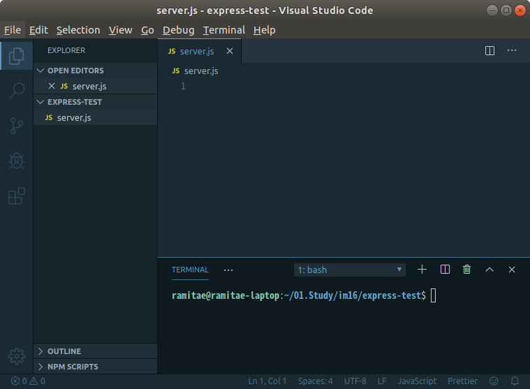
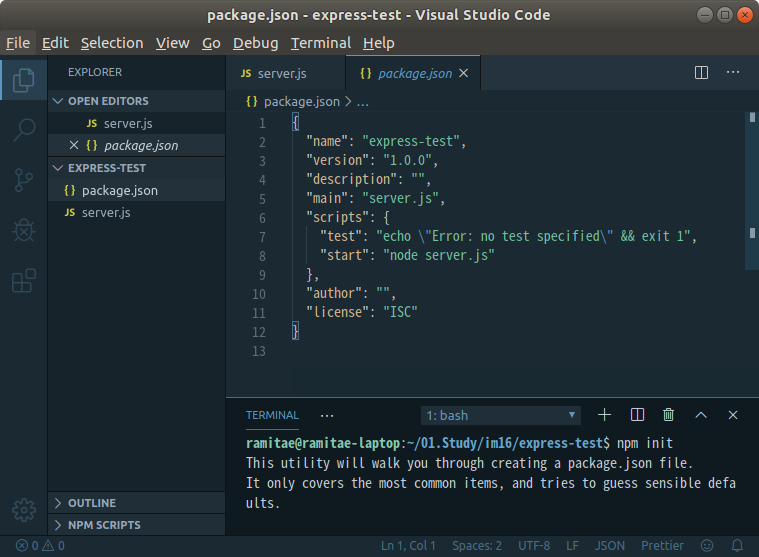
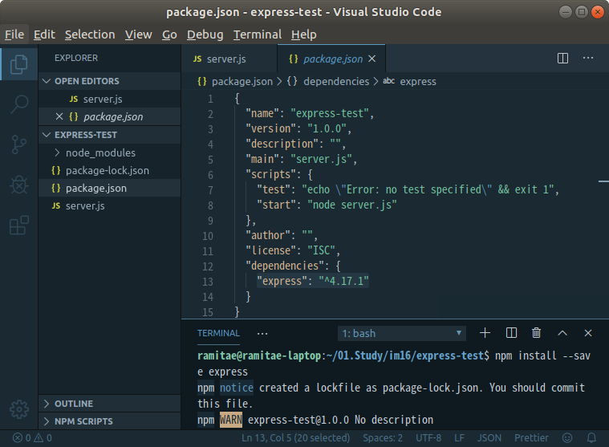
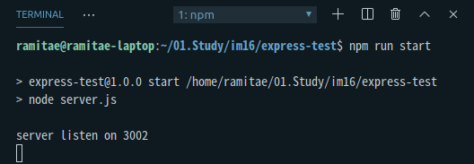
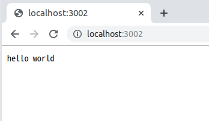

# [CODESTATES im16] 

# 1. Intro Express

http 서버를 위한 작지만 강력한 툴을 제공하는 프레임워크

**Express**: 자체적인 최소한의 기능을 갖춘 라우팅 및 미들웨어 웹 프레임워크

**Express 애플리케이션**: 기본적으로 일련의 미들웨어 함수 호출입니다.

- Middleware: 중간 공정

- Router: 어떤 네트워크 안에서 통신 데이터를 보낼 경로를 선택하는 과정

  > [wiki routing]([https://ko.wikipedia.org/wiki/%EB%9D%BC%EC%9A%B0%ED%8C%85](https://ko.wikipedia.org/wiki/라우팅))


express: 예외처리를 자동으로 해줌. > 다른 url의 경우 404를 자동으로 보내줌


---

## 1-1. Middleware

: 중간에서 받아들이는 것들.

> [[Express] 미들웨어의 사용](https://expressjs.com/ko/guide/using-middleware.html)

* [요청 오브젝트](https://expressjs.com/ko/4x/api.html#req)(`req`), [응답 오브젝트](https://expressjs.com/ko/4x/api.html#res) (`res`), 그리고 애플리케이션의 요청-응답 주기 중 그 다음의 미들웨어 함수 대한 액세스 권한을 갖는 함수. 그 다음의 미들웨어 함수는 일반적으로 `next`라는 이름의 변수로 표시됨.
* 컨베이어 벨트 위에 올라 가 있는 request에 무언가 악세사리를 덕지 덕지 붙이거나, 혹은 불량품이라면 밖으로 걷어내는 역할을 하는 express의 가장 강한 장점 중 하나

> 자주 쓰는 미들웨어
>
> - `req.on('data',()=>{})` 없이 data 받는법 https://www.npmjs.com/package/body-parser
>
> - 하지만 express.js도 빌트인 body parser를 넣었기 때문에(`4.x API`기준) 아래와 같이 사용해도 됨!
>
>   ```js
>   var express = require('express')
>   var app = express();
>   app.use(express.json())
>   app.post('/profile', function(req, res) => {
>     console.log(req.body)
>   })
>   ```
>
> - `cors header`설정 손쉽게 하는 법 https://www.npmjs.com/package/cors

---

## 1-2. Router

: 어떤 네트워크 안에서 통신 데이터를 보낼 경로를 선택하는 과정.

데이터를 보낼 **경로를 선택**하는 과정.

신호에 길을 찾아 주는 행위를 다 라우팅이라고 함.


---

## 1-3. Express를 사용하여 간단하게 서버 만들어보기

새 디렉토리를 만들고 거기다가 서버를 구성해보자.

일단 `express-test/`라는 디렉토리를 만들고 거기다가 `server.js`파일을 생성했다.




---

지금은 `package.json`파일도 없는 상태이기 때문에 `package.json`을 생성해야 한다.

```
$ npm init
```

해당 디렉토리의 터미널에서 `npm init`을 실행시키면 아래와 같은 `package.json`파일이 생성된다.




---

코드를 짜기 전 `express`도 설치해줘야 한다.

```js
$ npm install --save express
```

패키지 설치 시 `--save`명령어를 적어줘야 `package.json`의 `dependencies`에 새로 설치한 패키지와 그 버전이 자동으로 추가된다.

협업을 하거나 여러 환경에서 작업할 시 `package.json`의 `dependencies`에 사용하는 패키지의 정보가 없으면 안된다. 그럴 경우 `$ npm install`을 실행하더라도 코드에서 사용하는 패키지들이 설치되지 않기 때문이다!!




`package.json`의 `dependencies`에 `express`가 추가되었음을 확인할 수 있다.


---

이제 기본적인 환경설정은 끝났고 코딩만 하면 된다.


(server.js)

```js
const express = require('express');
const app = express();
const PORT = process.env.NODE_ENV === 'production' ? 3001: 3002;
//배포환경(production)일 경우 3001로, 개발환경(development, 상세한 에러메세지가 보이는 환경)일 경우 3002으로

app.listen(PORT, () => {
    console.log(`server listen on ${PORT}`);
})

```

이렇게 저장하고 터미널에서 아래를 실행하면 서버가 열린다.

```js
$ node server.js
```



하지만 지금은 서버 오픈만 진행한 상태이기 때문에 이 상태에서 브라우저나 postman등을 통해 http://localhost:3002/에 접근해도 오류가 난다.


---

(server.js)

```js
const express = require('express');
const app = express();
const PORT = process.env.NODE_ENV === 'production' ? 3001: 3002;
//배포환경(production)일 경우 3001로, 개발환경(development, 상세한 에러메세지가 보이는 환경)일 경우 3002으로

app.get('/', (request, response) => {
    response.end('hello world');
}); //get요청 추가

app.listen(PORT, () => {
    console.log(`server listen on ${PORT}`);
})

```

이제 http://localhost:3002/ 에 접근하면 브라우저에 아래와 같이 `hello world`가 뜰 것이다!




---

# 2. 서버 디버깅하기

> [[Node.js] 인스펙터 활성화](https://nodejs.org/ko/docs/guides/debugging-getting-started/)

`node --inspect /sfile.js`브라우저에서 확인할 수 있게 됨.

서버 테스팅 시 api단위로 테스트를 할 수 있게 한다.

postman으로 get요청, post요청을 테스트 해본 후 client를 작성하는 것이 좋다.


---

# 3.QnA

## Q. form-data가 뭔가?

ajax에서 formdata을 사용할 듯.


---

## Q. node에서의 라우팅과 네트워크에서의 라우팅의 차이

[라우팅](https://ko.wikipedia.org/wiki/%EB%9D%BC%EC%9A%B0%ED%8C%85)

라우팅: 신호에 길을 찾아 주는 행위를 다 라우팅이라고 함.

같은 단어를 다르게 쓰는 경우가 많으니 검색 시 `express 라우팅` 이런식으로 검색하는 것을 추천


---

# 알아보기 및 팁

> * [npm SuperTest](https://www.npmjs.com/package/supertest)
>
> * 새로운 package를 사용할 때 npmjs에서 어떻게 사용하는지 알아보기.
>
> * 사용 예제 찾는 방법: `express static example`등과 같이 `example`을 찾아보기.