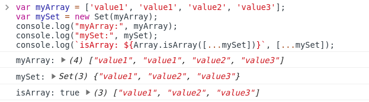

# [CODESTATES im16] Start React, ES6

# 1. What is "React"?

* 관리해야 할 DOM이 많아질수록 상태 관리가 힘들어짐(요즘의 웹페이지는 한두가지 이상의 상태를 관리해야 함). => 프론트 엔드 라이브러리, 프레임웍이 많이 생김. 그 중 하나가 react.

* UI(User-Interface)를 만들기 위한 자바스크립트 Library. React가 DOM에 접근을 하는 도구들을 제공해준다는 점은 기본 JavaScript 또는 jQuery와 같지만, 언어의 구조가 사람의 생각 구조에 가깝게 직관적(Declarative)임.

* component(하나의 의미를 가진 독립적인 단위 모듈)에 집중


> [React 공식 한글페이지](https://reactjs-kr.firebaseapp.com/)

* 선언형
  * React는 대화형 UI를 만드는 데 어려움을 줄입니다. 어플리케이션의 각 상태에 대한 간단한 뷰를 설계하면 React는 데이터가 변경될 때 적절한 구성요소만 효과적으로 업데이트하고 렌더링합니다.
  * 선언형 뷰는 코드를 예측 가능하고 디버그하기 쉽게 만듭니다.
* 컴포넌트 기반
  * 스스로 상태를 가지고 관리하는 캡슐화된 컴포넌트를 생성한 다음 복잡한 UI를 만들기 위해 구성합니다.
  * 컴포넌트 로직은 템플릿 대신 JavaScript로 작성되므로, 앱을 통해 풍부한 데이터를 쉽게 전달하고 DOM에서 상태를 유지할 수 있습니다.
* 한번 배우고, 어디서나 작성한다
  * 기술 스택의 나머지 부분에 대해 가정하지 않으므로, 기존 코드를 다시 작성하지 않고 React에서 새로운 기능을 개발할 수 있습니다.
  * React는 [React Native](https://facebook.github.io/react-native/)를 이용하여 강력한 모바일앱을 만들거나 Node를 사용한 서버에서 렌더링할 수도 있습니다.


---

# 2. React ES6 & JSX

## 2-1. 반드시 알아야 할 ES6 문법들

react는 기본적으로 es6문법을 따름

### 1) Destructuring(구조 분해)

> [[MDN] 구조 분해 할당](https://developer.mozilla.org/ko/docs/Web/JavaScript/Reference/Operators/Destructuring_assignment)

배열이나 객체의 속성을 해체하여 그 값을 개별 변수에 담을 수 있게 하는 JavaScript 표현식

```js
var a, b, rest;
[a, b] = [10, 20];
console.log(a); //10
console.log(b); //20

[a, b, ...rest] = [10, 20, 30, 40, 50];
console.log(a); //10
console.log(b); //20
console.log(rest); //[30, 40, 50]

({ a, b } = { a: 10, b: 20 });
console.log(a); // 10
console.log(b); // 20

({a, b, ...rest} = {a: 10, b: 20, c: 30, d: 40});
console.log(a); // 10
console.log(b); // 20
console.log(rest); // {c: 30, d: 40}

var x = [1, 2, 3, 4, 5];
var [y, z] = x;
console.log(y); // 1
console.log(z); // 2
```

 

#### 선언에서 분리한 할당

```js
var a, b;

[a, b] = [1, 2];
console.log(a); // 1
console.log(b); // 2
```

 

#### 기본값

```js
var a, b;

[a=5, b=7] = [1];
console.log(a); // 1
console.log(b); // 7
```


#### 변수 값 교환하기

```js
var a = 1, b = 3;

[a, b] = [b, a];
console.log(a); // 3
console.log(b); // 1
```

 

#### 일부 반환 값 무시하기

```js
function f() {
    return [1, 2, 3];
}

var [a, , b] = f();
console.log(a); // 1
console.log(b); // 3

//반환 값을 모두 무시할 수도 있음
[,,] = f();
```

 

#### 새로운 변수 이름으로 할당하기

```js
var o = {p: 42, q: true};
var {p: foo, q: bar} = o;
//[foo, bar] = [42, true] 와 결과가 같다.

console.log(foo); // 42
console.log(bar); // true
//신기하다
```

 

### 2) spread operator(전개 구문)

> [[MDN] 전개 구문](https://developer.mozilla.org/ko/docs/Web/JavaScript/Reference/Operators/Spread_syntax)

배열이나 문자열과 같이 반복 가능한 문자를 0개 이상의 인수 (함수로 호출할 경우) 또는 요소 (배열 리터럴의 경우)로 확장하여, 0개 이상의 키-값의 쌍으로 객체로 확장시킬 수 있음.

```js
function sum(x, y, z) {
  return x + y + z;
}

const numbers = [1, 2, 3];

console.log(sum.apply(null, numbers)); //6
console.log(sum(...numbers)); //6
//함수에 배열을 인자로 넣고 싶을 대, apply대신 배열을 전개해서 사용할 수 있다.
```

 

#### 구문

```js
//함수 호출
myFunction(...iterableObj);

//배열 리터럴과 문자열
[...iterableObj, '4', 'five', 6];

//객체 리터럴(ECMAScript 2018에서 추가)
let obj = {a: 1, b: 2};
let objClone = { ...obj }; //얕은 복사
console.log(objColne); //{a: 1, b: 2}
```

 

#### 배열의 연결(concat 대신 사용)

```js
//concat을 사용한 예제
var arr1 = [0, 1, 2];
var arr2 = [3, 4, 5];
arr1 = arr1.concat(arr2); //arr1: [0, 1, 2, 3, 4, 5]
```

 

``` js
//전개를 사용한 예제
var arr1 = [0, 1, 2];
var arr2 = [3, 4, 5];
arr1 = [...arr1, ...arr2]; //arr1: [0, 1, 2, 3, 4, 5]
```


 

### 3) rest parameters

> [[MDN] Rest 파라미터](https://developer.mozilla.org/ko/docs/Web/JavaScript/Reference/Functions/rest_parameters)

정해지지 않은 수(an indefinite number, 부정수) 인수를 배열로 나타낼 수 있게 함.

```js
function sum(...theArgs) {
  return theArgs.reduce((previous, current) => {
    return previous + current;
  });
}

console.log(sum(1, 2, 3)); //6
console.log(sum(1, 2, 3, 4)); //10
```

 

#### Rest 파라미터와 arguments 객체간의 차이

- Rest 파라미터는 구분된 이름(예, 함수 표현에 정식으로 정의된 것)이 주어지지 않은 유일한 대상인 반면, `arguments` 객체는 함수로 전달된 모든 인수를 포함합니다.
- `arguments` 객체는 실제 배열이 아니고 rest 파라미터는 [`Array`](https://developer.mozilla.org/ko/docs/Web/JavaScript/Reference/Global_Objects/Array) 인스턴스로, [`sort`](https://developer.mozilla.org/ko/docs/Web/JavaScript/Reference/Global_Objects/Array/sort), [`map`](https://developer.mozilla.org/ko/docs/Web/JavaScript/Reference/Global_Objects/Array/map), [`forEach`](https://developer.mozilla.org/ko/docs/Web/JavaScript/Reference/Global_Objects/Array/forEach) 또는 [`pop`](https://developer.mozilla.org/ko/docs/Web/JavaScript/Reference/Global_Objects/Array/pop) 같은 메서드가 바로 인스턴스에 적용될 수 있음을 뜻합니다.
- 즉 `arguments` 객체는 자체에 특정 추가 기능이 있습니다 (`callee` 속성처럼).

 

#### Rest 파라미터 해체

```js
function f(...[a, b, c]) {
  return a + b + c;
}

f(1)          // NaN (b 와 c 가 undefined)
f(1, 2, 3)    // 6
f(1, 2, 3, 4) // 6 (4번 째 파라미터는 해체되지 않음)
```

 

#### 예제

이렇게도 쓸 수 있다!

```js
function myFun(a, b, ...manyMoreArgs) {
  console.log("a", a); 
  console.log("b", b);
  console.log("manyMoreArgs", manyMoreArgs); 
}

myFun("one", "two", "three", "four", "five", "six");
// a, one
// b, two
// manyMoreArgs, [three, four, five, six]
```

 

### 4) default parameters(기본 매개변수)

기본 함수 매개변수(**default function parameter**)를 사용하면 값이 없거나 `undefined`가 전달될 경우 매개변수를 기본값으로 초기화할 수 있음.

```js
function multiply(a, b = 1) {
  return a * b;
}

console.log(multiply(5, 2)); //10
console.log(multiply(5)); //5
```

 

### 5) template literals

> [[MDN] Template literals](https://developer.mozilla.org/ko/docs/Web/JavaScript/Reference/Template_literals)

 내장된 표현식을 허용하는 문자열 리터럴입니다. 여러 줄로 이뤄진 문자열과 문자 보간기능을 사용할 수 있습니다. 이전 버전의 ES2015사양 명세에서는 "template strings" (템플릿 문자열) 라고 불려 왔습니다.

 

#### 구문

 이중 따옴표나 작은 따옴표 대신 백틱(`)([grave accent](http://en.wikipedia.org/wiki/Grave_accent)) 을 이용합니다.

 템플릿 리터럴은 또한 플레이스 홀더를 이용하여 표현식을 넣을 수 있는데, 이는 $와 중괄호( `$ {expression}` ) 로 표기할 수 있습니다. 플레이스 홀더 안에서의 표현식과 그 사이의 텍스트는 함께 함수로 전달됩니다. 기본 함수는 단순히 해당 부분을 단일 문자열로 연결시켜 줍니다. 템플릿 리터럴 앞에 어떠한 표현식이 있다면(여기에서는 태그), 템플릿 리터럴은 "태그가 지정된 템플릿"이라고 불리게 됩니다. 이 때, 태그 표현식 (주로 함수)이 처리된 템플릿 리터럴과 함께 호출되면, 출력하기 전에 조작할 수 있습니다. 템플릿 리터럴 안의 백틱을 벗어나려면 백틱 앞에 백슬러쉬(`\`)를 넣으십시오.

```js
var text = `hello`;
console.log(`text: ${text}, type: ${typeof text}`);
//text: hello, type: string
```


### 6) arrow function(화살표 함수)

> [[MDN] 화살표 함수]([https://developer.mozilla.org/ko/docs/Web/JavaScript/Reference/Functions/%EC%95%A0%EB%A1%9C%EC%9A%B0_%ED%8E%91%EC%85%98](https://developer.mozilla.org/ko/docs/Web/JavaScript/Reference/Functions/애로우_펑션))

화살표 함수 표현(**arrow function expression**)은 [function 표현](https://developer.mozilla.org/ko/docs/Web/JavaScript/Reference/Operators/function)에 비해 구문이 짧고  자신의 [this](https://developer.mozilla.org/ko/docs/Web/JavaScript/Reference/Operators/this), [arguments](https://developer.mozilla.org/ko/docs/Web/JavaScript/Reference/Functions/arguments), [super](https://developer.mozilla.org/ko/docs/Web/JavaScript/Reference/Operators/super) 또는 [new.target](https://developer.mozilla.org/ko/docs/Web/JavaScript/Reference/Operators/new.target)을 바인딩 하지 않습니다. 화살표 함수는 항상 [익명](https://developer.mozilla.org/ko/docs/Web/JavaScript/Reference/Global_Objects/Function/name)입니다. 이  함수 표현은 메소드 함수가 아닌 곳에 가장 적합합니다. 그래서 생성자로서 사용할 수 없습니다.

```js
var materials = [
  'Hydrogen',
  'Helium',
  'Lithium',
  'Beryllium'
];

console.log(materials.map(material => material.length));
//Array [8, 6, 7, 9]
```

 

### 7) for-of loop

> [[MDN] for...of](https://developer.mozilla.org/ko/docs/Web/JavaScript/Reference/Statements/for...of)

**`for...of` 명령문**은 [반복가능한 객체](https://developer.mozilla.org/ko/docs/Web/JavaScript/Reference/Iteration_protocols#iterable) ([`Array`](https://developer.mozilla.org/ko/docs/Web/JavaScript/Reference/Global_Objects/Array), [`Map`](https://developer.mozilla.org/ko/docs/Web/JavaScript/Reference/Global_Objects/Map), [`Set`](https://developer.mozilla.org/ko/docs/Web/JavaScript/Reference/Global_Objects/Set), [`String`](https://developer.mozilla.org/ko/docs/Web/JavaScript/Reference/Global_Objects/String), [`TypedArray`](https://developer.mozilla.org/ko/docs/Web/JavaScript/Reference/Global_Objects/TypedArray), [arguments](https://developer.mozilla.org/ko/docs/Web/JavaScript/Reference/Functions/arguments) 객체 등을 포함)에 대해서 반복하고 각 개별 속성값에 대해 실행되는 문이 있는 사용자 정의 반복 후크를 호출하는 루프를 생성합니다.

```js
const array1 = ['a', 'b', 'c'];

for (const element of array1) {
  console.log(element);
}
// expected output: "a"
// expected output: "b"
// expected output: "c"
```

 

#### 구문

```js
const array1 = ['a', 'b', 'c'];

for (const element of array1) {
  console.log(element);
}

// expected output: "a"
// expected output: "b"
// expected output: "c"
```

`for...in`구문과 비슷하지만 `for...in`은 객체의 `key`값을 받아옴.

`for...of`는 반복가능한 객체의 값을 받아옴.


## 2-2. JSX

자바 스크립트의 확장 문법

1. 반드시 하나의 엘리먼트로 감싸야 한다.

2. 자바스크립트 코드를 적용할 땐 { } 안에 작성한다.

3. JSX 내부에선 if문을 사용할 수 없다. IIFE or 삼항연산자 사용

4. 엘리먼트의 클래스 이름을 적용할 때, className 을 사용(class는 ES6에 존재하기 때문)

 

> [[React] JSX소개](https://reactjs-kr.firebaseapp.com/docs/introducing-jsx.html)

 

---

# 기타

## 1) Map 객체

> [[MDN] Map](https://developer.mozilla.org/ko/docs/Web/JavaScript/Reference/Global_Objects/Map)

**`Map`** 객체는 키-값 쌍을 저장하며 각 쌍의 삽입 순서도 기억합니다. 아무 값(객체, [원시 값](https://developer.mozilla.org/ko/docs/Glossary/Primitive))이나 키 또는 값으로 사용할 수 있습니다.

```js
var myMap = new Map();

var keyString = "어떤 문자열",
    keyObj = {},
    keyFunc = function () {};

// 값 저장하기
myMap.set(keyString, "'어떤 문자열'과 연결된 값");
myMap.set(keyObj, "keyObj와 연결된 값");
myMap.set(keyFunc, "keyFunc와 연결된 값");

myMap.size; // 3

// 값 불러오기
myMap.get(keyString);    // "'어떤 문자열'과 연결된 값"
myMap.get(keyObj);       // "keyObj와 연결된 값"
myMap.get(keyFunc);      // "keyFunc와 연결된 값"

//아래의 결과는 Shallow copy, Deep copy와 관련있음.
myMap.get("어떤 문자열");   // "'어떤 문자열'과 연결된 값"
                         // 왜냐면 keyString === '어떤 문자열'
myMap.get({});           // undefined, keyObj !== {}
myMap.get(function() {}) // undefined, keyFunc !== function () {}
```

> Shallow Copy, Deep Copy: https://ram-t.tistory.com/16


## 2) Set 객체

> [[MDN] Set](https://developer.mozilla.org/ko/docs/Web/JavaScript/Reference/Global_Objects/Set)

**`Set`** 객체는 자료형에 관계 없이 [원시 값](https://developer.mozilla.org/ko/docs/Glossary/Primitive)과 객체 참조 모두 유일한 값을 저장할 수 있습니다.

```js
const set1 = new Set([1, 1, 2, 2, 3, 4, 5]);

console.log(set1); //Set(5) {1, 2, 3, 4, 5}
console.log(set1.has(1)); //true
console.log(set1.has(5)); //true
console.log(set1.has(6)); //false
```

 

### Array 객체와의 관계

```js
var myArray = ['value1', 'value2', 'value3'];

// Array를 Set으로 변환하기 위해서는 정규 Set 생성자 사용
var mySet = new Set(myArray);

mySet.has('value1'); // true 반환

// set을 Array로 변환하기 위해 전개 연산자 사용함.
console.log([...mySet]); // myArray와 정확히 같은 배열을 보여줌
```

