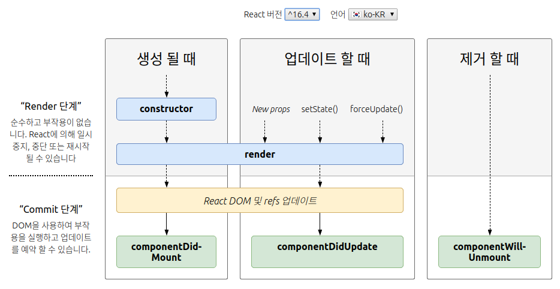

# [CODESTATES im16] React Key Concept

# 1. Data flow

단방향 데이터 흐름

부모 컴포넌트에서 자식 컴포넌트로 데이터가 흐름. > 자식컴포넌트가 직접적으로 부모 컴포넌트에게 데이터를 전달해줄 수 없음.


 

---

# 2. 컴포넌트와 Props

Props: 상위 컴포넌트가 하위 컴포넌트에게 내려주는 데이터(속성)

* 단순히 사용만 할 수 있다.
* 변경할 수 없다.

 

> [[React] 컴포넌트와 props](https://reactjs-kr.firebaseapp.com/docs/components-and-props.html)

컴포넌트를 사용하면 UI를 독립적이고 재사용 가능한 부분으로 분리하고 각 부분을 독립적으로 생각할 수 있음.

* 개념상 컴포넌트는 자바스크립트 함수와 비슷함. 임의의 입력 (“props”라고 부르는)을 받아들이고 어떤 게 화면에 나타나야 하는 지를 설명하는 React 요소를 반환함.

 

## 2-1. 함수형 및 클래스 컴포넌트

컴포넌트는 자바스크립트의 함수형 및 클래스형으로 작성할 수 있다.


1. 아래는 함수형으로 작성한 컴포넌트

```react
function Welcome(props) {
    return <h1>Hello, {props.name}</h1>;
}
```


2. 아래는 `ES6`를 사용해 작성한 컴포넌트

```react
class Welcome extends React.Component {
    render() {
        return <h1>Hello, {props.name}</h1>;
    }
}
```


위의 두 컴포넌트는 React 관점에서 보면 동일하지만 `ES6`의 클래스 기능을 사용한 컴포넌트가 몇가지 기능을 더 가지고 있음.

 

## 2-2. 컴포넌트 렌더링

**props**: React가 유저가 정의한 컴포넌트를 나타내는 요소를 볼 때 JSX 속성을 이 컴포넌트에 단일 객체로 전달하는데, 이 객체를 props라고 부름

```jsx
function Welcome(props) {
  return <h1>Hello, {props.name}</h1>;
}

const element = <Welcome name="Rami" />;
ReactDOM.render(
  element,
  document.getElementById('root')
);
```


여기서의 props: `{ name: 'rami' }`

**컴포넌트의 이름은 항상 대문자로 시작해야 함.**

 

## 2-3. 컴포넌트 결합

컴포넌트는 출력될 때 다른 컴포넌트를 참조할 수 있습니다. 이를 통해 모든 세부 레벨에서 동일한 컴포넌트 추상화를 사용할 수 있습니다.

아래와 같이 사용 가능.

```jsx
function Welcome(props) {
  return <h1>Hello, {props.name}</h1>;
}

function App() {
  return (
    <div>
      <Welcome name="Sara" />
      <Welcome name="Cahal" />
      <Welcome name="Edite" />
    </div>
  );
}

ReactDOM.render(
  <App />,
  document.getElementById('root')
);
```


[Try it on CodePen](https://reactjs-kr.firebaseapp.com/redirect-to-codepen/components-and-props/composing-components).

 

## 2-4. Props는 읽기전용

**props는 수정할 수 없음.**

  

---

# 3. State & Life Cycle

## 3-1. State

컴포넌트가 갖는 상태.
**객체**의 형태로 컴포넌트 내에서 보관하고 관리한다.

### 1) class 컴포넌트로 작성되어야 한다

### 2) 반드시 **setState** 메서드로 값을 변경

state의 값을 직접적으로 변경하면 안됨.

* state 값 변경 ( setState 메서드 사용 ) ==> render() 함수가 실행

```jsx
class Foo extends Component{
    state = {
        a: 10,
        b: false
    }
	changeState() {        
        //this.state.a = 100; //!!!!직접 바꾸면 안 됨!!!!
        this.setState({
            a: 100
        })
    }
}
```

### 3) State 업데이트는 비동기일 수 있다

* React는 여러 `setState()` 호출을 성능을 위해 단일 업데이트로 배치할 수 있습니다.

* `this.props` 및 `this.state` 가 비동기로 업데이트될 수 있기 때문에, 다음 state를 계산할 때 해당 값을 신뢰해서는 안됩니다.

* 예를 들어, 카운터를 업데이트하는 이 코드는 실패할 수 있습니다.

  ```jsx
  // Wrong
  this.setState({
    counter: this.state.counter + this.props.increment,
  });
  ```

* 이 문제를 해결하기 위해 객체가 아닌 함수를 받는 두 번째 형식의 `setState()` 를 사용할 수 있습니다.

  ```jsx
  // Correct
  this.setState((prevState, props) => ({
    counter: prevState.counter + props.increment
  }));
  ```

### 4) State Update는 병합됨

* `setState()` 를 호출할 때, React는 현재 state와 제공한 객체를 병합합니다.

  ```jsx
  constructor(props) {
      super(props);
      this.state = {
          posts: [],
          comments: []
      };
  }
  
  componentDidMount() {
      fetchPosts().then(response => {
        this.setState({
          posts: response.posts
          //여기서의 setState()는 posts만 변경할 뿐 comments는 건드리지 않음.
        });
      });
  
      fetchComments().then(response => {
        this.setState({
          comments: response.comments
          //여기서의 setState()는 comments만 변경할 뿐 posts는 건드리지 않음.
        });
      });
    }
  ```

### 5) 데이터는 아래로 흐름

* 부모 컴포넌트나 자식 컴포넌트는 특정 컴포넌트의 state 유무를 알 수 없으며 해당 컴포넌트가 함수나 클래스로 선언되었는 지 알 수 없습니다.

 

**State는 props와 비슷하지만 컴포넌트에 의해 완전히 제어되며 private 속성이다.**


## 3-2. Life Cycle(중요)

컴포넌트가 브라우저에 보여질 때, 업데이트될 때, 사라질 때 각 단계 전,후로 특정 메서드가 호출된다.



> [[React] 위 이미지 링크](http://projects.wojtekmaj.pl/react-lifecycle-methods-diagram/)

* 많은 컴포넌트를 가진 어플리케이션에서, 컴포넌트가 제거될 때 리소스를 풀어주는 건 아주 중요한 일
* 컴포넌트가 DOM에 최초로 렌더링 될 때 React에서 이를 “mounting” 이라고 부릅니다.
  * 메서드명은 `componentDidMount`라고 써야 함.
* DOM에서 컴포넌트를 삭제할 때 React에서 이를 “unmounting” 이라고 부릅니다.
  * 메서드명은 `componentWillUnmount`이다.

컴포넌트가 마운트 (mount) 되고 언마운트 (unmount) 될 때 특정 코드를 실행하기 위해 컴포넌트 클래스에 특별한 메서드를 선언할 수 있고 이런 메서드들을 “라이프사이클 훅” 이라고 부릅니다.


## 3-3. State와 Life Cycle로 타이머 만들기

```jsx
//변경 전 타이머
function tick() {
  const element = (
    <div>
      <h1>Hello, world!</h1>
      <h2>It is {new Date().toLocaleTimeString()}.</h2>
    </div>
  );
  ReactDOM.render(
    element,
    document.getElementById('root')
  );
}

setInterval(tick, 1000);
```

[Try it on CodePen.](http://codepen.io/gaearon/pen/gwoJZk?editors=0010)

위 CodePen에서 추가, 삭제해가며 해보기

 

### 1) 클래스화

```jsx
//클래스로 Clock컴포넌트 생성
class Clock extends React.Component {
  render() {
    return (
      <div>
        <h1>Hello, world!</h1>
        <h2>It is {this.props.date.toLocaleTimeString()}.</h2>
      </div>
    );
  }
}

function tick() {
  ReactDOM.render(
    <Clock date={new Date()} />,
    document.getElementById('root')
  );
}

setInterval(tick, 1000);
```

 

### 2) 클래스에 로컬 state 추가

`date`를 `props`에서 `state`로 옮기기 위한 세 단계.

1. `render()` 메서드 내의 `this.props.date` 를 `this.state.date` 로 바꿉니다.
2. `this.state` 를 초기화 하는 [클래스 생성자](https://developer.mozilla.org/en/docs/Web/JavaScript/Reference/Classes#Constructor) 를 **추가**합니다.
   * 기존의 props를 없애는 것이 아니기 때문에 props는 상속받아오고 state(여기선 date)만 새로 만든다.
3. `<Clock />`요소에서 `date` prop을 삭제합니다.


```jsx
class Clock extends React.Component {
  constructor(props) {
    super(props);
    this.state = {date: new Date()};
  }
  render() {
    return (
      <div>
        <h1>Hello, world!</h1>
        <h2>It is {this.state.date.toLocaleTimeString()}.</h2>
      </div>
    );
  }
}

ReactDOM.render(
  <Clock />,
  document.getElementById('root')
);
```

 

### 3) 클래스에 라이프사이클 메서드 추가

```jsx
class Clock extends React.Component {
  constructor(props) {
    super(props);
    this.state = {date: new Date()};
  }
  
  componentDidMount() {
    this.timerID = setInterval( () => this.tick(), 1000);
  }
  
  componentWillUnmount() {
    clearInterval(this.timerID);
  }
  
  tick() {
    this.setState({ date: new Date() });
  }
  
  render() {
    return (
      <div>
        <h1>Hello, world!</h1>
        <h2>It is {this.state.date.toLocaleTimeString()}.</h2>
      </div>
    );
  }
}

ReactDOM.render(
  <Clock />,
  document.getElementById('root')
);

```


