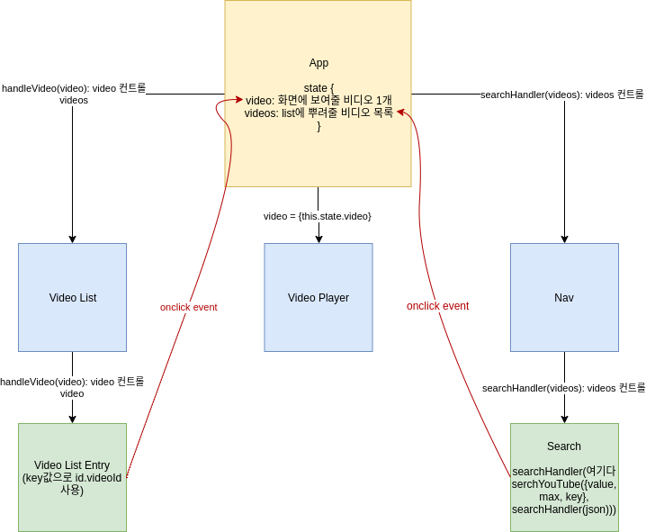

# [CODESTATES im16] Recast.ly

# 1. Recast.ly

recastly의 컴포넌트간 props 및 state flow 다이어그램

# 2. Sprint Office Hour

## 2-1. component

* 독립적이고, 재사용 가능한 코드의 집합
* 컴포넌트 합성: 컴포넌트 안의 컴포넌트
* Class & function component

## 2-2. class vs function

차이: 

* class: state, life cycle사용 가능
  * constructor는 상황에 따라 생략 가능(state를 사용하지 않는 경우 생성자를 쓰지 않아도 됨)
  * 하지만 `render()`는 필수이다.
* function: class보다 가벼움

## 2-3. props

* HTML 속성을 통해 하위 컴포넌트에 전달되는 인자
* 부모 컴포넌트가 자식 컴포넌트에게 넘겨주는 데이터
* **읽기 전용**

## 2-4. Life Cycle

* `componentDidMount`: 서버와 통신받은 값을 비동기 처리 시 많이 쓰임.
* `componentDidUpdate`: 이전 porps, 이전 state를 인자로 받음. 이전 데이터와 실행되고 있는 데이터를 비교해서 처리를 해야할 경우에 많이 쓰임
* `componentWillUnmount`: 컴포넌트에 걸려 있는 이벤트들을 제거할 때 사용. 
  * ex) 특정 컴포넌트가 인터벌로 서버에 요청을 보냄. 컴포넌트가 사라질 때 해당 인터벌 요청을 clear하는 작업을 함

## 2-5. this binding

Arrow Function Binding은 퍼포먼스 이슈가 있기 때문에 Constructor binding방법을 추천

### arrow function

항상 부모의 this를 바인딩하기 때문에 arraw function을 사용하면 binding을 안해줘도 됨.

## QnA

### Q. this binding문제 발생 시 this가 undefind되는 이유

클래스가 엄격 모드로 작동하기 때문에 method를 props로 내려줄 때 this binding문제 발생 시 this가 window가 아닌 undefined가 된다.

### Q. App constructor에서 fetch해도 되는가?

안됨. fetch요청은 비동기로 실행되기 때문에 render시 오류가 날 수 있음.

=> componentDidMount에서 Ajex요청을 보내야 함

> References
>
> constructor없이 사용하는 state: https://www.robinwieruch.de/react-state-without-constructor
>
> 리액트에서 발생하는 this binding이슈에 대한 글: https://www.freecodecamp.org/news/this-is-why-we-need-to-bind-event-handlers-in-class-components-in-react-f7ea1a6f93eb/
>
> 왜 super(props)를 사용하는지: https://overreacted.io/why-do-we-write-super-props/
>
> http://cheng.logdown.com/posts/2016/03/26/683329