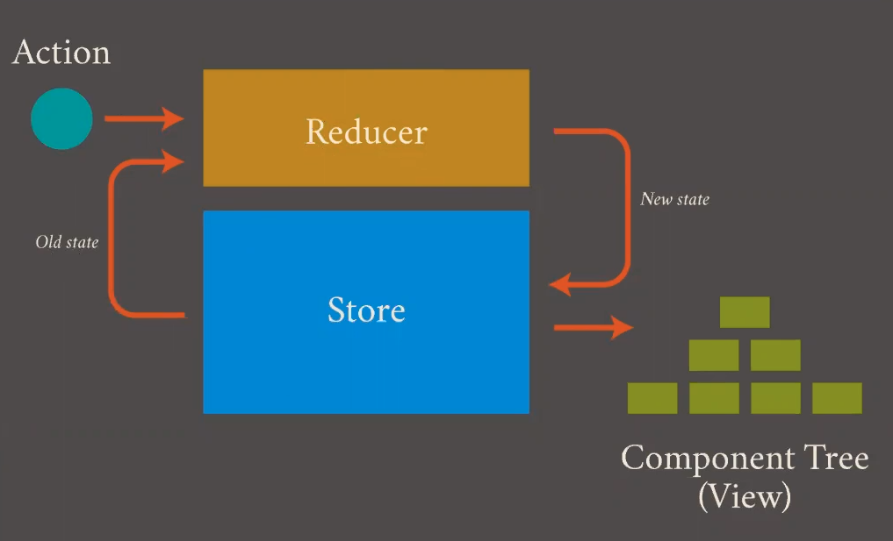

# [CODESTATES in16] intro Redux

redux: Js에서 사용할 수 있는 state container

# 1. Intro Redux

## 1-1. 컴포넌트 간 정보 공유 방식

* react: 자식 컴포넌트 간 데이터를 주고받을 대, 부모 컴포넌트를 통해서만 주고받는다.
  * 친척 컴포넌트 간 데이터를 주고받아야 한다면? 상태 관리가 힘들어짐.

## 1-2. Redux의 기본 개념

* Single source of truth: **store**
  * 컴포넌트들의 상태를 저장
  * 상태가 관리되는 공간은 오직 하나: 외부에 존재하는 하나의 store
* State is read-only: **Action**
  * 어떤 행동(Action)과 그에 따라 상태를 변경해주는 메소드들의 집합
  * Action: Simple JavaScript Object
* Changes are made with pure functions: **Reducer**
  * 개념적으로 Store내부에 존재하며 Action메소드에서 변경한 상태를 받아 기존의 상태를 새로운 상태로 변경하는 역할
  * 현재 상태와 Action을 이용해 다음 상태를 만들어냄

## 1-3. 데이터 흐름

## 1-4. Redux의 장점

* 상태를 예측 가능하게 만들어줌
  * (볼 수 있는)Reducer를 통해 다음의 state를 예측할 수 있음.
* 유지보수 용이
* 디버깅에 유리함(action과 state 로그를 기록하도록 한다면)
* 테스트를 붙이기 쉽다.(순수함수를 사용하기 때문)
