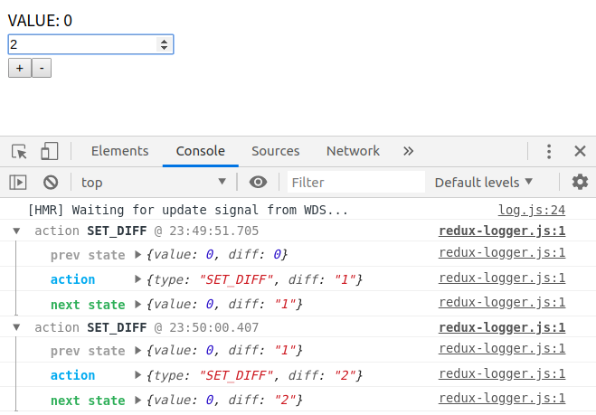

# 1. Redux

## 1-1. Store

> https://redux.js.org/api/store
>
> 영어로 된 Docs읽느라 힘들었는데 찾아보니 한글번역사이트가 있었다!!!: https://deminoth.github.io/redux/api/Store.html

A store holds the whole [state tree](https://redux.js.org/glossary#state) of your application. The only way to change the state inside it is to dispatch an [action](https://redux.js.org/glossary#action) on it.

A store is not a class. It's just an object with a few methods on it. To create it, pass your root [reducing function](https://redux.js.org/glossary#reducer) to [`createStore`](https://redux.js.org/api/createstore).

## 1) getState()

**Returns the current state tree of your application**. It is equal to the last value returned by the store's reducer.

## 2) dispatch(action)

> https://deminoth.github.io/redux/api/Store.html#dispatch

액션을 보냅니다. 이것이 상태 변경을 일으키기 위한 유일한 방법입니다.

스토어의 리듀싱 함수는 [`getState()`](https://deminoth.github.io/redux/api/Store.html#getState)의 현재 결과와 주어진 `액션`과 함께 동기적으로 호출됩니다. 반환된 값이 다음 상태가 되어 이제부터 [`getState()`](https://deminoth.github.io/redux/api/Store.html#getState)에서 반환될 것이고, 상태 변경 리스너들은 즉시 알림을 받을 것입니다.

### Arguments

* `action` (*Object*†): 앱의 변경사항을 기술하는 평범한 객체입니다. 액션은 스토어로 데이터를 보내는 유일한 방법이기 때문에 UI 이벤트, 네트워크 콜백, 웹소켓 등 다른 어떤 소스에서 오는 데이터든간에 액션을 통해 보내져야 합니다. 액션은 반드시 어떤 형태의 액션이 행해질지 지시하는 `type` 필드를 가져야 합니다. `type`에는 [Symbols](https://developer.mozilla.org/en/docs/Web/JavaScript/Reference/Global_Objects/Symbol) 보다는 문자열을 사용하는 편이 직렬화가 가능하기 때문에 더 낫습니다. `type` 외에 액션 객체의 구조는 여러분에게 달려 있습니다. 관심이 있다면 액션을 어떻게 구성하는것을 추천하는지 [Flux Standard Action](https://github.com/acdlite/flux-standard-action)에서 확인해보세요.

### Returns

* (Object†): The dispatched action.

### Notes

† [`createStore`](https://deminoth.github.io/redux/api/createStore.html) 호출에서 얻을 수 있는 평범한(vanilla) 스토어는 평범한 오브젝트만을 액션으로 받을 수 있으며 받은 액션은 바로 리듀서에 넘깁니다.

하지만 [`createStore`](https://deminoth.github.io/redux/api/createStore.html)를 [`applyMiddleware`](https://deminoth.github.io/redux/api/applyMiddleware.html)로 감싸면 미들웨어가 액션을 중간에 다르게 처리해서 [비동기 액션](https://deminoth.github.io/redux/Glossary.html#비동기-액션)을 보낼 수 있게 해줍니다. 비동기 액션은 보통 Promise, Observable, thunk와 같은 비동기 원시 타입입니다.

미들웨어는 커뮤니티에서 만들어지고 Redux에 기본적으로 포함되어 나오지는 않습니다. 사용하기 위해서는 [redux-thunk](https://github.com/gaearon/redux-thunk)나 [redux-promise](https://github.com/acdlite/redux-promise) 같은 패키지를 직접 설치해줘야 합니다. 여러분이 직접 미들웨어를 만들 수도 있습니다.

비동기적으로 API를 호출하거나, 액션 생산자 안에서 현재 상태를 읽거나, 사이드이펙트를 일으키거나, 이들을 순차적으로 엮는 방법을 알아보려면 [`applyMiddleware`](https://deminoth.github.io/redux/api/applyMiddleware.html)의 예시를 보세요.

## 3) subscribe(listner)

> https://deminoth.github.io/redux/api/Store.html#subscribelistener

변경사항에 대한 리스너를 추가합니다. 리스너는 액션이 보내져서 상태 트리의 일부가 변경될 수 있을 때마다 호출됩니다. 콜백 안에서 현재 상태 트리를 읽으려면 [`getState()`](https://deminoth.github.io/redux/api/Store.html#getState)를 호출하면 됩니다.

store에 변경사항이 생길 때 마다 listner가 실행됨.

### Arguments

* `listener` (*Function*): 액션이 보내져서 **상태 트리가 바뀌게 될 때마다 호출**할 **콜백**입니다. 현재 상태 트리를 읽기 위해 콜백 내에서 [`getState()`](https://deminoth.github.io/redux/api/Store.html#getState)를 호출할 수 있습니다. 스토어의 리듀서는 순수 함수일 것이므로 상태 트리의 값이 변경되었는지 확인하기 위해 레퍼런스를 비교할 수 있습니다.

##  createStore()

## 4) connect()

## redux-logger

# 2. Sprint Office Houre

**[CODESTATES im16]**

기본 개념: store, action

## 컨테이너와 컴포넌트의 차이

컴포넌트: 데이터 받아와서 그려줌.

컨테이너: 데이터 받아와서 컴포넌트에 프롭스를 넘겨줌.

=> 코드 분리를 통해 가독성이 좋아짐

글로벌한 store를 만들어서 모든 컴포넌트들에게 길을 터줌(state를 글로벌하게 관리함)

작은 규모의 프로젝트: redux까지 필요한가? 하는 고민을 많이 함.

이 프로젝트를 진행하는것에 있어 redux사용 여부에 대해 고민을 많이 해봐야 함.

## Redux-thunk & Redux-saga

acync 처리를 위해 필요한 redux의 **middleware**

thunk

* 깔끔해짐. 

saga

* 훨씬 더 깔끔
* 테스트하기 좋음

## redux-observable

요새 핫함

RxJS

이벤트를 처리하는 방식이 다름.

이런게 있다는 정도로 알아둬도 됨..

## mobX

## Apollo

## Q. 리덕스 적용했을 때 비동기 처리가 큰 이슈인 듯. reducer가 pure function이라서 그런가?

**A.** 그렇다. reducer는 항상 pure function로 해야함. action type에 따라서 예상 가능한 답을 줘야 함.

그렇기 때문에 action에서 처리를 해줘야 하는데 action에서도 원래 함수처리를 하는 녀석은 아니니까 action의 middleware가 많이 생긴 것.

action에서 type을 주기 전에 fetch를 받아서 대기를 하다가 이후에 reducer에 type을 넘겨줌

