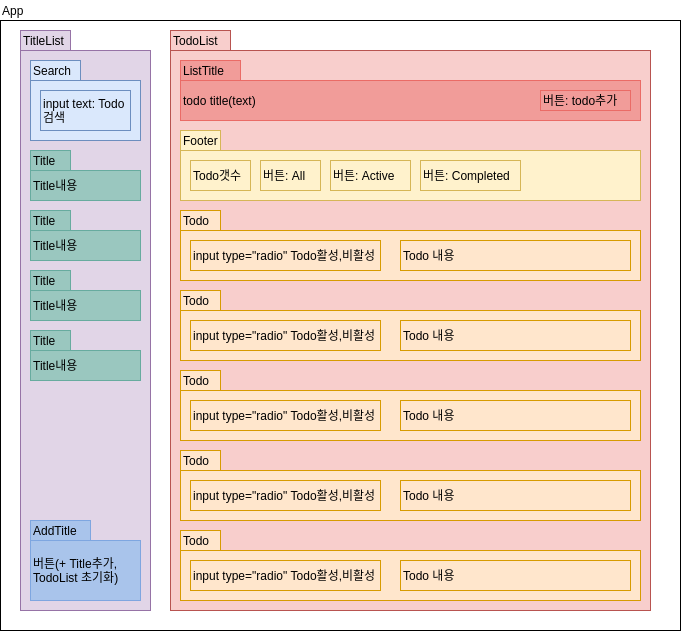
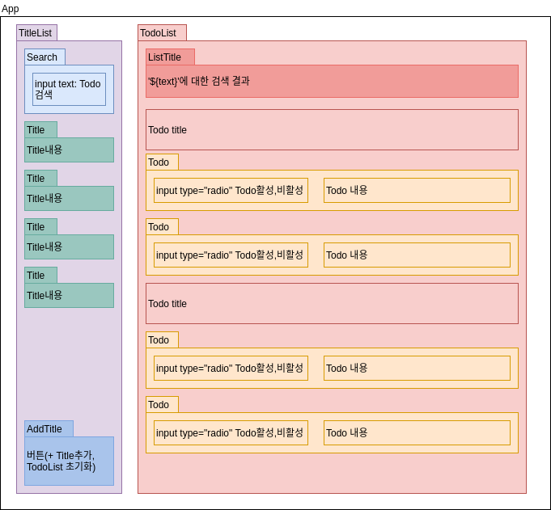
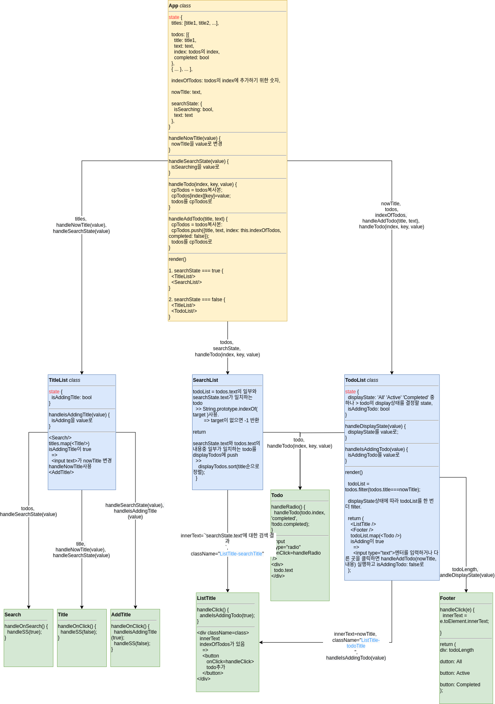

# 1. Sprint Review

## 1-1. react-redux

store라는 글로벌한 객체에서 state를 받아와서 상태를 관리하기 쉽게 함.

## 1-2. redux immutable.js

> https://immutable-js.github.io/immutable-js/docs/#/
>
> [React ❤️ Immutable.js – 리액트의 불변함, 그리고 컴포넌트에서 Immutable.js 사용하기](https://velopert.com/3486)

스테이트를 복잡하게 설정한 경우 immutablejs를 사용하는게 좋다.

# 2. React Todo App Intro

flex box: https://css-tricks.com/snippets/css/a-guide-to-flexbox/

> flex공부용 개구리게임: https://flexboxfroggy.com/#ko
>
> flex설명 레퍼런스: https://css-tricks.com/snippets/css/a-guide-to-flexbox/

Todo list

설계

데이터 관리(CRUD, create read update delete )

* 할일 내용
* 리스트 제목
* 완료/미완료 여부
* 날짜

state={list}

[{},{},{}, ...], [[,,], [,,], ...]

컴포넌트를 다 파악하고 시작해야 함: 설계

1. 컴포넌트 layout.
2. 컴포넌트 역할.
3. 데이터가 어떻게 이동하는지 그려야 함.

# 3. Todo App 설계

## 3-1. 컴포넌트 레이아웃

보통 상태의 레이아웃

검색 시 레이아웃

## 3-2. 컴포넌트 구조

하다 보니 컴포넌트 구조에다가 수도코드를 짜버렸다.. 그 바람에 엄청 오래걸림ㅋㅋㅋ

대신 코딩은 금방 할 수 있을 것 같다(그랬으면 좋겠다!)