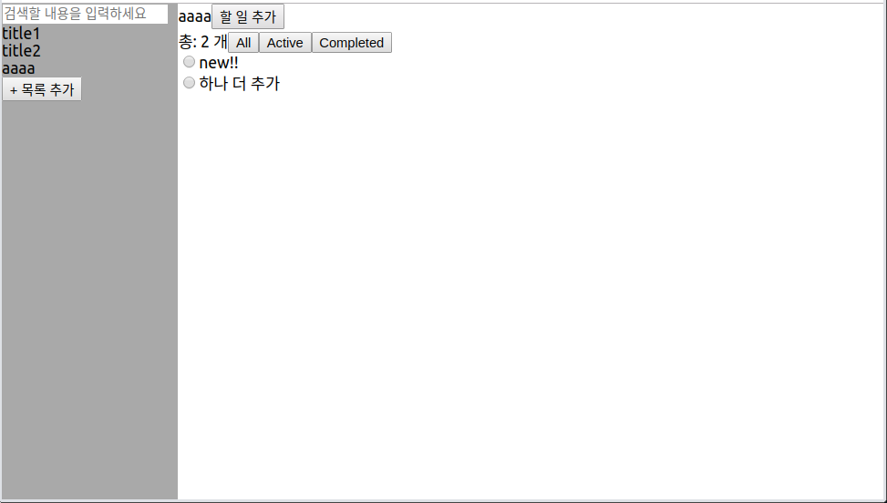

오늘은 어제 그린 설계를 토대로 react로 todo앱을 만들어봤다.

규모가 매우 작은데에도 불구하고 props내리고 state상태 관리하고 하는 게 마냥 쉽지만은 않다.

아 이래서 react-redux를 쓰는구나~를 깨달았음!

일단 시간이 부족해서 CSS는 건드리지 못했고 현재까지 구현한 Todo앱에 대한 스크린샷과 간단한 기능 설명만 할 것 이다.(아직 미완성이지만 오늘은 종일 이것만 했기 때문에ㅋㅋ)

완성하면 그 때 또 블로깅해야지~

테스팅을 위해 기본 데이터를 저장해뒀다.

목록 1: title1 - [ ] text1, [ ] text2

목록 2: title2 - [ ] text3

목록의 데이터들은 모두 체크되어있지 않은 상태다.

# [ Todo App ]

---

## 1. 최초 실행 시 화면

실행했을 때 메인 화면. 리스트들만 떠 있고 우측에는 아무것도 표시하지 않는다.

왼쪽 영역 설명

* 제일 위에는 할 일을 검색하기 위한 text input이 있다.
* 그 다음에는 목록들의 title이 나열된다.
* 가장 아래에는 목록을 추가하는 버튼이 있다.

---

## 2. 목록의 title 클릭 시 변화

왼쪽의 목록을 클릭하면 오른쪽에 그 목록의 할 일이 표시된다.(아래 이미지는 'title1'을 클릭한 상태)

오른쪽 영역 설명

* 최상단에는 클릭된 title이 표시되고 그 옆에 할 일을 추가하는 버튼이 생긴다.
* 그 아래에는 할 일들의 목록과 filter를 위한 버튼들이 있다.
* 할 일 목록들

---

## 3. 할 일의 상태 관리

할 일의 왼쪽에 있는 radio input을 클릭하면 할 일의 상태가 바뀐다. 다른 목록으로 이동했다가 돌아와도 radio input의 상태는 변하지 않는다.

할 일 완료 시 버튼 클릭. 추후 완료된 할 일의 경우 text에 줄이 그어지는 style을 추가할 예정.

---

## 4. filter기능

두번째 줄에는 해당 목록의 할 일의 갯수가 표시되며 그 옆에 있는 버튼들을 클릭함에 따라 아래에 표시 될 할 일들이 달라진다.

* All: 모든 상태의 할 일을 보여준다. 기본적으로 이 상태이다.
* Active: 활성화된 할 일을 보여준다.
* Completed: 완료된 할 일을 보여준다.

'completed'버튼을 클릭했을때의 변화. 완료된 할 일의 갯수와 완료된 할 일들을 보여준다.

---

## 5. 검색 기능

왼쪽 상단의 text input에 글을 쓰면 실시간으로 그 단어가 포함 된 할 일을 보여준다.

* 아래 그림은 'te'를 입력한 결과. 아까 text1에 눌러 둔 radio버튼의 상태 그대로 보여진다.

* text박스의 내용을 지우면 이전 목록으로 돌아간다.

* 아래와 같이 검색을 하고 있는 상태에서 다른 목록의 title을 클릭하면 해당 목록을 보여주는 창으로 넘어간다. text박스의 내용도 비워짐.

---

## 6. 목록 추가 기능

목록 추가 버튼을 누르면 이미 있던 목록의 title아래로 text박스가 생긴다. 지금 적고 있는 내용이 실시간으로 오른쪽 상단의 '할 일 추가' 버튼 왼쪽에 표시된다.

엔터를 누르면 입력 완료.

---

## 7. 할 일 추가 기능

'할 일 추가'버튼을 클릭하면 '할 일'list가장 아래에 text박스가 생긴다.

목록 추가와 마찬가지로 엔터를 누르면 입력 완료.

할 일의 갯수는 바로바로 표시된다.

> **알아두면 좋을 reference**
>
> CSS가 힘들다면?! CSS library를 사용해보라!
>
> * Ant Design: https://ant.design/
> * [6 Best ReactJS based UI Frameworks](https://medium.com/@zeolearn/6-best-reactjs-based-ui-frameworks-9c780b96236c)
> * 구글에 'css library'를 검색하면 더 다양한 라이브러리들을 찾아볼 수 있다! 신세계!!!