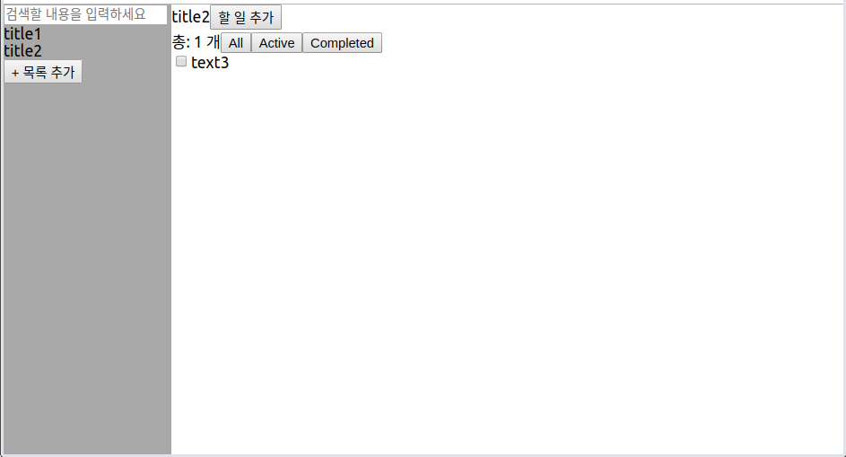

# [ Todo list 기능 추가 ]

오늘은 어제 만든 todo list에 기능을 추가했다. 아마 이번 주 동안 계속 얘만 붙잡고 있을 것 같다.


## 목록, todo 추가 시 포커스 변경

input text: autoFocus 사용


## 다른 목록으로 이동하면 filter초기화(all)로

todo list에 있던 state: displayState를 app.js로 옮긴 후 title클릭 시 해당 state의 상태를 'all'로 변경





## 완료된 todo는 todo list 맨 밑으로 이동

이건 스크린샷을 못 찍었다.

sort사용.

```js
todoList.sort((todoA, todoB) => {
  if (todoA.completed && !todoB.completed) {
    return 1;
  } else if (!todoA.completed && todoB.completed) {
    return -1;
  }
  return 0;
});
```


## 완료된 todo와 완료되지 않은 todo 영역 분리


완료된 todo와 완료되지 않은 todo 분리해서 저장.

```js
todoList.forEach(todo => {
  if (todo.completed) {
    completedTodos.push(todo); //완료된 todo
  } else {
    activeTodos.push(todo); //완료되지 않은 todo
  }
});
```


display상태에 따라 render할 방식을 정한다.

`render`를 `return`할 때 todo리스트를 보여줄 자리에 `{displayList}`를 넣어주면 됨.

```jsx
if (displayState === "All") {
  if (completedTodos.length) {
    displayList = (
      <div>
       {activeTodos.map((todo, idx) => (
       <Todo key={idx} todo={JSON.stringify(todo)} handleTodo={handleTodo} />
       ))}
       <div>완료됨</div>
       {completedTodos.map((todo, idx) => (
       <Todo key={idx} todo={JSON.stringify(todo)} handleTodo={handleTodo} />
  	   ))}
      </div>
    );
  } else {
    displayList = (
      <div>
        {activeTodos.map((todo, idx) => (
        <Todo key={idx} todo={JSON.stringify(todo)} handleTodo={handleTodo} />
        ))}
      </div>
    );
  }
}
```


## 새 todo추가 시 완료되지 않은 todo 영역에 text input 추가


완료된 todo영역과 완료하지 않은 todo를 분리하고, 그 사이에 text input을 추가함.

``` jsx
if (displayState === "All") {
  if (completedTodos.length) {
    //todo의 타입별로 분리해서 저장
    displayList = (
      //완료하지 않은 todo들 저장
      <div>
        {activeTodos.map((todo, idx) => (
          <Todo key={idx} todo={JSON.stringify(todo)} handleTodo={handleTodo} />
        ))}
      </div>
    );
    displayCompletedList = (
      //완료된 todo들 저장
      <div>
        <div>완료됨({completedTodos.length})</div> {/*완료된 todo의 개수 보여줌*/}
        {completedTodos.map((todo, idx) => (
          <Todo key={idx} todo={JSON.stringify(todo)} handleTodo={handleTodo} />
        ))}
      </div>
    );
  }
}
```


아래는 return부분

```jsx
return (
  <div id="TodoList">
    <ListTitle innerText={nowTitle} className="ListTitle-todoTitle" handleIsAddingTodo={this.handleIsAddingTodo} />
    <Footer displayState={displayState} todoLength={todoList.length} handleDisplayState={handleDisplayState} />
    {displayList} {/* 완료하지 않은 todo들을 display */}
    {this.state.isAddingTodo ? <AddTodo nowTitle={nowTitle} handleAddTodo={handleAddTodo} handleIsAddingTodo={this.handleIsAddingTodo} /> : null} {/* todo를 추가하고 있는 경우에 AddTodo컴포넌트를 생성한다. */}
    {displayCompletedList} {/* 완료한 todo들 */}
  </div>
);
```
