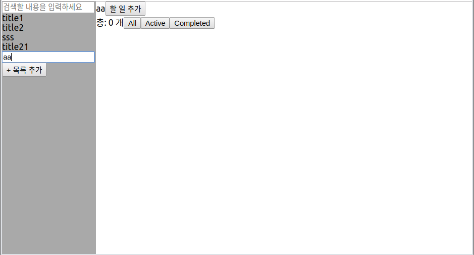
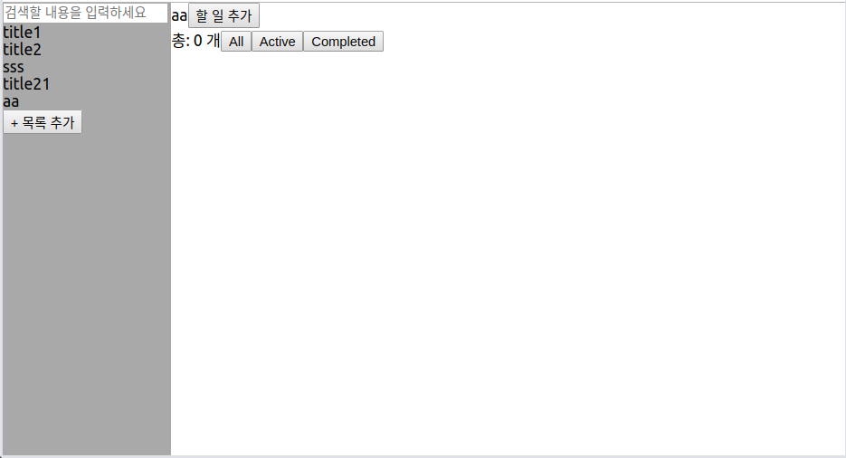

# [ Todo list 기능 추가 ]

## 새 목록 추가 시 다른 영역 클릭하면 바로 저장 & input text 사라짐

TitleList에서 관리하던 isAddingTitle(isAddingTitle이 true일 경우 input text가 생기며, 그 input text에 입력되는 값을 새 목록으로 만든다) state를 App으로 올려서 관리.





*(엔터 누른 게 아니고 다른 영역을 클릭한 것임)*


App의 클릭 핸들러에 클릭 시 클릭한 영역의 id를 토대로 input text가 아닌 곳이 클릭된 것을 판별한다.

아래는 해당 클릭 핸들러 함수.

```js
watchAppClick(e) {
  if (this.state.isAddingTitle) { //현재 새 title 입력 중
    if (e.target.id !== "AddTitle_text_input") {
      //input text영역이 아닌 다른 곳 클릭
      this.handleIsAddingTitle(false);
      this.handleAddTitle(this.state.nowTitle);
    }
  }
}
```


추가로 중복되는 타이틀은 추가할 수 없게 변경했다.

```js
handleAddTitle(newTitle) {
  if (!newTitle) { //비어있는 경우
    return;
  } else if (this.state.titles.includes(newTitle)) {
    //입력된 title(newTitle)의 값이 이미 있을 경우
    return;
  }
  const titles = this.state.titles.concat();
  titles.push(newTitle);
  this.setState({ titles });
}
```