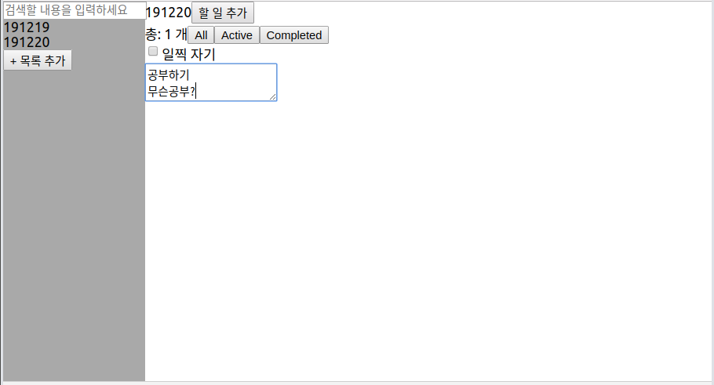
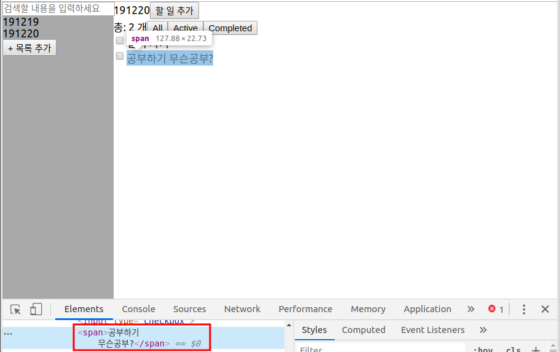
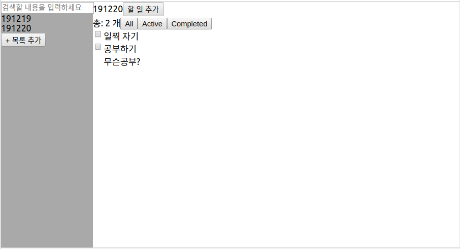

## todo추가 시 여러 줄 입력 가능

enter버튼을 누르면 입력이 되고, shift+enter를 동시에 누르면 입력창이 한 줄 늘어난다.




todo를 추가하는 component

```js
function AddTodo({ nowTitle, handleAddTodo, handleIsAddingTodo }) {
  function handleKeyDown(e) {
    if (e.shiftKey) {
      //shift키가 눌러졌을 경우 바로 아무 일도 하지 않는다.
      // =>shift + Enter의 경우에도 아래의 else if문을 돌지 않고 바로 return
      return;
    } else if (e.keyCode === 13) {
      handleAddTodo(nowTitle, e.target.value);
      handleIsAddingTodo(false);
    }
  }

  return <textarea id="AddTodo" onKeyDown={handleKeyDown} placeholder="입력을 완료하고 싶다면 Enter를 누르세요" autoFocus />;
}
```

하지만 이렇게만 하면 아래의 스크린샷과 같이 한 줄이 되어버린다.



한 줄로 처리되는 이유는 HTML상에서 '공부하기 무슨공부?'와 '공부하기\n무슨공부?'는 같은 것으로 처리하기 때문이다. 이를 해결하기 위해서는 줄바꿈(\n)대신 `<br>`을 사용하거나 `<p>`태그를 사용해 앞 뒤 문장을 바꾸는 수 밖에 없다. 난 `<p>`태그를 사용했다.

```jsx
function Todo({ todo, handleTodo, isSearching }) {
  const parseTodo = JSON.parse(todo);
  function handleCheckbox(e) {
    handleTodo(parseTodo.index, "completed", !parseTodo.completed);
  }
  const spletedByEnter = parseTodo.text.split("\n");

  return (
    <div className="Todo">
      {isSearching ? `[${parseTodo.title}] ` : null}
      <input type="checkbox" onClick={handleCheckbox} checked={parseTodo.completed} />
      <span>
        {spletedByEnter.map((text, key) => (
          //jsx는 여는태그, 닫는태그 쌍이 필요하기 때문에 여닫는 태그가 따로 없는 <br>은 Array.map에 사용하기 부적합하다.
          <p key={key}>
            {text}
          </p>
        ))}
      </span>
    </div>
  );
}
```


## 새 todo 추가 시 다른 영역 클릭하면 바로 저장 & textarea 사라짐

기능을 추가하면 추가할수록 상위 component에서 관리하는 state가 늘어난다.

최대한 state를 나눠서 관리하고 싶었는데 App component의 클릭이벤트를 확인해서 아래 component의 state를 변경해야 하다 보니 어쩔 수 없이 그 state를 App으로 옮겼다.

모든 state를 상위 component에서 관리하다보니 최상위 component만 더러워져 간다..

생각해보니 state로 관리하지 않아도 될 것들도 state로 관리하고 있는 것 같아서 기능구현 끝낸 후 리펙토링 함 해야겠다.


기존에는 textarea에 내용을 입력하고 enter키를 눌러야 입력이 됐는데 이제는 textarea 외 다른 영역을 클릭하면 저장된다.




state에 todo를 추가하고 있는 상태인지를 확인하는 값을 추가해야 함.

AddTodo 컴포넌트의 textarea에 id를 추가.

```jsx
function AddTodo({ nowTitle, handleAddTodo, handleIsAddingTodo }) {
  function handleKeyDown(e) {
    // console.log(e);
    if (e.shiftKey) {
      return;
    } else if (e.keyCode === 13) {
      handleAddTodo(nowTitle, e.target.value);
      handleIsAddingTodo(false);
    }
  }

  return <textarea id="AddTodo" onKeyDown={handleKeyDown} placeholder="입력을 완료하고 싶다면 Enter를 누르세요" autoFocus />;
}
```


아래는 App컴포넌트의 onClick이벤트에 달릴 App의 method

```js
watchAppClick(e) {
  if (this.state.isAddingTitle) { //기존 코드
    if (e.target.id !== "AddTitle_text_input") {
      this.handleIsAddingTitle(false);
      this.handleAddTitle(this.state.nowTitle);
    }
  } else if (this.state.isAddingTodo) {
    //클릭이벤트가 발생했을 때 todo를 입력 중
    if (e.target.id !== "AddTodo") {
      //AddTodo영역 외를 클릭
      this.handleIsAddingTodo(false);
      const nowTodoText = document.getElementById("AddTodo").value;
      //AddTodo의 value를 가져옴
      this.handleAddTodo(this.state.nowTitle, nowTodoText);
    }
  }
}
```

