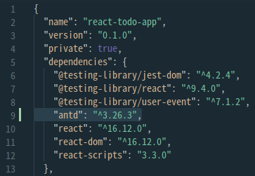
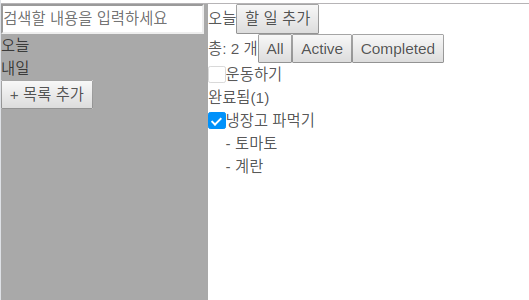

# Ref와 DOM

> https://ko.reactjs.org/docs/refs-and-the-dom.html

## 1. Ref를 사용해야 할 때

- 포커스, 텍스트 선택영역, 혹은 미디어의 재생을 관리할 때.
- 애니메이션을 직접적으로 실행시킬 때.
- 서드 파티 DOM 라이브러리를 React와 같이 사용할 때.

선언적으로 해결될 수 있는 문제에서는 ref 사용을 지양하세요.


## 2. Ref 생성하기

Ref는 `React.createRef()`를 통해 생성되고 `ref` 어트리뷰트를 통해 React 엘리먼트에 부착됩니다. 보통, 컴포넌트의 인스턴스가 생성될 때 Ref를 프로퍼티로서 추가하고, 그럼으로서 컴포넌트의 인스턴스의 어느 곳에서도 Ref에 접근할 수 있게 합니다.

```jsx
class MyComponent extends React.Component {
  constructor(props) {
    super(props);
    this.myRef = React.createRef();
  }
  render() {
    return <div ref={this.myRef} />;
  }
}
```


### 3. Ref에 접근하기

`render` 메서드 안에서 ref가 엘리먼트에게 전달되었을 때, 그 노드를 향한 참조는 ref의 `current` 어트리뷰트에 담기게 됩니다.

```react
const node = this.myRef.current;
```

ref의 값은 노드의 유형에 따라 다릅니다.

- `ref` 어트리뷰트가 HTML 엘리먼트에 쓰였다면, 생성자에서 `React.createRef()`로 생성된 `ref`는 자신을 전달받은 DOM 엘리먼트를 `current` 프로퍼티의 값으로서 받습니다.
- `ref` 어트리뷰트가 커스텀 클래스 컴포넌트에 쓰였다면, `ref` 객체는 마운트된 컴포넌트의 인스턴스를 `current` 프로퍼티의 값으로서 받습니다.
- **함수 컴포넌트는 인스턴스가 없기 때문에 함수 컴포넌트에 ref 어트리뷰트를 사용할 수 없습니다**.


> React-Ref 연습하면서 만들어 본 코드펜
>
> https://codepen.io/rami-Tae/pen/mdymrYJ


# Todo list

## React 안티 패턴 => Ref로 수정

마우스 클릭 제어 시 satate 관리가 까다로워서 DOM에 직접 접근하는 방식을 사용하고 있었다. 왠지 찝찝해서 찾아보니 안티패턴이었다니..


**사용하던 안티패턴**

1. 컴포넌트에 id속성 사용
   * 컴포넌트는 (추후에)여러개가 생성될 수 있기 때문에 id를 사용하면 안된다!
2. getElement나 querySelector 등 id나 class명으로 DOM에 직접적으로 접근
   * 컴포넌트의 캡슐화를 위해 위와 같이 DOM접근을 하면 안된다.


이걸 어떻게 처리해야 하나 고민하던 차 구글링을 통해(갓구글!) Ref를 사용하면 된다는 것을 알게되었다.

state가 자꾸 늘어나서 코드는 지저분해지지만.. 그건 나중에 리팩토링하면 된다!


constructor의 state에 ref를 저장할 status 추가

```js
this.state = {
  titles: props.titles,
  todos: props.todos,
  indexOfTodos: props.indexOfTodos,
  nowTitle: null,
  searchState: {
    isSearching: false,
    text: null
  },
  displayState: "All",
  isAddingTitle: false,
  isAddingTodo: false,
  titleInput: null, //* title Input Ref 저장
  todoInput: null //* todo Input Ref 저장
};
```


ref를 관리할 함수

```js
handleRef(type, ref) {
  this.setState({ [type]: ref });
}
```


App의 onClick이벤트의 함수 부분을 바꿨다.

```jsx
watchAppClick(e) {
  const { isAddingTitle, titleInput, isAddingTodo, todoInput } = this.state;

  if (isAddingTitle) { //title 추가 중
    if (e.target !== titleInput) {
      //클릭 이벤트 발생 시 타겟이 titleInput이 아니다!
      this.handleIsAddingTitle(false); //title 추가 중 flag를 false로
      if (titleInput) { //titleInput이 비어있지 않음
        this.handleAddTitle(titleInput.value); //titleInput의 value를 새 title로 추가
        this.handleRef("titleInput", null);
      }
    }
  }

  if (isAddingTodo) { //todo를 추가 중
    console.log(isAddingTodo, todoInput);
    if (e.target !== todoInput) {
      //클릭 이벤트 타겟이 todoInput이 아님
      this.handleIsAddingTodo(false); //todo 추가 중 flag를 false로
      if (todoInput) {
        this.handleAddTodo(this.state.nowTitle, todoInput.value); //nowTitle을 title로, todoInput의 value를 value로 새로운 todo 생성
        this.handleRef("todoInput", null); //todoInput 초기화
      }
    }
  }
}
```


Add title component

```jsx
export default class AddTitle extends Component {
  constructor(props) {
    super(props);
    this.titleInput = React.createRef();

    this.handleOnClick = this.handleOnClick.bind(this);
    this.handleOnChange = this.handleOnChange.bind(this);
    this.handleKeyClick = this.handleKeyClick.bind(this);
  }

  handleOnChange(e) {
    //input text에 변화가 있을 때 마다
    // 1. now title 변경
    // 2. titleInput 변경
    this.props.handleNowTitle(e.target.value);
    this.props.handleRef("titleInput", this.titleInput.current);
  }

  handleKeyClick(e) {
    if (e.keyCode === 13) {
      this.props.handleIsAddingTitle(false);
      this.props.handleAddTitle(e.target.value);
    }
  }

  handleOnClick() {
    this.props.handleIsAddingTitle(true);
  }

  render() {
    const { isAddingTitle } = this.props;

    return (
      <div>
        {isAddingTitle ? <input type="text" ref={this.titleInput} onChange={this.handleOnChange} onKeyDown={this.handleKeyClick} placeholder="입력" autoFocus></input> : null}
        <button onClick={this.handleOnClick}>+ 목록 추가</button>
      </div>
    );
  }
}
```


# Ant design사용

> https://ant.design/docs/react/introduce


Ant design을 사용하려면 일단 npm install이나 yarn add를 해줘야 한다.

```js
$ npm install --save antd
```

설치가 끝나면 아래의 이미지처럼 package.json파일의  dependencies에 antd가 생긴다.




그 후 antd에서 필요한 component와 스타일을 import해서 사용하면 된다.

```jsx
import React from "react";
import { Checkbox } from "antd"; //antd의 Checkbox사용
import "antd/dist/antd.css"; //antd의 스타일 적용
import "./Todo.css";

export default function Todo({ todo, handleTodo, isSearching }) {
  const parseTodo = JSON.parse(todo);
  function handleCheckbox(e) {
    handleTodo(parseTodo.index, "completed", !parseTodo.completed);
  }
  const spletedByEnter = parseTodo.text.split("\n");

  return (
    <div className="Todo">
      {isSearching ? `[${parseTodo.title}] ` : null}
      <Checkbox onClick={handleCheckbox} checked={parseTodo.completed} /> {/*antd 의 Checkbox 사용: Component처럼 사용한다*/}
      <span>
        {spletedByEnter.map((text, key) => (
          <p key={key}>{text}</p>
        ))}
      </span>
    </div>
  );
}
```


아래는 적용 후 화면




