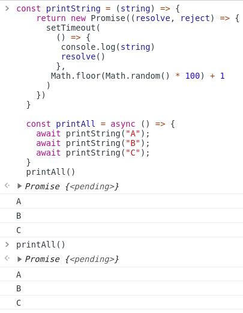

# 1. Async

비동기는 제어하기 힘들다.

```js
const printString = (string) => {
    setTimeout(
      () => {
        console.log(string)
      }, 
      Math.floor(Math.random() * 100) + 1
    )
  }

  const printAll = () => {
    printString("A")
    printString("B")
    printString("C")
  }
  printAll() //"A", "B", "C"가 뒤죽박죽 출력됨
```


# 2. Callback

callback을 통해서 비동기 실행을 제어할 수 있음.

```js
const printString = (string, callback) => {
    setTimeout(
      () => {
        console.log(string)
        callback()
      }, 
      Math.floor(Math.random() * 100) + 1
    )
  }

  const printAll = () => {
    printString("A", () => {
      printString("B", () => {
        printString("C", () => {})
      })
    })
  }
  printAll() // "A", "B", "C"
```


하지만 callback이 많아지면 가독성이 안좋아지고 코드 분석이 힘들어짐. => **callback hell**

```js
//callback hell
$.get('url', function(response) {
	parseValue(response, function(id) {
		auth(id, function(result) {
			display(result, function(text) {
				console.log(text);
			});
		});
	});
});
```


# 3. Promise

promise를 사용하면 callback보다 깔끔하게 코드를 표현할 수 있다.

```js
const printString = (string) => {
    return new Promise((resolve, reject) => {
      setTimeout(
        () => {
         console.log(string)
         resolve()
        }, 
       Math.floor(Math.random() * 100) + 1
      )
    })
  }

  const printAll = () => {
    printString("A")
    .then(() => {
      return printString("B")
    })
    .then(() => {
      return printString("C")
    })
  }
  printAll()
```


**promise는 함수에 콜백을 전달하는 대신에, 콜백을 첨부하는 방식의 객체**

## 3-1. 특징

* 콜백은 자바스크립트 Event Loop이 현재 실행중인 콜 스택을 완료하기 이전에는 절대 호출되지 않음
* 비동기 작업이 성공하거나 실패한 뒤에 `then()`을 이용하여 추가한 콜백의 경우에도 위 와 같음
* `then()`을 여러번 사용하여 여러개의 콜백을 추가할 수 있음. 그리고 각각의 콜백은 주어진 순서대로 하나하나 실행하게 됨. 이것을 chaining이라고 함.


# 4. async await (ES8)

비동기 함수를 동기함수인것처럼 사용 가능

**promise와 동일하게 돌아가지만** 동기적인것처럼 표현할 수 있어서 이해하기 쉽다.

```js
const printString = (string) => {
    return new Promise((resolve, reject) => {
      setTimeout(
        () => {
         console.log(string)
         resolve()
        }, 
       Math.floor(Math.random() * 100) + 1
      )
    })
  }

  const printAll = async () => {
    await printString("A");
    await printString("B");
    await printString("C");
  }
  printAll()
```



async function은 반환값이 Promise이다. 

[[MDN] async_function](https://developer.mozilla.org/en-US/docs/Web/JavaScript/Reference/Statements/async_function) 을 보면, async function의 반환 값은 **A `Promise` which will be *resolved* with the value returned by the async function, or *rejected* with an exception uncaught within the async function.** 라고 되어 있다.

이 Promise가 끝난 후의 값이 뭘까 궁금해서 then으로 출력해봤더니 undefined가 나왔다.


이 부분에 대해서는 나중에 더 공부해봐야겠다.


## require, module.exports 등의 node module 사용법을 이해하고 있다.

common.js 

Import / Default


## Asynchronous JS

Call-stack, web-api, event loop

```sequence
code -> call_stack : execution
call_stack -> web_api : async function ( timer, fetch .. )
web_api -> event_queue : thing done
event_queue -> call_stack : result
Note Right of call_stack : event loop
```

아직 처리되지 못한 영역: `<pending>` web_api 혹은 event_queue일수도


## Sprint core objective

* [ ] callback (왜 별로일까?) : 가독성 별로, 추상적임

* [ ] Promise

* [ ] Async / await (비동기 함수들을 동기적으로 쓰는 것), try/catch


---

* [ ] fs (in-memory X, storage O )

  -> database와 연계해서 생각해보기

---

1. callback
2. promise
3. promification ?? callback ??
4. Basic-chaining (fs 읽고, 읽은 것을 바탕으로 요청, 응답내용을 바탕으로 쓰기 ...)
   1. 외부자원 사용해서 코딩해보기
5. Async-await refactor


1. 모든 값이 `.then`으로 넘어가는가
2. `.catch`의 동작.(하나로 모든 error 처리 가능), 인데 `.catch`의 위치에 따른 차이가 있을까?


> **참조**
>
> code states immersive course
>
> https://joshua1988.github.io/web-development/javascript/javascript-asynchronous-operation/
>
> [[MDN] Using promises](https://developer.mozilla.org/ko/docs/Web/JavaScript/Guide/Using_promises)
>
> [[MDN] async_function](https://developer.mozilla.org/ko/docs/Web/JavaScript/Reference/Statements/async_function)