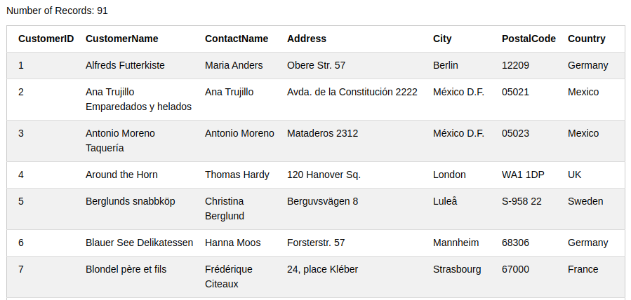
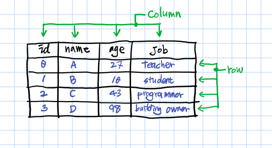
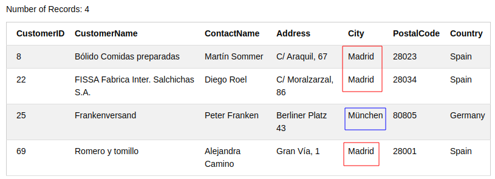
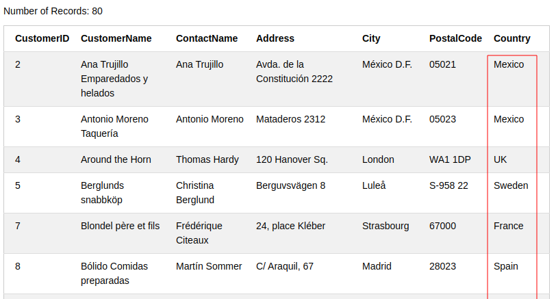
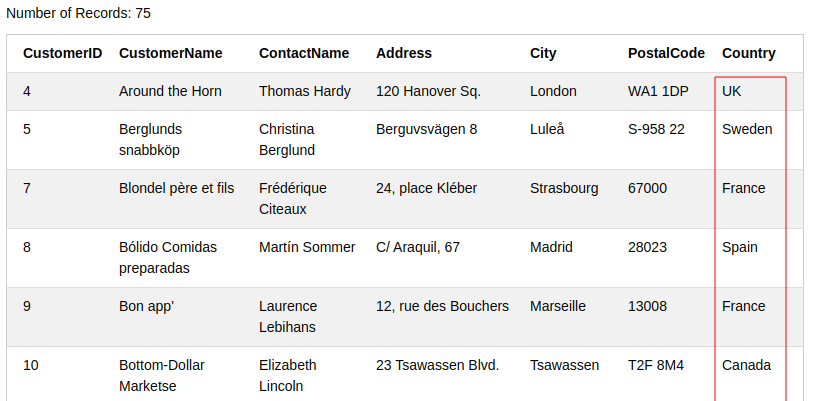
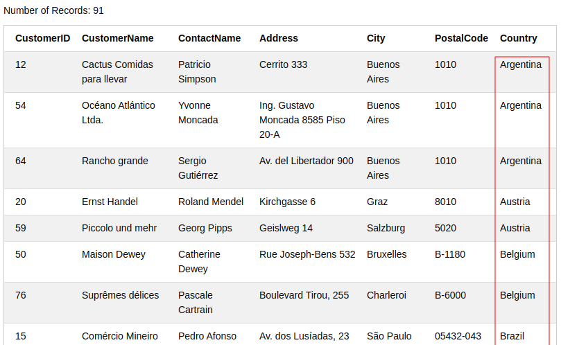

# DB를 사용하는 이유

In-memory

* 끄면 데이터가 없어짐

File I/O

* 원하는 데이터만 가져올 수 없고 항상 모든 데이터를 가져온 뒤 서버에서 필터링 필요

DB

* 데이터 관리, 필터링 등 데이터에 특화된 여러 기능들을 가지고 있는 서버


> https://www.w3schools.com/sql/default.asp

# 1. SQL Intro

## 1-1. SQL

* **SQL** (Structured Query Language): 구조화된 Query 언어

* DB에 접속하고 처리할 수 있게 해줌

- 데이터베이스용 프로그래밍 언어
  - DB에 query를 보내 원하는 데이터만을 가져올 수 있음.
- Query: (질의문)저장되어있는 정보를 필터하기 위한 질문


## 1-2. RDBMS

**RDBMS** (Relational Database Management System): 관계형 데이터베이스 관리 시스템

SQL의 기본이고,   MS SQL Server, IBM DB2, Oracle, MySQL, Microsoft Access 등 모든 모던 데이터베이스 시스템에서 사용한다.

RDBMS는 table라고 불리는 데이터베이스 객체로 저장되어 있다. table은 column(열)과 row(행)들로 이루어져 있으며, 관련 데이터들의 entry들이다.


## 1-3. Table

> 다음의 링크에서 아래 table을 확인할 수 있다: https://www.w3schools.com/sql/trysql.asp?filename=trysql_select_all

```sql
SELECT * FROM Customers;
```



모든 테이블은 fild라 불리는 작은 entitiy들로 나눌 수 있다.

Customers 테이블의 field는 CustomerID, CustomerName, ContactName, Address, City, PostalCode, Country 이다. 




# 2. Syntax

데이터베이스는 대부분 하나 이상의 테이블을 가지고 있고 각 테이블은 이름으로 식별됨.

SQL키워드는 대소문자를 구별하지 않음.

일부 데이터베이스 시스템은 각 SQL문 끝에 세미콜론이 필요하다.


## 2-1) 자주 쓰이는 SQL문

- **SELECT** - extracts data from a database

  - 데이터 선택

  - `table_name`이라는 테이블에서 `column1`, `column2`, ... 칼럼을 선택

    ```sql
    SELECT column1, column2, ...
    FROM table_name;
    ```

  - `table_name`의 모든 field를 출력하고 싶다면 아래와 같이 

    ```sql
    SELECT * FROM table_name;
    ```

- **UPDATE** - updates data in a database

  - 데이터 변경

    ```sql
    UPDATE table_name
    SET column1 = value1, column2 = value2, ...
    WHERE condition;
    ```

- **DELETE** - deletes data from a database

  - 데이터 삭제

    ```sql
    DELETE FROM table_name WHERE condition;
    ```

- **INSERT INTO** - inserts new data into a database

  - 데이터 추가

    ```sql
    INSERT INTO table_name (column1, column2, column3, ...)
    VALUES (value1, value2, value3, ...);
    ```

- **CREATE DATABASE** - creates a new database

  - 새 데이터베이스 만들기

    ```sql
    CREATE DATABASE databasename;
    ```

- **ALTER DATABASE** - modifies a database

  - 데이터베이스 수정

- **CREATE TABLE** - creates a new table

  - 테이블 생성

    ```sql
    CREATE TABLE table_name (
        column1 datatype,
        column2 datatype,
        column3 datatype,
       ....
    );
    ```

- **ALTER TABLE** - modifies a table

  - 테이블의 컬럼 수정 및 삭제

  - 테이블에 컬럼 추가

    ```sql
    ALTER TABLE table_name
    ADD column_name datatype;
    ```

  - 테이블에 컬럼 삭제

    ```sql
    ALTER TABLE table_name
    DROP COLUMN column_name;
    ```

  - 테이블에 컬럼 수정

    - SQL Server / MS Access:

      ```sql
      ALTER TABLE table_name
      ALTER COLUMN column_name datatype;
      ```

    - My SQL / Oracle (prior version 10G):

      ```sql
      ALTER TABLE table_name
      MODIFY COLUMN column_name datatype;
      ```

    - Oracle 10G and later:

      ```sql
      ALTER TABLE table_name
      MODIFY column_name datatype;
      ```

- **DROP TABLE** - deletes a table
  
  - 테이블 삭제
  
    ```sql
    DROP TABLE table_name;
    ```
- **CREATE INDEX** - creates an index (search key)
  
  - index추가
  
    ```sql
    CREATE INDEX index_name
    ON table_name (column1, column2, ...);
    ```
- **DROP INDEX** - deletes an index
  
  - index삭제
  
    - MS Access:
  
      ```sql
      DROP INDEX index_name ON table_name;
      ```
  
    - SQL Server:
  
      ```sql
      DROP INDEX table_name.index_name;
      ```
  
    - DB2/Oracle:
  
      ```sql
      DROP INDEX index_name;
      ```
  
    - MySQL:
  
      ```sql
      ALTER TABLE table_name
      DROP INDEX index_name;
      ```
  
      
  
    
  
    


# 3. Where

where은 레코드(row)를 필터링하는데 사용됨.

지정된 조건을 충족하는 레코드만 추출함.

```sql
SELECT column1, column2, ...
FROM table_name
WHERE condition;
```

SQL은 텍스트 값 주위에 작은 따옴표가 필요함(대부분의 DB시스템은 큰따옴표도 허용함). 숫자는 따옴표 쓰면 안됨.


> 아래 예제 해보기: https://www.w3schools.com/sql/trysql.asp?filename=trysql_select_where

```sql
> SELECT * FROM Customers WHERE Country='Mexico';
```


| Operator            | 설명                                              |
| ------------------- | ------------------------------------------------- |
| `a` = `b`           | `a`와 `b`가 같다                                  |
| `a` > `b`           | `a`가 `b`보다 크다                                |
| `a` < `b`           | `a`가 `b`보다 작다                                |
| `a` >= `b`          | `a`가 `b`보다 크거나 같다                         |
| `a` <= `b`          | `a`가 `b`보다 작거나 같다                         |
| `a` <> `b`          | `a`가 `b`가 다르다(몇몇 버전의 SQL은 !=를 사용함) |
| BETWEEN `a` AND `b` | `a` 와 `b` 사이                                   |
| LIKE `패턴`         | `패턴`을 찾음                                     |
| IN (`a`,`b`)        | column에서 원하는 값(`a`, `b`)을 가진 row만 선택  |


## 3-1. BETWEEN

```sql
SELECT * FROM Products
WHERE Price BETWEEN 50 AND 60;
```


숫자 말고 문자열도 between을 사용할 수 있다.

```sql
SELECT * FROM Products 
where ProductName between 'A' and 'C'
```


## 3-2. LIKE

```sql
SELECT * FROM Customers
WHERE City LIKE 'sa%';
```


## 3-3. IN

```sql
SELECT * FROM Customers
WHERE City IN ('Paris','London');
```


# 4. And, Or, Not

> https://www.w3schools.com/sql/sql_and_or.asp

## 4-1. AND

and 사이에 있는 모든 조건을 만족하는 record를 추출한다.

```sql
SELECT * FROM Customers
WHERE Country='Spain' AND City='Madrid';
```


## 4-2. OR

or 사이에 있는 조건들 중 하나만이라도 만족하는 record를 추출한다.

```sql
SELECT * FROM Customers
WHERE City='Madrid' OR City='München';
```




## 4-3. NOT

조건에 해당하지 않는 record를 추출한다.

```sql
SELECT * FROM Customers
WHERE NOT Country='Germany';
```




## 4-4. AND, OR, NOT 연결해서 사용

```sql
SELECT * FROM Customers
WHERE Country='Germany' AND (City='Frankfurt' OR City='München');
```


```sql
SELECT * FROM Customers
WHERE NOT Country='Germany' AND NOT Country='USA';
```




# 5. Order By

결과들을 오름차순(ascending) 또는 내림차순(descending)으로 정렬하는 데 사용.

ORDER BY키워드는 기본적으로 오름차순으로 정렬함. 내림차순정렬을 하고 싶다면 DESC키워드를 사용해야 함.

```sql
SELECT column1, column2, ...
FROM table_name
ORDER BY column1, column2, ... ASC|DESC;
```

column1 기준으로 정렬 후, column1이 변하지 않는 선에서 column2를 정렬함.


```sql
SELECT * FROM Customers
ORDER BY Country;
```




```sql
SELECT * FROM Customers
ORDER BY Country, PostalCode;
```


# 6. Insert Into

테이블에 새 레코드를 추가할 때 사용

두 가지 방법으로 쓸 수 있음.

1. 컬럼이름과 값을 둘 다 쓰는 방법

```sql
INSERT INTO table_name (column1, column2, column3, ...)
VALUES (value1, value2, value3, ...);
```

2. 테이블의 모든 컬럼에 값을 넣을 경우, 컬럼 이름들을 적지 않아도 됨. **값의 순서가 테이블 칼럼의 순서와 동일한지 확인해야 함**.

```sql
INSERT INTO table_name
VALUES (value1, value2, value3, ...);
```


# 7. NULL Values

NULL로 채워진 value는 값이 없다는 것과 같다.

새 레코드를 삽입할 때 반드시 입력하지 않아도 되는 필드에 값을 추가하지 않은 경우, 그 필드는 NULL값으로 저장됨.

*NULL값은 0값이나 공백만 들어있는 필드와는 다름. NULL값을 가진 필드는 레코드 작성 시 비워 둔 필드임.*


## 7-1. NULL값을 테스트하는 방법

NULL값은 비교연산자(=, <, <> 등)를 사용할 수 없기 때문에 IS NULL이나 NOT NULL을 사용해야 한다.

* **IS NULL**

```sql
SELECT column_names
FROM table_name
WHERE column_name IS NULL;
```

* **NOT NULL**

```sql
SELECT column_names
FROM table_name
WHERE column_name IS NOT NULL;
```


# 8. Wildcards

문자열에서 하나 이상의 문자를 대신하기 위해 사용하는 문자열이다.

wildcard문자는 SQL LIKE연산자와 함께 특정 패턴을 검색하는 데 사용함.


## 8-1. Wildcard Characters

### 1) MS Access

| Symbol | 설명                                   | 예                                                        |
| ------ | -------------------------------------- | --------------------------------------------------------- |
| *      | 0개 이상의 문자                        | `bl*` :: bl, black, blue, blob, ...                       |
| ?      | 단일 문자                              | `h?t` :: hot, hat, hit                                    |
| []     | 괄호 안에 있는 문자들 중 하나라도 일치 | `h[oa]t` :: hot, hat (hit은 안 됨)                        |
| !      | 괄호 안의 어떤 문자라도 일치하지 않음  | `h[!oa]t` :: hit (hot, hat은 안 됨)                       |
| -      | 문자의 범위                            | `c[a-b]t` :: cat, cbt                                     |
| #      | 단일 숫자                              | `2#4` :: 204, 214, 224, 234, 244, 254, 264, 274, 284, 294 |

### 2) SQL Server

| Symbol | 설명                                   | 예                                  |
| ------ | -------------------------------------- | ----------------------------------- |
| %      | 0개 이상의 문자                        | `bl%` :: bl, black, blue, blob, ... |
| _      | 단일 문자                              | `h_t` :: hot, hat, hit              |
| []     | 괄호 안에 있는 문자들 중 하나라도 일치 | `h[oa]t` :: hot, hat (hit은 안 됨)  |
| ^      | 괄호 안의 어떤 문자라도 일치하지 않음  | `h[^oa]t` :: hit (hot, hat은 안 됨) |
| -      | 문자의 범위                            | `c[a-b]t` :: cat, cbt               |

다음과 같이 사용할수도 있음: `a%`, `%a`, `%or%`, `_r%`, `a_%_%`, `a%o`


# 9. Aliases

aliase는 테이블이나 테이블의 컬럼의 임시 이름으로 사용됨.

컬럼 이름을 쉽게 사용하기 위해 쓰기도 함.

alias는 쿼리 기간동안만 존재함.


## 9-1. Alias Column Syntax

```sql
SELECT column_name AS alias_name
FROM table_name;
```


## 9-2. Alias Table Syntax

```sql
SELECT column_name(s)
FROM table_name AS alias_name;
```


---

서비스 만드는 것에 필요한 것

1. 어떤 데이터가 필요할까
2. 데이터 간 상관관계를 정의


스키마: description of the way data is organized in a database and the relationships among its different entities. 테이블들 간 관계

구성요소:

1. entities:: field

관계형 DB: 테이블간의 관계를 나타내는 DB

* 1대 다
  * 상대를 하나만 가질 것 같은 테이블에 
* 다대 다
  * 테이블 하나 더 만들어서 그 테이블과 기존에 있던 테이블들 간 '1대 다'의 관계를 갖게 함.


관계가 있는 두 개의 테이블을 통합검색하고 싶을 때: join사용