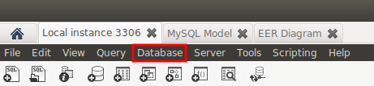
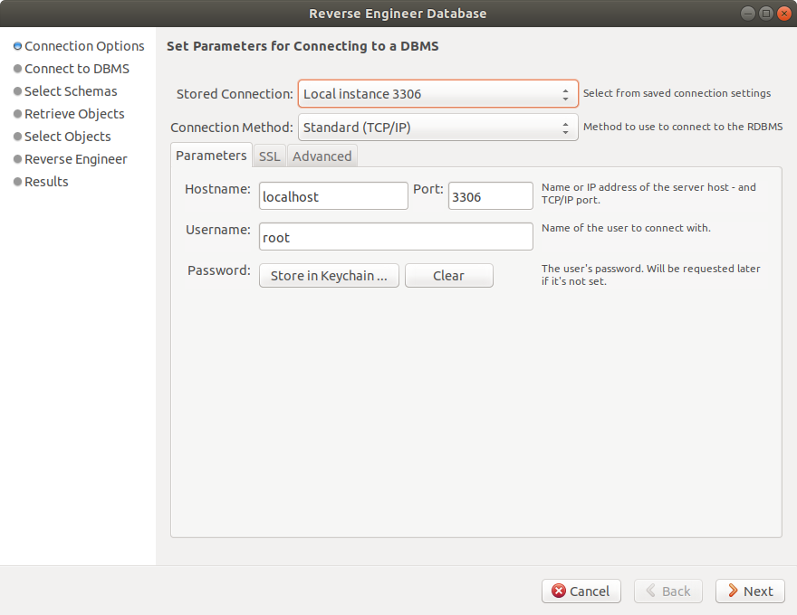
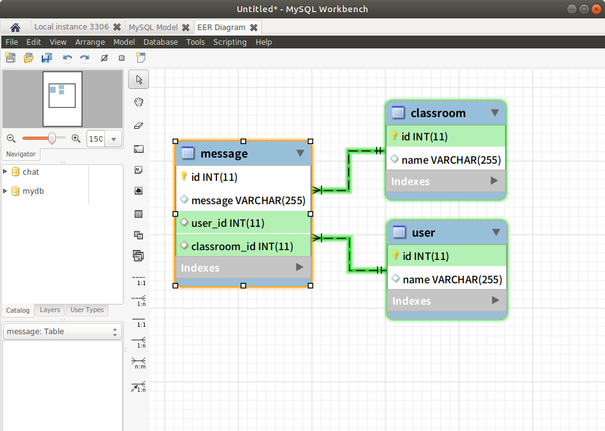

# SQL-2

# 1. Joins

두 개 이상의 테이블에서 칼럼을 중심으로 테이블의 행을 결합함.


* (INNER) JOIN: 겹치는 값만 return함
* LEFT (OUTER) JOIN: 모든 왼쪽 table의 값, 겹치는 값을 return
* RIGHT (OUTER) JOIN: 모든 오른쪽 table의 값, 겹치는 값을 return
* FULL (OUTER) JOIN: 모든 값 return


> 다음의 사이트에서 SQL명령어를 입력하면 직접 해 볼 수 있다: https://www.w3schools.com/sql/trysql.asp?filename=trysql_select_all

```sql
SELECT * FROM orders;
```


```sql
SELECT * FROM customers;
```


```sql
SELECT orders.orderID, customers.customerName, orders.orderDate FROM orders INNER JOIN customers ON orders.customerID=customers.customerID;
```


# 2. MySQL Workbench

## 2-1. EER diagram 그리기

1. Database > Reverse Engineer...



2. 연결할 DB 설정.

   

3. 연결 상황 보여줌. 완료되면 Next

   

4. Reverse Engineer 할 Schema 선택

   

5. 진행 상황 보여 줌.

   

6. Next

   

7. Next

   

8. Next

9. MySQL Model에 EER Diagram이 생김! 그 Diagram을 더블클릭하면


10. 아래와 같이 다이어그램이 생긴 것을 알 수 있다.




## 2-2. EER diagram을 토대로 테이블 생성하기

Database > Forword Engineer...


EER diagram을 만들때와 같이 next, next를 눌러주면 된다.

만약 Error가 뜬다면 Error메세지를 잘 읽어보고 해결하면 됨.