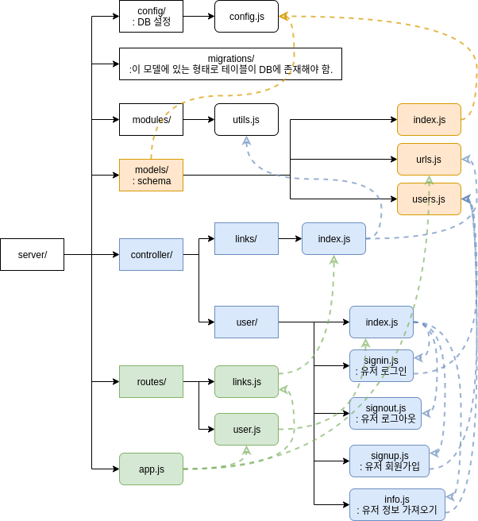
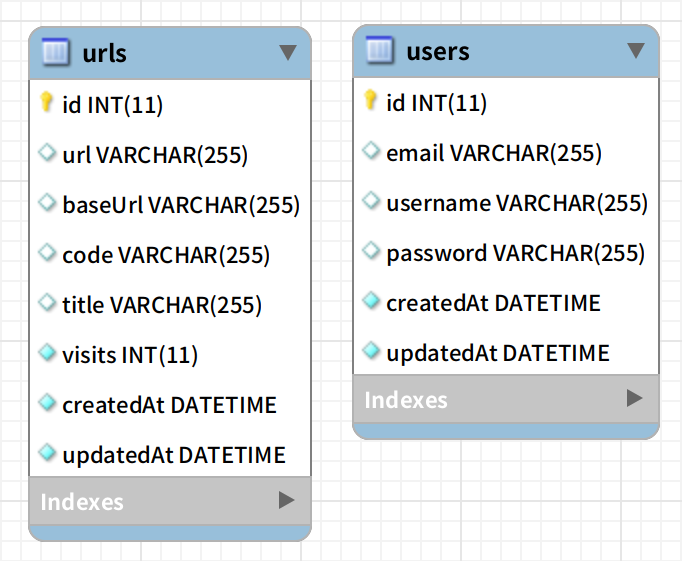

# Shortly Sprint 구조

# 1. server/

실선은 디렉토리 구조, 점선은 화살표 시작점이 끝나는 파일을 require해서 사용하는 관계를 나타냄!

# 2. DB

## 2-1. urls table

| Column Name | Type    |                                           |
| ----------- | ------- | ----------------------------------------- |
| id          | integer | **primary key**, not null, auto increment |
| url         | string  |                                           |
| baseUrl     | string  |                                           |
| code        | string  |                                           |
| title       | string  |                                           |
| visits      | integer | not null, default: 0                      |
| createdAt   | date    | not null                                  |
| updatedAt   | date    | not null                                  |

## 2-2. user table

| Column Name | Type    |                                           |
| ----------- | ------- | ----------------------------------------- |
| id          | integer | **primary key**, not null, auto increment |
| email       | string  |                                           |
| username    | string  |                                           |
| password    | string  |                                           |
| createdAt   | date    | not null                                  |
| updatedAt   | date    | not null                                  |