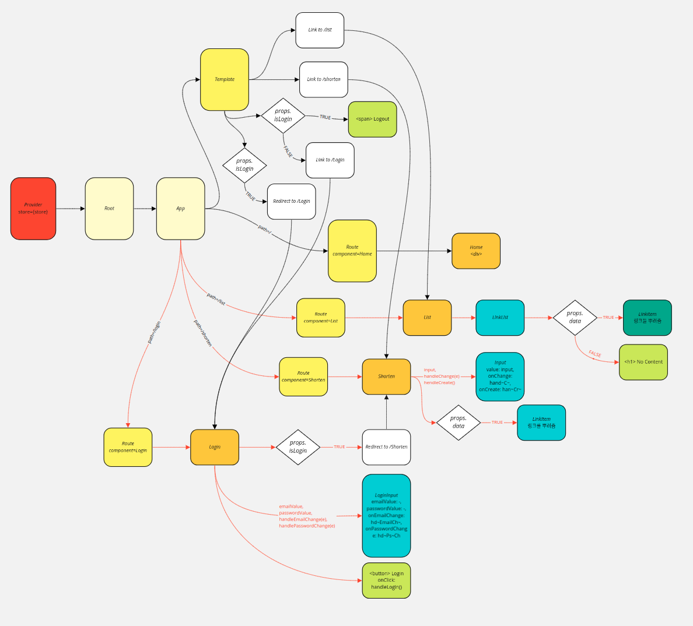
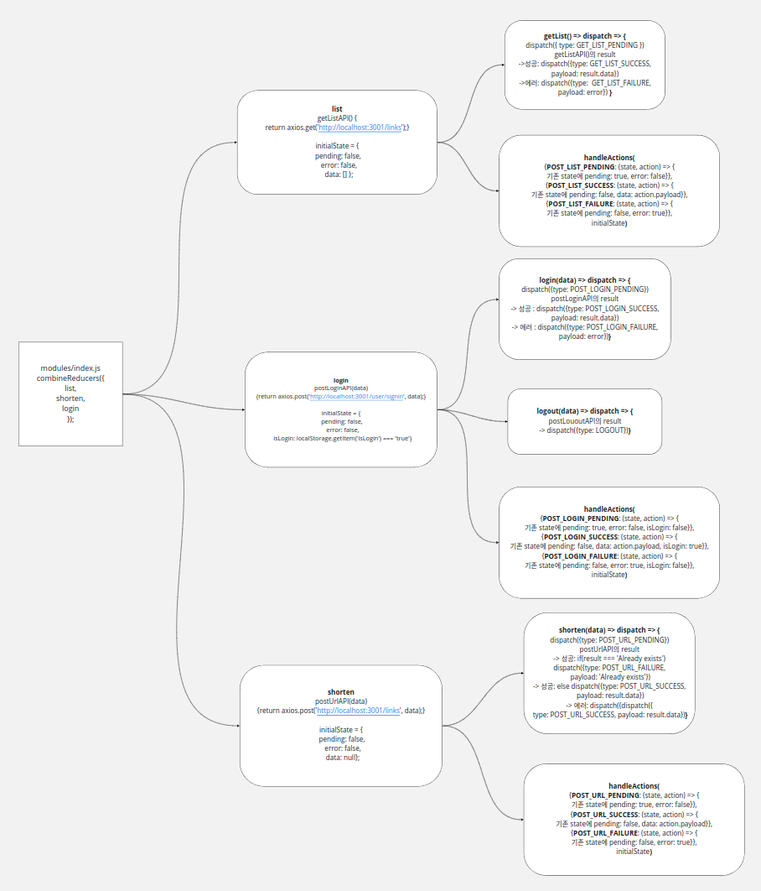

# 1. sequelize로 foreign key 설정

~~sequelize로 foreign key를 설정하는 방법은 3가지로 나눠진다.~~

~~이 방법들을 모두 사용하지 말고 셋 중 하나의 방법만 사용하는 것이 좋다.~~

~~각 방법마다 자기만의 foreign key를 만들기 때문이다..~~

~~모델 define 시 세 방법이 다 같은 이름의 foreign key를 생성한다면 문제가 없겠지만(이미 존재하는 건 넘어가기 때문에),~~

~~실수로 한 곳의 foreignKey값을 비워두면 'user_id'와 'userId'를 동시에 만들어버리는 일이 생길수도 있다..! (오늘의 삽질 포인트)~~

> 2020.01.16 추가
>
> 위 내용은 완전 잘못됐다.
>
> sequelize의 model에서 foreign key 설정을 하고, include를 통해 sequelize의 join기능을 사용하려면 hasMany랑 belongsTo를 다 써줘야 한다(**양쪽 모델에서 전부!!**).
>
> 1-1의 '모델 define 시 references로 설정'하는 부분은 테스트를 해보질 않아서 추후에 테스트를 해보고 다시 정리할것이다.


테이블 관계는 다음과 같다

* user Table : url Table = 1 : n


## 1-1.  ~~모델 define 시 references로 설정하기~~(추후 테스트 후 수정)

colunm의 references설정을 사용한다.

```js
const urls = sequelize.define(
  'urls',
  {
    url: DataTypes.STRING,
    baseUrl: DataTypes.STRING,
    code: DataTypes.STRING,
    title: DataTypes.STRING,
    user_id: {
      type: DataTypes.INTEGER,
      allowNull: false,
      // 모델 간 관계 설정
      references: {
        model: 'user', //user모델의 primery key를 강제로 참조함.
        key: 'user_id' //foreign key를 'user_id'로 설정
      }
    }
  }
);
```


## 1-2. belongsTo(), hasMany() 사용

> sequelize 공식문서: https://sequelize.org/master/class/lib/associations/belongs-to.js~BelongsTo.html

```js
const urls = sequelize.define(
  'urls',
  {
    url: DataTypes.STRING,
    baseUrl: DataTypes.STRING,
    code: DataTypes.STRING,
    title: DataTypes.STRING
  }
);

urls.belongsTo(users, { //urls는 users에 속해 있다 => url이 user모델의 primary key 참조
  foreignKey: 'user_id' //foreign key는 'user_id'
});
```


> sequelize 공식문서: https://sequelize.org/master/class/lib/associations/has-many.js~HasMany.html

```js
const users = sequelize.define(
  'users',
  {
    email: DataTypes.STRING,
    username: DataTypes.STRING,
    password: DataTypes.STRING
  }
);

users.hasMany(urls, { //users는 많은 url을 가지고 있다 => url이 user모델의 primary key 참조
  foreignKey: 'user_id' //foreign key는 'user_id'
});
```


> 2020.01.16 추가
>
> 위처럼 관계가 있는 두 model 모두에게 관계성을 명시해줘야
>
> users에서 include를 통한 urls에 접근,
>
> urls에서 include를 통한 users에 접근
>
> 을 할 수 있다.


---

# 2. jwt(json web token)사용

> jwt 홈페이지:  https://jwt.io/
>
> jwt npm 페이지: https://www.npmjs.com/package/jsonwebtoken


## 2-1. jwt 설치

npm을 사용한다면 아래의 커맨드 로그 입력

```
$ npm install jsonwebtoken
```


yarn을 사용한다면 아래의 커맨드 로그 입력

```
$ yarn add jsonwebtoken
```


## 2-2. jwt 사용

아래는 jwt블로깅을 위해 몇몇 기능들을 삭제한 코드

### 1) 로그인

```js
const { users } = require('..파일 경로'); //sequlize users모델을 가져옴
const jwt = require('jsonwebtoken');
require('dotenv').config(); //jwt의 secrete key는 공개하면 안되기 때문에 dotenv모듈을 사용했다.

module.exports = {
  post: (req, res) => {
    const { email, password } = req.body;
    users.findOne({ where: { email, password } })
    .then(result => {
      const token = jwt.sign(
        {
          //token에 보내고 싶은 데이터
          userid: result.dataValues.id
        },
        //secrete key 자리
        process.env.SECRETE_KEY,
        //이 자리를 비워두면 default 설정으로 토큰이 생성된다.
      );
        
      res.cookie('token': token);
      res.status(200).send();
    });
  }
}
```


### 2) 토큰으로 유저 정보 받아오기

> https://github.com/auth0/node-jsonwebtoken#jwtverifytoken-secretorpublickey-options-callback

```js
const { users } = require('..파일 경로'); //sequlize users모델을 가져옴
const jwt = require('jsonwebtoken');
require('dotenv').config();

module.exports = {
  get: (req, res) => {
    const token = req.cookies.token; //전송된 토큰을 받아옴
    const decoded = jwt.verify(token, process.env.SECRET_KEY); //권한확인 후 토큰이 유효하다면 디코딩 된 페이로드를 출력함

    if (!decoded) {
      //토큰이 존재하지 않으면 status 401 전송
      return res.status(401).send('need user token');
    }
    users
      .findOne({ where: { id: decoded.userid } }) //토큰으로부터 userid 받아옴
      .then(result => res.status(200).json(result.dataValues)); //해당하는 user정보 전송
  }
};
```


---

# 3. shortly client 구조

시간이 부족해서 상세 설명은 주말에 할 예정이다.


## 3-1. component 구조



미리 간단하게 설명하자면,

컴포넌트의 역할과 depth에 따라 색을 다르게 지정했다.

오른쪽으로 갈수록 depth가 깊어지며 같은 색을 가진 컴포넌트들은 같은 depth이다.

연두색은 컴포넌트는 아니고 컴포넌트를 구성하는 tag를 표시한 것이다.

흰색은 Link나 true/false분기처럼 직접 렌더링을 하는 것이 아니라 다른 지점으로 연결시켜주는 것을 의미한다.


## 1-2. reducer 구조

