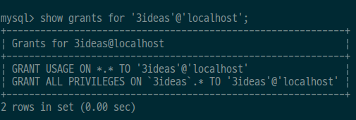

# 1. Express request

> https://expressjs.com/ko/api.html#req

### req.originalUrl

`req.url` is not a native Express property, it is inherited from Node’s [http module](https://nodejs.org/api/http.html#http_message_url).

This property is much like `req.url`; however, it retains the original request URL, allowing you to rewrite `req.url` freely for internal routing purposes. For example, the “mounting” feature of [app.use()](https://expressjs.com/ko/api.html#app.use) will rewrite `req.url` to strip the mount point.

```javascript
// GET /search?q=something
console.dir(req.originalUrl)
// => '/search?q=something'
```

In a middleware function, `req.originalUrl` is a combination of `req.baseUrl` and `req.path`, as shown in the following example.

```javascript
app.use('/admin', function (req, res, next) { // GET 'http://www.example.com/admin/new'
  console.dir(req.originalUrl) // '/admin/new'
  console.dir(req.baseUrl) // '/admin'
  console.dir(req.path) // '/new'
  next()
})
```


### req.params

This property is an object containing properties mapped to the [named route “parameters”](https://expressjs.com/ko/guide/routing.html#route-parameters). For example, if you have the route `/user/:name`, then the “name” property is available as `req.params.name`. This object defaults to `{}`.

```javascript
// GET /user/tj
console.dir(req.params.name)
// => 'tj'
```

When you use a regular expression for the route definition, capture groups are provided in the array using `req.params[n]`, where `n` is the nth capture group. This rule is applied to unnamed wild card matches with string routes such as `/file/*`:

```javascript
// GET /file/javascripts/jquery.js
console.dir(req.params[0])
// => 'javascripts/jquery.js'
```

If you need to make changes to a key in `req.params`, use the [app.param](https://expressjs.com/ko/4x/api.html#app.param) handler. Changes are applicable only to [parameters](https://expressjs.com/ko/guide/routing.html#route-parameters) already defined in the route path.

Any changes made to the `req.params` object in a middleware or route handler will be reset.

> NOTE: Express automatically decodes the values in `req.params` (using `decodeURIComponent`).


### req.query

This property is an object containing a property for each query string parameter in the route. If there is no query string, it is the empty object, `{}`.

> As `req.query`’s shape is based on user-controlled input, all properties and values in this object are untrusted and should be validated before trusting. For example, `req.query.foo.toString()` may fail in multiple ways, for example `foo` may not be there or may not be a string, and `toString` may not be a function and instead a string or other user-input.

```javascript
// GET /search?q=tobi+ferret
console.dir(req.query.q)
// => 'tobi ferret'

// GET /shoes?order=desc&shoe[color]=blue&shoe[type]=converse
console.dir(req.query.order)
// => 'desc'

console.dir(req.query.shoe.color)
// => 'blue'

console.dir(req.query.shoe.type)
// => 'converse'

// GET /shoes?color[]=blue&color[]=black&color[]=red
console.dir(req.query.color)
// => ['blue', 'black', 'red']
```


---

# 2. mysql 사용자 추가

1. mysql서버에 로그인

```sql
$ mysql -u root -p
Enter password:
```


2. 로컬에서 접속 가능한 사용자 추가

```sql
$ create user '사용자'@'localhost' identified by '비밀번호';
```


3. DB권한 부여

```sql
$ grant all privileges on *.* to '사용자'@'localhost';
$ grant all privileges on DB이름.* to '사용자'@'localhost';
```

​	`*.*`는 모든 DB에 접근 가능, 특정 DB에만 접근하게 하려면 `DB이름`으로 설정.


4. 사용자 계정 삭제

```sql
$ drop user '사용자'@'localhost';
```


5. 생성된 계정 확인

```sql
$ use mysql;
```

```sql
$ select user,host from user;

+------------------+-----------+
| user             | host      |
+------------------+-----------+
| 사용자            | localhost |
+------------------+-----------+
```


6. 권한 확인

```sql
$ show grants for '사용자'@'localhost';
```

