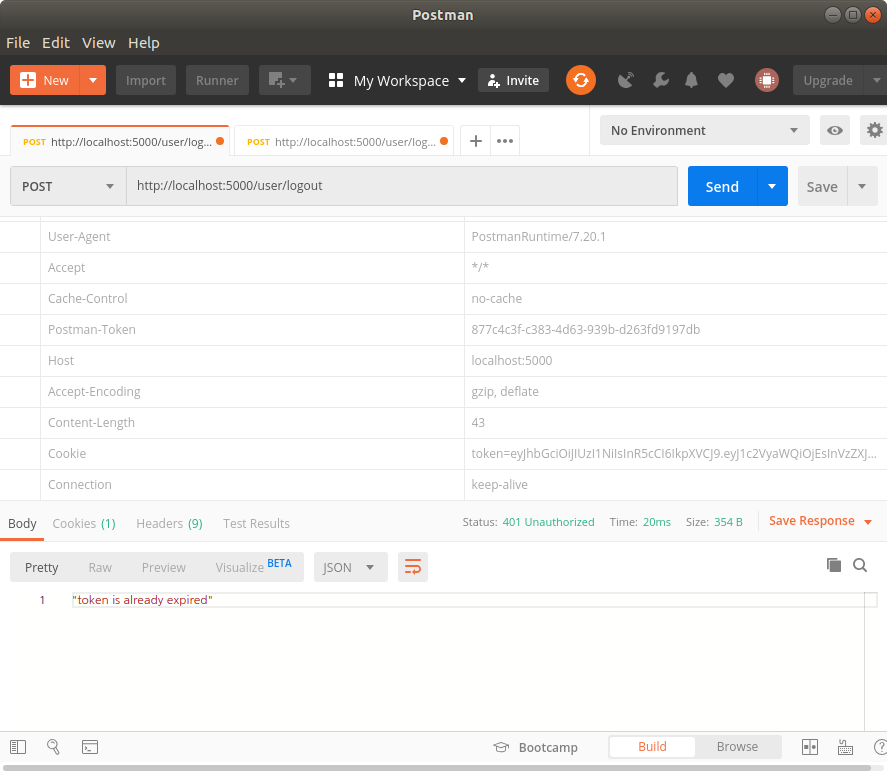

# 1. Sequelize Data type

> https://sequelize.org/master/manual/model-basics.html#data-types

sequelize에는 여러 옵션이 있는데, 그 중 data type옵션을 알아보았다.

테이블에 flag설정을 위해 boolean형식의 data type을 찾는 중, 하는 김에 다 가져와봤다(Others에 딸린 링크에 더 있긴 하지만).


### Strings

```js
DataTypes.STRING             // VARCHAR(255)
DataTypes.STRING(1234)       // VARCHAR(1234)
DataTypes.STRING.BINARY      // VARCHAR BINARY
DataTypes.TEXT               // TEXT
DataTypes.TEXT('tiny')       // TINYTEXT
DataTypes.CITEXT             // CITEXT          PostgreSQL and SQLite only.
```

### Boolean

```js
DataTypes.BOOLEAN            // TINYINT(1)
```

### Numbers

```js
DataTypes.INTEGER            // INTEGER
DataTypes.BIGINT             // BIGINT
DataTypes.BIGINT(11)         // BIGINT(11)

DataTypes.FLOAT              // FLOAT
DataTypes.FLOAT(11)          // FLOAT(11)
DataTypes.FLOAT(11, 10)      // FLOAT(11,10)

DataTypes.REAL               // REAL            PostgreSQL only.
DataTypes.REAL(11)           // REAL(11)        PostgreSQL only.
DataTypes.REAL(11, 12)       // REAL(11,12)     PostgreSQL only.

DataTypes.DOUBLE             // DOUBLE
DataTypes.DOUBLE(11)         // DOUBLE(11)
DataTypes.DOUBLE(11, 10)     // DOUBLE(11,10)

DataTypes.DECIMAL            // DECIMAL
DataTypes.DECIMAL(10, 2)     // DECIMAL(10,2)
```

#### Unsigned & Zerofill integers - MySQL/MariaDB only

In MySQL and MariaDB, the data types `INTEGER`, `BIGINT`, `FLOAT` and `DOUBLE` can be set as unsigned or zerofill (or both), as follows:

```js
DataTypes.INTEGER.UNSIGNED
DataTypes.INTEGER.ZEROFILL
DataTypes.INTEGER.UNSIGNED.ZEROFILL
// You can also specify the size i.e. INTEGER(10) instead of simply INTEGER
// Same for BIGINT, FLOAT and DOUBLE
```

### Dates

```js
DataTypes.DATE       // DATETIME for mysql / sqlite, TIMESTAMP WITH TIME ZONE for postgres
DataTypes.DATE(6)    // DATETIME(6) for mysql 5.6.4+. Fractional seconds support with up to 6 digits of precision
DataTypes.DATEONLY   // DATE without time
```

### UUIDs

For UUIDs, use `DataTypes.UUID`. It becomes the `UUID` data type for PostgreSQL and SQLite, and `CHAR(36)` for MySQL. Sequelize can generate UUIDs automatically for these fields, simply use `Sequelize.UUIDV1` or `Sequelize.UUIDV4` as the default value:

```js
{
  type: DataTypes.UUID,
  defaultValue: Sequelize.UUIDV4 // Or Sequelize.UUIDV1
}
```

### Others

There are other data types, covered in a [separate guide](https://sequelize.org/master/manual/other-data-types.html).


---

# 2. jwt.verify

> https://github.com/auth0/node-jsonwebtoken#jwtverifytoken-secretorpublickey-options-callback

`jwt.verify`를 쓸 경우 토큰 만료 시 token 에러명이 TokenExpiredError인 에러가 발생한다.

해당 상황 발생 시 서버 터미널에 에러메세지가 줄줄 나오는게 싫어서 열심히 찾아본 후 `jwt.verify`의 `callback`용법 사용으로 해결했다(이 방법이 맞는건지는 잘 모르겠다).


아래는 verify TokenExpiredError에 대한 응답을 보여주는 코드이다. 원래는 더 긴 코드인데 token expired error처리 부분만 적당히 잘라왔다.

참고로 아래의 post는 `/user/logout`의 post요청을 express로 처리한다.

```js
post: (req, res) => {
  const token = req.cookies.token;
  if (!token) {
    //? token이 존재하지 않음
    return res.status(400).json(`token isn't exist`);
  }

  let tokenErr = false;
  const decoded = jwt.verify(token, process.env.SECRET_KEY, (err, decoded) => {
    if (err) {
      // console.log(err.name);
      tokenErr = true;

      switch (err.name) {
        case 'TokenExpiredError':
          //? token이 만료됨.
          return res.status(401).json('token is already expired');
        default:
          //? token decoded 에러
          return res.status(400).json(`invalid token. error name: ${err.name}`);
      }
    }
    return decoded;
  });
    
  if (tokenErr) {
    //! token decoded error
    return;
  }
}
```



만료된 토큰을 가지고 `/user/logout`의 post요청을 보낼 경우 원하던대로 "token is already expired"응답이 온다.

