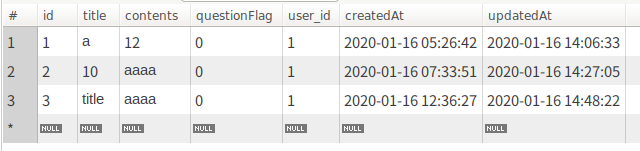
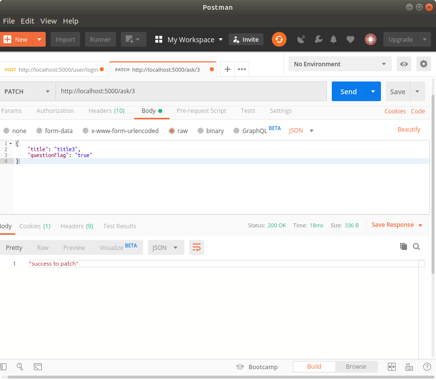
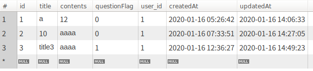

# 1. sequelize model.create(values: Object, options: Object)

Builds a new model instance and calls save on it.

## Params:

| Name                | Type                                                         | Attribute                | Description                                                  |
| ------------------- | ------------------------------------------------------------ | ------------------------ | ------------------------------------------------------------ |
| values              | [Object](https://developer.mozilla.org/en-US/docs/Web/JavaScript/Reference/Global_Objects/Object) |                          | Hash of data values to create new record with                |
| options             | [Object](https://developer.mozilla.org/en-US/docs/Web/JavaScript/Reference/Global_Objects/Object) | optional                 | Build and query options                                      |
| options.raw         | [boolean](https://developer.mozilla.org/en-US/docs/Web/JavaScript/Reference/Global_Objects/Boolean) | optionaldefault: false   | If set to true, values will ignore field and virtual setters. |
| options.isNewRecord | [boolean](https://developer.mozilla.org/en-US/docs/Web/JavaScript/Reference/Global_Objects/Boolean) | optionaldefault: true    | Is this new record                                           |
| options.include     | [Array](https://developer.mozilla.org/en-US/docs/Web/JavaScript/Reference/Global_Objects/Array) | optional                 | An array of include options - Used to build prefetched/included model instances. See `set` |
| options.fields      | [string](https://developer.mozilla.org/en-US/docs/Web/JavaScript/Reference/Global_Objects/String)[] | optional                 | An optional array of strings, representing database columns. If fields is provided, only those columns will be validated and saved. |
| options.silent      | [boolean](https://developer.mozilla.org/en-US/docs/Web/JavaScript/Reference/Global_Objects/Boolean) | optionaldefault: false   | If true, the updatedAt timestamp will not be updated.        |
| options.validate    | [boolean](https://developer.mozilla.org/en-US/docs/Web/JavaScript/Reference/Global_Objects/Boolean) | optionaldefault: true    | If false, validations won't be run.                          |
| options.hooks       | [boolean](https://developer.mozilla.org/en-US/docs/Web/JavaScript/Reference/Global_Objects/Boolean) | optionaldefault: true    | Run before and after create / update + validate hooks        |
| options.logging     | [Function](https://developer.mozilla.org/en-US/docs/Web/JavaScript/Reference/Global_Objects/Function) | optionaldefault: false   | A function that gets executed while running the query to log the sql. |
| options.benchmark   | [boolean](https://developer.mozilla.org/en-US/docs/Web/JavaScript/Reference/Global_Objects/Boolean) | optionaldefault: false   | Pass query execution time in milliseconds as second argument to logging function (options.logging). |
| options.transaction | [Transaction](https://sequelize.org/master/class/lib/transaction.js~Transaction.html) | optional                 | Transaction to run query under                               |
| options.searchPath  | [string](https://developer.mozilla.org/en-US/docs/Web/JavaScript/Reference/Global_Objects/String) | optionaldefault: DEFAULT | An optional parameter to specify the schema search_path (Postgres only) |
| options.returning   | [boolean](https://developer.mozilla.org/en-US/docs/Web/JavaScript/Reference/Global_Objects/Boolean) \| [Array](https://developer.mozilla.org/en-US/docs/Web/JavaScript/Reference/Global_Objects/Array) | optionaldefault: true    | Appends RETURNING <model columns> to get back all defined values; if an array of column names, append RETURNING <columns> to get back specific columns (Postgres only) |

## Return:

[Promise](https://developer.mozilla.org/en-US/docs/Web/JavaScript/Reference/Global_Objects/Promise)<[Model](https://sequelize.org/master/class/lib/model.js~Model.html)>

## See:

- [Model.build](https://sequelize.org/master/class/lib/model.js~Model.html#static-method-build)
- [Model.save](https://sequelize.org/master/class/lib/model.js~Model.html#instance-method-save)


---

# 2. HTTP 상태관리 코드

| 상태코드 | 설명                                                         |
| -------- | ------------------------------------------------------------ |
| 400      | 클라이언트의 잘못. 클라이언트가 명세를 잘못보냄              |
| 401      | 인증되지 않았음                                              |
| 404      | 데이터가 없음<br />403을 보내는 것이 맞는 error인데도 404를 보내는 경우가 많다<br />(이 API로 접근할 수 있는 데이터가 있다는것을 알리지 않음으로써 해킹을 쉽게 못하게 함) |
| 422      | 파라미터의 명세는 맞는데 서버 로직에 의해서 처리를 못 함.<br />*ex) 닉네임의 중복*<br />409(422와 비교해보기): 이미 요청된 form을 다시 요청했을 경우 |
| 500번대  | 서버가 터지거나 예외상황 발생<br />**되도록 발생하면 안되는 코드!!!** |


---

# 3. server sprint office hour

> codestates immersive course

**Q.** JWT로 인증을 사용하기 때문에 매 요청마다 토큰확인작업을 해야합니다. 이걸 매 요청마다 새로 작성하는것보다는 토큰을 확인하는 함수가 들어있는 파일을 만들어서 require로 불러오는게 나을 것 같은데 그 파일은 controller인걸까요??

**A. 그것은 미들웨어로 하면 됩니다!**

> 관련 블로그: https://morningbird.tistory.com/60


**Q.** createdAt 등 시간 정보를 서버에서 받아서, 프론트에서 브라우저에 보여줄 때, 일반적으로 시간 포맷 설정(2020-01-01이나 Jan 1, 2020 등)은 프론트단에서 하나요? 아니면 DB에 저장할 때부터 원하는 포맷으로 설정해서 저장하나요? 

**A.**

**API로 ISO8601이나 타임스탬프 타입으로 전달하면 클라이언트에서 알아서 처리해서 사용해야 합니다.**

데이터를 서버에서 가공해서 넘겨준다면 뷰와 컨트롤러의 의존성이 높아집니다. 의존성이 높아지면 코드수정이 복잡해지기 때문에 서로의 의존성은 낮은것이 좋습니다.

**코딩할 때 의존성 관리는 매우 중요합니다!**


---

# 4. sequelize model의 field 받아오기

> https://sequelize.org/master/class/lib/model.js~Model.html

`dataValues`관련된 의문점이 생겨서 sequelize 공식문서를 봤더니 다음의 내용을 찾았다. 

공식문서의 model페이지 제일 위에 적혀 있는 내용인데 항상 지나쳐왔었다.

이 중요한걸 이제서야 읽다니 역시 공식문서 중요하다~


A Model represents a table in the database. Instances of this class represent a database row.

Model instances operate with the concept of a `dataValues` property, which stores the actual values represented by the instance. By default, the values from dataValues can also be accessed directly from the Instance, that is:

```js
instance.field
// is the same as
instance.get('field')
// is the same as
instance.getDataValue('field')
// is the same as
instance.dataValues.field
```

However, if getters and/or setters are defined for `field` they will be invoked, instead of returning the value from `dataValues`. Accessing properties directly or using `get` is preferred for regular use, `getDataValue` should only be used for custom getters.


공식문서는 `instance.field`처럼 속성에 직접 엑세스하거나 `instance.get('field')`처럼 `get()`을 사용하는 것이 바람직하다고 한다.


# 5. sequelize model.update

> https://sequelize.org/master/class/lib/model.js~Model.html#static-method-update

HTTP patch요청을 처리하기 위해 sequelize model.update에 대해 찾아봤다.


Update multiple instances that match the where options.

## Params:

| Name                    | Type                                                         | Attribute              | Description                                                  |
| ----------------------- | ------------------------------------------------------------ | ---------------------- | ------------------------------------------------------------ |
| values                  | [Object](https://developer.mozilla.org/en-US/docs/Web/JavaScript/Reference/Global_Objects/Object) |                        | hash of values to update                                     |
| options                 | [Object](https://developer.mozilla.org/en-US/docs/Web/JavaScript/Reference/Global_Objects/Object) |                        | update options                                               |
| options.where           | [Object](https://developer.mozilla.org/en-US/docs/Web/JavaScript/Reference/Global_Objects/Object) |                        | Options to describe the scope of the search.                 |
| options.paranoid        | [boolean](https://developer.mozilla.org/en-US/docs/Web/JavaScript/Reference/Global_Objects/Boolean) | optionaldefault: true  | If true, only non-deleted records will be updated. If false, both deleted and non-deleted records will be updated. Only applies if `options.paranoid` is true for the model. |
| options.fields          | [Array](https://developer.mozilla.org/en-US/docs/Web/JavaScript/Reference/Global_Objects/Array) | optional               | Fields to update (defaults to all fields)                    |
| options.validate        | [boolean](https://developer.mozilla.org/en-US/docs/Web/JavaScript/Reference/Global_Objects/Boolean) | optionaldefault: true  | Should each row be subject to validation before it is inserted. The whole insert will fail if one row fails validation |
| options.hooks           | [boolean](https://developer.mozilla.org/en-US/docs/Web/JavaScript/Reference/Global_Objects/Boolean) | optionaldefault: true  | Run before / after bulk update hooks?                        |
| options.sideEffects     | [boolean](https://developer.mozilla.org/en-US/docs/Web/JavaScript/Reference/Global_Objects/Boolean) | optionaldefault: true  | Whether or not to update the side effects of any virtual setters. |
| options.individualHooks | [boolean](https://developer.mozilla.org/en-US/docs/Web/JavaScript/Reference/Global_Objects/Boolean) | optionaldefault: false | Run before / after update hooks?. If true, this will execute a SELECT followed by individual UPDATEs. A select is needed, because the row data needs to be passed to the hooks |
| options.returning       | [boolean](https://developer.mozilla.org/en-US/docs/Web/JavaScript/Reference/Global_Objects/Boolean) \| [Array](https://developer.mozilla.org/en-US/docs/Web/JavaScript/Reference/Global_Objects/Array) | optionaldefault: false | If true, append RETURNING <model columns> to get back all defined values; if an array of column names, append RETURNING <columns> to get back specific columns (Postgres only) |
| options.limit           | [number](https://developer.mozilla.org/en-US/docs/Web/JavaScript/Reference/Global_Objects/Number) | optional               | How many rows to update (only for mysql and mariadb, implemented as TOP(n) for MSSQL; for sqlite it is supported only when rowid is present) |
| options.logging         | [Function](https://developer.mozilla.org/en-US/docs/Web/JavaScript/Reference/Global_Objects/Function) | optionaldefault: false | A function that gets executed while running the query to log the sql. |
| options.benchmark       | [boolean](https://developer.mozilla.org/en-US/docs/Web/JavaScript/Reference/Global_Objects/Boolean) | optionaldefault: false | Pass query execution time in milliseconds as second argument to logging function (options.logging). |
| options.transaction     | [Transaction](https://sequelize.org/master/class/lib/transaction.js~Transaction.html) | optional               | Transaction to run query under                               |
| options.silent          | [boolean](https://developer.mozilla.org/en-US/docs/Web/JavaScript/Reference/Global_Objects/Boolean) | optionaldefault: false | If true, the updatedAt timestamp will not be updated.        |

## Return:

[Promise](https://developer.mozilla.org/en-US/docs/Web/JavaScript/Reference/Global_Objects/Promise)<[Array](https://developer.mozilla.org/en-US/docs/Web/JavaScript/Reference/Global_Objects/Array)<[number](https://developer.mozilla.org/en-US/docs/Web/JavaScript/Reference/Global_Objects/Number), [number](https://developer.mozilla.org/en-US/docs/Web/JavaScript/Reference/Global_Objects/Number)>>

* The promise returns an array with one or two elements. The first element is always the number of affected rows, while the second element is the actual affected rows (only supported in postgres with `options.returning` true).


## 사용 예)

patch의 경우 변경이 필요한 데이터만 request의 body로 온다.


```js
const { questions } = require('../../models'); //questions는 sequelize의 model(questions 테이블).

module.exports = {
  patch: (req, res) => {
    const { title, contents, questionFlag } = req.body;
    if (!title && !contents && !questionFlag) {
      //! title, contents, questionFlag 셋 다 없으면 안됨.
      return res.status(400).json('Please send patch data');
    }

    //? 변경할 부분이 있는 경우 그 부분만 새 객체에 넣음
    const patchValues = {};
    if (title) {
      patchValues.title = title;
    }
    if (contents) {
      patchValues.contents = contents;
    }
    if (questionFlag) {
      patchValues.questionFlag = questionFlag;
    }

    const askId = req.params.askId;
    questions
      .update(patchValues, { where: { id: askId } }) //questions의 id가 askId와 같은 경우 변경해야 될 부분을 변경함.
      .then(([affectedRows]) => { //affectedRows는 변경된 행의 갯수를 받아온다.
        if (!affectedRows) {
          //! 아무것도 변경되지 않았음
          return res.status(400).json('fail to patch');
        }
        res.status(200).json('success to patch');
      })
      .catch(err => res.status(400).send(err)); //에러 처리
  }
}
```


1. patch 전 테이블




2. patch요청 성공




3. patch 후 테이블

