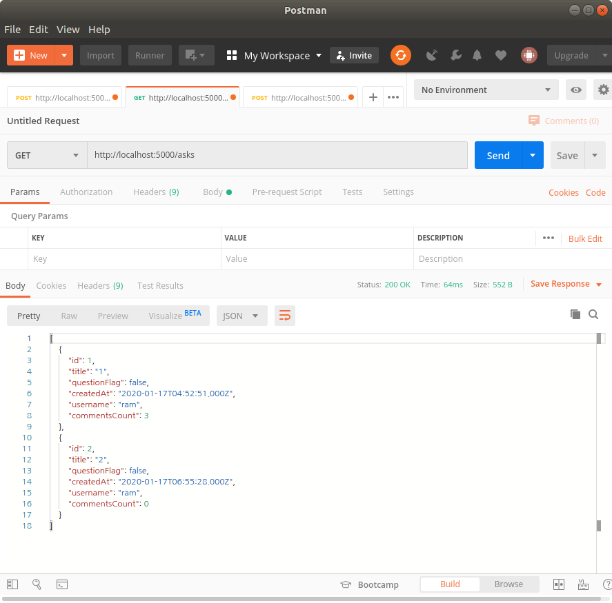

# 1. Sequelize model.delete

> https://sequelize.org/master/class/lib/model.js~Model.html#static-method-destroy

Delete multiple instances, or set their deletedAt timestamp to the current time if `paranoid` is enabled.

## Params:

| Name                    | Type                                                         | Attribute              | Description                                                  |
| ----------------------- | ------------------------------------------------------------ | ---------------------- | ------------------------------------------------------------ |
| options                 | [Object](https://developer.mozilla.org/en-US/docs/Web/JavaScript/Reference/Global_Objects/Object) |                        | destroy options                                              |
| options.where           | [Object](https://developer.mozilla.org/en-US/docs/Web/JavaScript/Reference/Global_Objects/Object) | optional               | Filter the destroy                                           |
| options.hooks           | [boolean](https://developer.mozilla.org/en-US/docs/Web/JavaScript/Reference/Global_Objects/Boolean) | optionaldefault: true  | Run before / after bulk destroy hooks?                       |
| options.individualHooks | [boolean](https://developer.mozilla.org/en-US/docs/Web/JavaScript/Reference/Global_Objects/Boolean) | optionaldefault: false | If set to true, destroy will SELECT all records matching the where parameter and will execute before / after destroy hooks on each row |
| options.limit           | [number](https://developer.mozilla.org/en-US/docs/Web/JavaScript/Reference/Global_Objects/Number) | optional               | How many rows to delete                                      |
| options.force           | [boolean](https://developer.mozilla.org/en-US/docs/Web/JavaScript/Reference/Global_Objects/Boolean) | optionaldefault: false | Delete instead of setting deletedAt to current timestamp (only applicable if `paranoid` is enabled) |
| options.truncate        | [boolean](https://developer.mozilla.org/en-US/docs/Web/JavaScript/Reference/Global_Objects/Boolean) | optionaldefault: false | If set to true, dialects that support it will use TRUNCATE instead of DELETE FROM. If a table is truncated the where and limit options are ignored |
| options.cascade         | [boolean](https://developer.mozilla.org/en-US/docs/Web/JavaScript/Reference/Global_Objects/Boolean) | optionaldefault: false | Only used in conjunction with TRUNCATE. Truncates all tables that have foreign-key references to the named table, or to any tables added to the group due to CASCADE. |
| options.restartIdentity | [boolean](https://developer.mozilla.org/en-US/docs/Web/JavaScript/Reference/Global_Objects/Boolean) | optionaldefault: false | Only used in conjunction with TRUNCATE. Automatically restart sequences owned by columns of the truncated table. |
| options.transaction     | [Transaction](https://sequelize.org/master/class/lib/transaction.js~Transaction.html) | optional               | Transaction to run query under                               |
| options.logging         | [Function](https://developer.mozilla.org/en-US/docs/Web/JavaScript/Reference/Global_Objects/Function) | optionaldefault: false | A function that gets executed while running the query to log the sql. |
| options.benchmark       | [boolean](https://developer.mozilla.org/en-US/docs/Web/JavaScript/Reference/Global_Objects/Boolean) | optionaldefault: false | Pass query execution time in milliseconds as second argument to logging function (options.logging). |

## Return:

`Promise<number>`

* The number of destroyed rows


---

# 2. Project Office Hour

> codestates immersive course

apache, nginx같은 웹서버가 PM2 등으로 옮겨줌

웹서버는 요청과 응답처리에 특화되어있음.

* 반드시 pm2와 웹서버를 사용해야 함.
* 웹서버를 사용하면 도메인을 붙일 수 있음.
  * 서버도메인 포함 최소 2개의 도메인을 사용해야 함.
  * 알아보기: Nginx reverse proxy (proxy: 중간다리 역할).


도메인만으로 서비스에 접근하기 위해서는 local에서는 기본적으로 port 80으로 요청을 보낸다. 그렇기 때문에 기본적으로 서비스 제공자는 주로 80번 포트를 쓴다. PM2의 경우 1000번째 미만은 관리자 권한이 필요함.

=> sudo로 해결할수도 있지만 지양하는 패턴이다. 이것을 해결하기 위해 reverse proxy작업을 해주는 apache, nginx와 같은 웹서버를 사용한다. 


**Q.** 서버 배포 시에는 config 파일에서 배포되었을 때랑 로컬에서 테스트할 때 사용하는 정보 관리하는 걸 지난 스프린트 때 봤는데요.
클라이언트도 로컬 테스트할 때와 배포되었을 때 사용하는 엔드포인트가 다른데 이 부분도 환경 변수로 관리할 수 있을 것 같은데 어떻게 하는지 잘 모르겠어요. 

**A.** 터미널에 빌드 하면서 process.env.NODE_ENV 이렇게 하는 걸 말하는걸까요? 

.env.production 
API_HOST=`http://api.mydomain.com `


**Q.** 코드에서 테이블을 만드는 것은 어떨까

**A.** 코드 상 DB에서 테이블을 만드는 것은 지양해야 한다.

테이블을 생성하지 않고 레코드만으로도 할 수 있을것이다.


**Q.** S3에 이미지를 저장하고 db는 경로만 남기는 것이 좋다고 들어서 S3에 접근하는 방법?

**A.** 경로만 남기는 것이 좋음.


# 3. Sequelize model.findAll attributes, 조인하기

> 

Search for multiple instances.

### Params:

| Name                                 | Type                                                         | Attribute                | Description                                                  |
| ------------------------------------ | ------------------------------------------------------------ | ------------------------ | ------------------------------------------------------------ |
| options                              | [Object](https://developer.mozilla.org/en-US/docs/Web/JavaScript/Reference/Global_Objects/Object) | optional                 | A hash of options to describe the scope of the search        |
| options.where                        | [Object](https://developer.mozilla.org/en-US/docs/Web/JavaScript/Reference/Global_Objects/Object) | optional                 | A hash of attributes to describe your search. See above for examples. |
| options.attributes                   | [Array](https://developer.mozilla.org/en-US/docs/Web/JavaScript/Reference/Global_Objects/Array)<[string](https://developer.mozilla.org/en-US/docs/Web/JavaScript/Reference/Global_Objects/String)> \| [Object](https://developer.mozilla.org/en-US/docs/Web/JavaScript/Reference/Global_Objects/Object) | optional                 | A list of the attributes that you want to select, or an object with `include` and `exclude` keys. To rename an attribute, you can pass an array, with two elements - the first is the name of the attribute in the DB (or some kind of expression such as `Sequelize.literal`, `Sequelize.fn` and so on), and the second is the name you want the attribute to have in the returned instance |
| options.attributes.include           | [Array](https://developer.mozilla.org/en-US/docs/Web/JavaScript/Reference/Global_Objects/Array)<[string](https://developer.mozilla.org/en-US/docs/Web/JavaScript/Reference/Global_Objects/String)> | optional                 | Select all the attributes of the model, plus some additional ones. Useful for aggregations, e.g. `{ attributes: { include: [[sequelize.fn('COUNT', sequelize.col('id')), 'total']] }` |
| options.attributes.exclude           | [Array](https://developer.mozilla.org/en-US/docs/Web/JavaScript/Reference/Global_Objects/Array)<[string](https://developer.mozilla.org/en-US/docs/Web/JavaScript/Reference/Global_Objects/String)> | optional                 | Select all the attributes of the model, except some few. Useful for security purposes e.g. `{ attributes: { exclude: ['password'] } }` |
| options.paranoid                     | [boolean](https://developer.mozilla.org/en-US/docs/Web/JavaScript/Reference/Global_Objects/Boolean) | optionaldefault: true    | If true, only non-deleted records will be returned. If false, both deleted and non-deleted records will be returned. Only applies if `options.paranoid` is true for the model. |
| options.include                      | [Array](https://developer.mozilla.org/en-US/docs/Web/JavaScript/Reference/Global_Objects/Array)<[Object](https://developer.mozilla.org/en-US/docs/Web/JavaScript/Reference/Global_Objects/Object)\|[Model](https://sequelize.org/master/class/lib/model.js~Model.html)\|[string](https://developer.mozilla.org/en-US/docs/Web/JavaScript/Reference/Global_Objects/String)> | optional                 | A list of associations to eagerly load using a left join. Supported is either `{ include: [ Model1, Model2, ...]}` or `{ include: [{ model: Model1, as: 'Alias' }]}` or `{ include: ['Alias']}`. If your association are set up with an `as` (eg. `X.hasMany(Y, { as: 'Z }`, you need to specify Z in the as attribute when eager loading Y). |
| options.include[].model              | [Model](https://sequelize.org/master/class/lib/model.js~Model.html) | optional                 | The model you want to eagerly load                           |
| options.include[].as                 | [string](https://developer.mozilla.org/en-US/docs/Web/JavaScript/Reference/Global_Objects/String) | optional                 | The alias of the relation, in case the model you want to eagerly load is aliased. For `hasOne` / `belongsTo`, this should be the singular name, and for `hasMany`, it should be the plural |
| options.include[].association        | [Association](https://sequelize.org/master/class/lib/associations/base.js~Association.html) | optional                 | The association you want to eagerly load. (This can be used instead of providing a model/as pair) |
| options.include[].where              | [Object](https://developer.mozilla.org/en-US/docs/Web/JavaScript/Reference/Global_Objects/Object) | optional                 | Where clauses to apply to the child models. Note that this converts the eager load to an inner join, unless you explicitly set `required: false` |
| options.include[].or                 | [boolean](https://developer.mozilla.org/en-US/docs/Web/JavaScript/Reference/Global_Objects/Boolean) | optionaldefault: false   | Whether to bind the ON and WHERE clause together by OR instead of AND. |
| options.include[].on                 | [Object](https://developer.mozilla.org/en-US/docs/Web/JavaScript/Reference/Global_Objects/Object) | optional                 | Supply your own ON condition for the join.                   |
| options.include[].attributes         | [Array](https://developer.mozilla.org/en-US/docs/Web/JavaScript/Reference/Global_Objects/Array)<[string](https://developer.mozilla.org/en-US/docs/Web/JavaScript/Reference/Global_Objects/String)> | optional                 | A list of attributes to select from the child model          |
| options.include[].required           | [boolean](https://developer.mozilla.org/en-US/docs/Web/JavaScript/Reference/Global_Objects/Boolean) | optional                 | If true, converts to an inner join, which means that the parent model will only be loaded if it has any matching children. True if `include.where` is set, false otherwise. |
| options.include[].right              | [boolean](https://developer.mozilla.org/en-US/docs/Web/JavaScript/Reference/Global_Objects/Boolean) | optional                 | If true, converts to a right join if dialect support it. Ignored if `include.required` is true. |
| options.include[].separate           | [boolean](https://developer.mozilla.org/en-US/docs/Web/JavaScript/Reference/Global_Objects/Boolean) | optional                 | If true, runs a separate query to fetch the associated instances, only supported for hasMany associations |
| options.include[].limit              | [number](https://developer.mozilla.org/en-US/docs/Web/JavaScript/Reference/Global_Objects/Number) | optional                 | Limit the joined rows, only supported with include.separate=true |
| options.include[].through.as         | [string](https://developer.mozilla.org/en-US/docs/Web/JavaScript/Reference/Global_Objects/String) | optional                 | The alias for the join model, in case you want to give it a different name than the default one. |
| options.include[].through.where      | [Object](https://developer.mozilla.org/en-US/docs/Web/JavaScript/Reference/Global_Objects/Object) | optional                 | Filter on the join model for belongsToMany relations         |
| options.include[].through.attributes | [Array](https://developer.mozilla.org/en-US/docs/Web/JavaScript/Reference/Global_Objects/Array) | optional                 | A list of attributes to select from the join model for belongsToMany relations |
| options.include[].include            | [Array](https://developer.mozilla.org/en-US/docs/Web/JavaScript/Reference/Global_Objects/Array)<[Object](https://developer.mozilla.org/en-US/docs/Web/JavaScript/Reference/Global_Objects/Object)\|[Model](https://sequelize.org/master/class/lib/model.js~Model.html)\|[string](https://developer.mozilla.org/en-US/docs/Web/JavaScript/Reference/Global_Objects/String)> | optional                 | Load further nested related models                           |
| options.include[].duplicating        | [boolean](https://developer.mozilla.org/en-US/docs/Web/JavaScript/Reference/Global_Objects/Boolean) | optional                 | Mark the include as duplicating, will prevent a subquery from being used. |
| options.order                        | [Array](https://developer.mozilla.org/en-US/docs/Web/JavaScript/Reference/Global_Objects/Array) \| [fn](https://sequelize.org/master/class/lib/sequelize.js~Sequelize.html#static-method-fn) \| [col](https://sequelize.org/master/class/lib/sequelize.js~Sequelize.html#static-method-col) \| [literal](https://sequelize.org/master/class/lib/sequelize.js~Sequelize.html#static-method-literal) | optional                 | Specifies an ordering. Using an array, you can provide several columns / functions to order by. Each element can be further wrapped in a two-element array. The first element is the column / function to order by, the second is the direction. For example: `order: [['name', 'DESC']]`. In this way the column will be escaped, but the direction will not. |
| options.limit                        | [number](https://developer.mozilla.org/en-US/docs/Web/JavaScript/Reference/Global_Objects/Number) | optional                 | Limit for result                                             |
| options.offset                       | [number](https://developer.mozilla.org/en-US/docs/Web/JavaScript/Reference/Global_Objects/Number) | optional                 | Offset for result                                            |
| options.transaction                  | [Transaction](https://sequelize.org/master/class/lib/transaction.js~Transaction.html) | optional                 | Transaction to run query under                               |
| options.lock                         | [string](https://developer.mozilla.org/en-US/docs/Web/JavaScript/Reference/Global_Objects/String) \| [Object](https://developer.mozilla.org/en-US/docs/Web/JavaScript/Reference/Global_Objects/Object) | optional                 | Lock the selected rows. Possible options are transaction.LOCK.UPDATE and transaction.LOCK.SHARE. Postgres also supports transaction.LOCK.KEY_SHARE, transaction.LOCK.NO_KEY_UPDATE and specific model locks with joins. |
| options.skipLocked                   | [boolean](https://developer.mozilla.org/en-US/docs/Web/JavaScript/Reference/Global_Objects/Boolean) | optional                 | Skip locked rows. Only supported in Postgres.                |
| options.raw                          | [boolean](https://developer.mozilla.org/en-US/docs/Web/JavaScript/Reference/Global_Objects/Boolean) | optional                 | Return raw result. See sequelize.query for more information. |
| options.logging                      | [Function](https://developer.mozilla.org/en-US/docs/Web/JavaScript/Reference/Global_Objects/Function) | optionaldefault: false   | A function that gets executed while running the query to log the sql. |
| options.benchmark                    | [boolean](https://developer.mozilla.org/en-US/docs/Web/JavaScript/Reference/Global_Objects/Boolean) | optionaldefault: false   | Pass query execution time in milliseconds as second argument to logging function (options.logging). |
| options.having                       | [Object](https://developer.mozilla.org/en-US/docs/Web/JavaScript/Reference/Global_Objects/Object) | optional                 | Having options                                               |
| options.searchPath                   | [string](https://developer.mozilla.org/en-US/docs/Web/JavaScript/Reference/Global_Objects/String) | optionaldefault: DEFAULT | An optional parameter to specify the schema search_path (Postgres only) |
| options.rejectOnEmpty                | [boolean](https://developer.mozilla.org/en-US/docs/Web/JavaScript/Reference/Global_Objects/Boolean) \| [Error](https://developer.mozilla.org/en-US/docs/Web/JavaScript/Reference/Global_Objects/Error) | optionaldefault: false   | Throws an error when no records found                        |

### Return: 

`Promise<Array>`


sequelize findAll에는 많은 속성을 사용할 수 있는데, 그 중 attributes와 include에 대해 설명할것이다.

attributes는 model에서 원하는 속성만 가져오는 옵션이고

include는 sequelize에서 join을 편하게 사용할 수 있게 해주는 옵션이다.


## 1. attributes

questions의 형식이 아래와 같다고 해보자.

```js
const questions = sequelize.define(
    'questions',
    {
      title: {
        type: DataTypes.STRING,
        allowNull: false,
      },
      contents: {
        type: DataTypes.TEXT,
        allowNull: false,
      },
      questionFlag: {
        type: DataTypes.BOOLEAN,
        allowNull: false,
        defaultValue: false,
      },
      user_id: {
        type: DataTypes.INTEGER,
        allowNull: false,
      },
    },
    {},
  );
```


```js
questions.findAll({
    attributes: ['title', 'contents']
})
```

attributes를 위와 같이 사용하면 model에 있는 'title', 'contents'만 return된다.

questionFlag와 user_id은 attrigutes배열의 요소가 아니기 때문에 findAll 시 가져오지 않는다.


## 2. include

include는 join을 해준다.

다른 옵션을 사용하지 않으면 기본적으로 left join을 한다.

하지만 include로 join을 사용하려면 hasMany나 belongsTo와 같이 테이블간의 관계를 명시를 해줘야 한다.


join을 위해 아래의 users모델도 만든다

```js
const users = sequelize.define(
    'users',
    {
      userName: {
        type: DataTypes.STRING,
        allowNull: false,
      },
      password: {
        type: DataTypes.STRING,
        allowNull: false,
      },
      point: {
        type: DataTypes.INTEGER,
        allowNull: false,
        defaultValue: 0,
      },
      report: {
        type: DataTypes.INTEGER,
        allowNull: false,
        defaultValue: 0,
      },
    },
    {},
);

//아래와 같은 관계명시는 꼭 해줘야 한다.
users.hasMany(models.questions, {
    foreignKey: 'user_id',
});
questions.belongsTo(models.users, {
    foreignKey: 'user_id',
});
```


그냥 include만 써도 좋지만 include에도 attributes를 사용할 수 있다.

```js
questions
.findAll({
    attributes: ['id', 'title', 'questionFlag', 'createdAt'],
    include: [
        {
            model: users,
            attributes: ['userName'],
        },
        {
            model: answers,
            attributes: ['id'],
        },
    ],
})
```

이러면 findAll을 한 결과의 각자 값은 id, title, questionFlag, createdAt, user.userName, answer.id만 가지고 있는 model이 될것이다.


## 3. 응용

findAll의 경우에는 데이터들이 model의 배열 형식으로 들어오기 때문에 그 안의 데이터를 다루는게 좀 까다로웠다.

하지만 얘도 결국 Array!

JS스럽게도 당연히 Array의 메서드들을 사용할 수 있었기에 그것을 응용해서 데이터 형식을 수정했다.

왠지 sequlize에 join 후 원하는 키값으로 데이터를 저장하는 방법이 있을 것 같긴 한데 아무리 찾아도 안나와서 그냥 map을 사용했다.


```js
const { questions, users, answers } = require('../../models');

module.exports = {
  //? 질문글 목록 요청( /asks 혹은 /asks?s=target )
  get: (req, res) => {
    const target = req.query.s;

    if (!target) {
      //? 모든 질문글을 응답으로 보냄

      questions
        .findAll({
          attributes: ['id', 'title', 'questionFlag', 'createdAt'], //id, title, questionFlag, createdAt만 가져옴
          include: [
            {
              model: users,
              attributes: ['userName'], //users의 userName만 받아옴
            },
            {
              model: answers,
              attributes: ['id'], //answers의 id만 받아옴
            },
          ],
        })
        .then(asks => {
          asks = asks.map(value => {
            //위 findAll의 결과는 Array이기때문에 asks에서 map을 사용할 수 있다!!
            const ask = {};
            Object.assign(ask, value.dataValues);
            //빈 배열에 value 얕은 복사

            ask.username = ask.user.userName; //ask의 username이라는 키값에 ask.user.userName의 데이터를 저장함
            delete ask.user; //ask에서 키값이 user인 키,값 쌍을 삭제함

            ask.commentsCount = ask.answers.length; //ask의 commentsCount라는 키값이 join해온 answers들의 갯수를 저장함
            delete ask.answers; //ask에서 키값이 answer인 키,값 쌍을 삭제

            return ask;
          });

          res.status(200).json(asks);
        })
        .catch(err => res.status(400).send(err));
    }
    else {
      //쿼리받아서 데이터를 찾는 API는 아직 구현하지 않았다.
      res.status(200).json(`asks get. query: ${target}`);
    }
  },
};

```


위 코드에 `/asks`요청을 보내면 아래와 같이 원하는 결과값이 나오는것을 알 수 있다.

