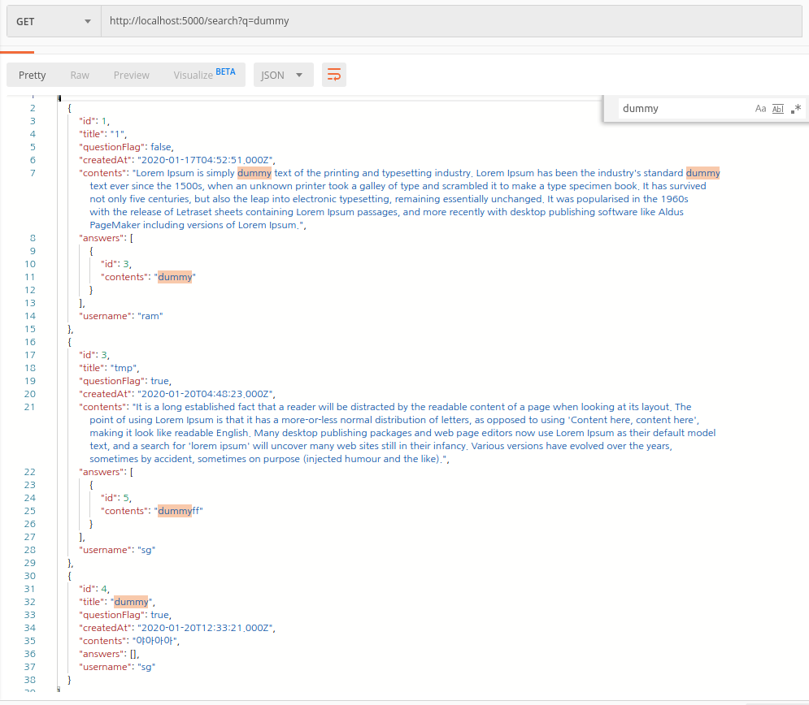

# 1. Sequelize and, or, like, not

검색기능 구현


20일에 블로깅하겠다고 적어둔 내용이다.

정리하고 올려야지 했었는데 이렇게 뒀다간 한참동안 안올릴 것 같아서 그냥 올린다.

검색기능구현을 통해 Sequelize.Op사용법과 include에 대해 많은 것을 배웠다. 역시 프로젝트가 최고다.


아래는 'dummy'라는 단어를 찾는 API요청을 보냈을때의 응답이다.

'질문글의 제목', '질문글의 내용', '답변글의 내용' 이 세 데이터에서 원하는 것을 찾는다!!




아래는 20일에 구현했던 코드.

```js
const { questions, answers, users } = require('../../models');
const { Sequelize } = require('sequelize');
const { and, or, like, not } = Sequelize.Op;

module.exports = {
  //? 검색 기능 ( /search?q=키워드 )
  get: async (req, res) => {
    let keyword = req.query.q;
    keyword = keyword.trim(); //trim으로 앞뒤 공백 제거
    if (!keyword.length) {
      //! 키워드에 공백만 존재
      return res.status(400).json('invalid target');
    }

    keyword = keyword.replace(/\s\s+/gi, ' '); //target 사이에 공백이 2개 이상 존재 > 하나의 공백으로 변환

    //* 1. questions에서 찾기 => question id 저장
    const searchIdResult = [];
    await questions
      .findAll({
        where: {
          [or]: [{ contents: { [like]: `%${keyword}%` } }, { title: { [like]: `%${keyword}%` } }],
        },
      })
      .then(asks => {
        // console.log(asks);
        asks = asks.forEach(value => {
          const { id } = value;
          searchIdResult.push({ id });
        });
        return asks;
      });
    // console.log(searchIdResult);

    //* 2. answers에서 찾기 => answer.user_id가 위에서 찾은 결과와 겹치지 않는다면 searchResult에 저장!
    const answersNotCondition = searchIdResult.map(value => {
      const question_id = value.id;
      return { question_id };
    });
    // console.log(answersNotCondition);

    await answers
      .findAll({
        attributes: ['question_id'],
        where: {
          [and]: [{ [not]: { [or]: answersNotCondition } }, { contents: { [like]: `%${keyword}%` } }],
        },
      })
      .then(result => {
        // console.log(result);
        result = result.forEach(value => {
          const id = value.question_id;
          searchIdResult.push({ id });
        });
        return result;
      });
    // console.log(searchIdResult);

    //? 찾은 questions id를 토대로 res로 보내줄 내용을 찾음
    const searchResult = await questions
      .findAll({
        attributes: ['id', 'title', 'questionFlag', 'createdAt'],
        include: [
          {
            model: users,
            attributes: ['userName'],
          },
          {
            model: answers,
            attributes: ['id'],
          },
        ],
        where: {
          [or]: searchIdResult,
        },
      })
      .then(asks => {
        asks = asks.map(value => {
          const ask = {};
          Object.assign(ask, value.dataValues);

          ask.username = ask.user.userName;
          delete ask.user;

          ask.commentsCount = ask.answers.length;
          delete ask.answers;

          return ask;
        });
        return asks;
      });

    res.status(200).json(searchResult);
  },
};

```


---

아래는 위 코드 작성 후 21일에 리펙토링한 코드이다.

자꾸 보다보니 없어도 될 부분이 눈에 띄더라.

```js
const { questions, answers, users } = require('../../models');
const { Sequelize } = require('sequelize');
const { or, like } = Sequelize.Op;

module.exports = {
  //? 검색 기능 ( /search?q=키워드 )
  get: async (req, res) => {
    let keyword = req.query.q;
    keyword = keyword.trim(); //trim으로 앞뒤 공백 제거
    if (!keyword.length) {
      //! 키워드에 공백만 존재
      return res.status(400).json('invalid target');
    }

    keyword = keyword.replace(/\s\s+/gi, ' '); //target 사이에 공백이 2개 이상 존재 > 하나의 공백으로 변환

    //* 1. questions에서 찾기 => 찾는 조건 저장
    const questionSearchCondition = [{ contents: { [like]: `%${keyword}%` } }, { title: { [like]: `%${keyword}%` } }];

    //* answers에서 찾기 => questionSearchCondition에 question id 저장
    await answers
      .findAll({
        attributes: ['question_id'],
        where: {
          contents: { [like]: `%${keyword}%` },
        },
      })
      .then(result => {
        // console.log(result);
        result = result.forEach(value => {
          const id = value.question_id;
          if (!questionSearchCondition.includes({ id })) {
            questionSearchCondition.push({ id });
          }
        });
        return result;
      });

    //? 찾은 질문글 id들 토대로 질문글에서 response data에 맞게 형식 바꿔서 저장
    let searchResults = await questions
      .findAll({
        attributes: ['id', 'title', 'questionFlag', 'createdAt', 'contents'],
        include: [
          {
            model: users,
            attributes: ['userName'],
          },
          {
            required: false,
            model: answers,
            attributes: ['id', 'contents'],
            where: { contents: { [like]: `%${keyword}%` } },
          },
        ],
        where: {
          [or]: questionSearchCondition,
        },
      })
      .then(async asks => {
        asks = await Promise.all(
          asks.map(async value => {
            const ask = {};
            Object.assign(ask, value.dataValues);

            ask.username = ask.user.userName;
            delete ask.user;

            ask.commentsCount = await answers.count({ where: { question_id: ask.id } });

            return ask;
          }),
        );
        return asks;
      });

    // console.log(searchResults);
    res.status(200).json(searchResults);
  },
};

```