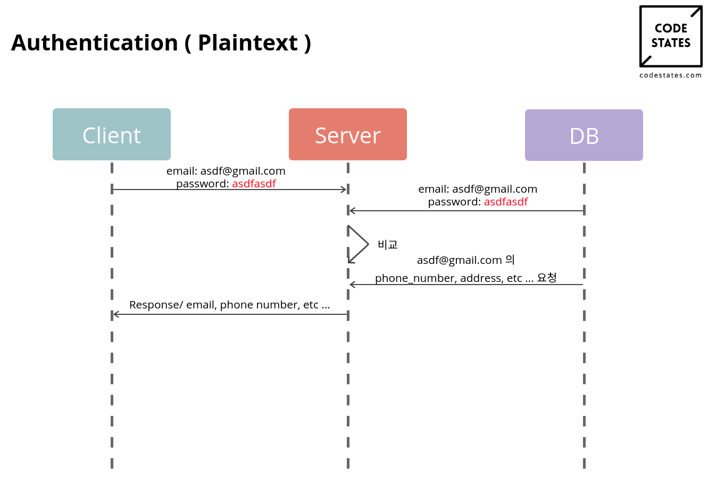
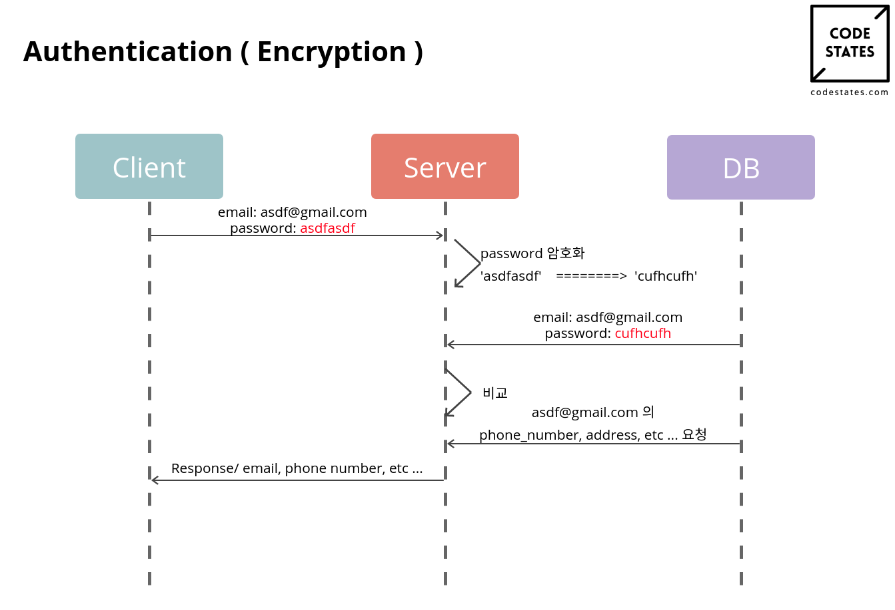
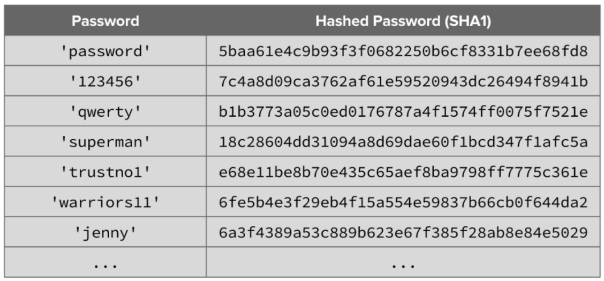
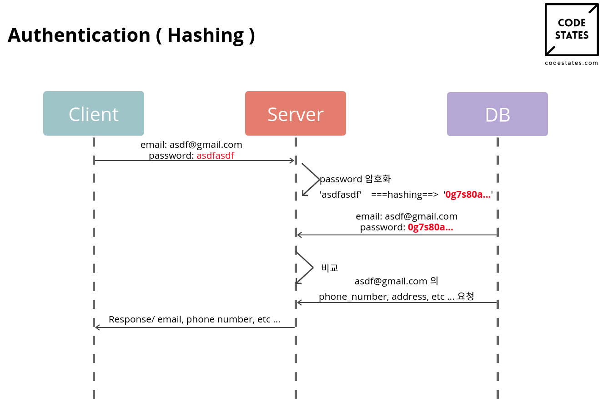
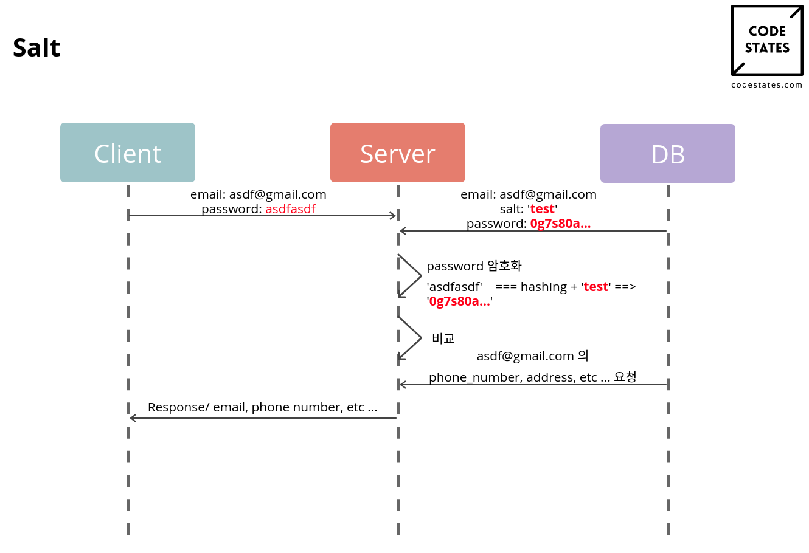
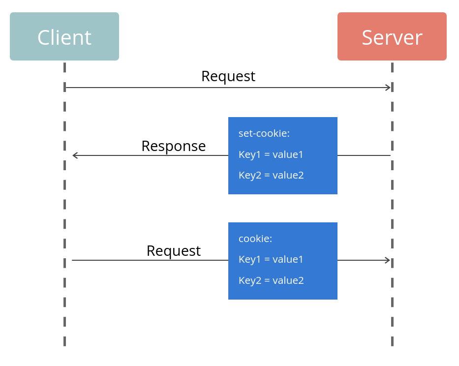
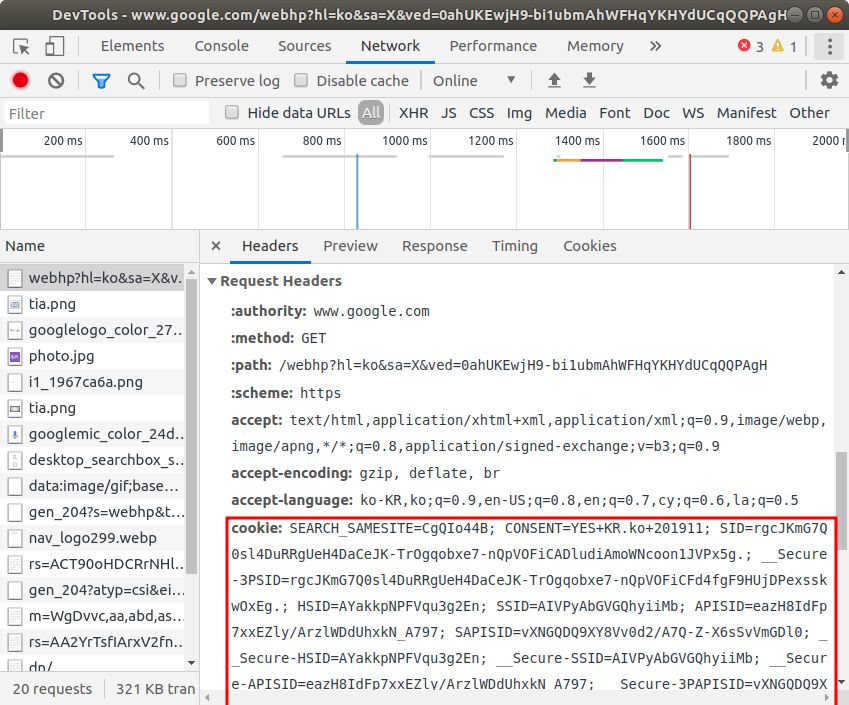
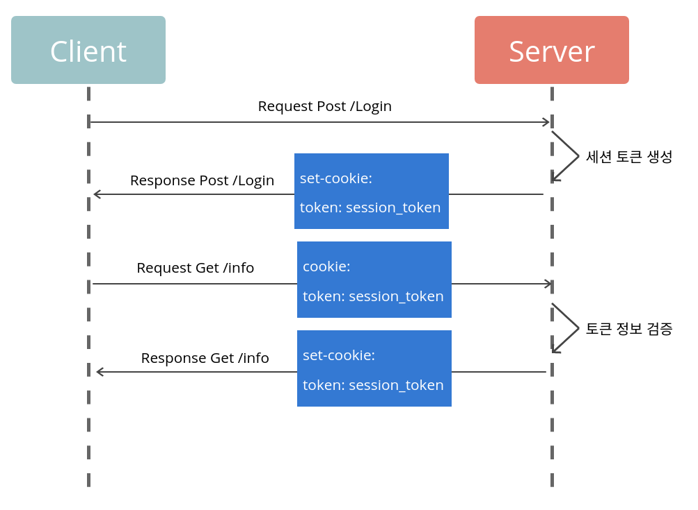
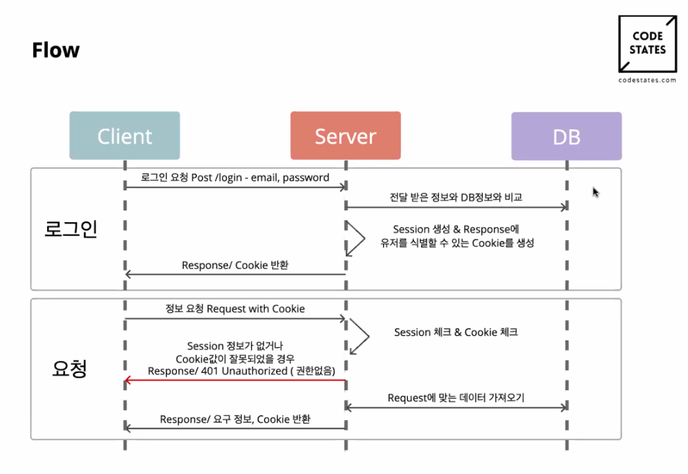
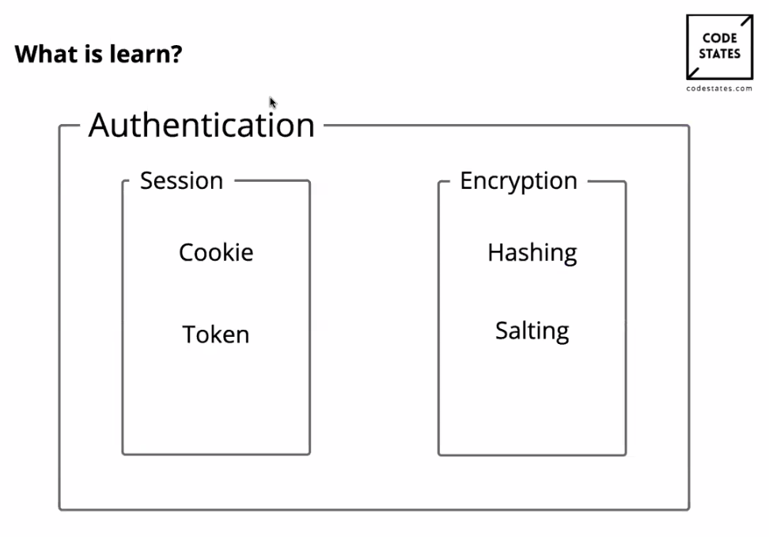

# Sprint Review

2주 프로젝트: join써보기

행동 기반 testcase

bdd(behavior driven development)

teardown, setup


---

# Authentication and Full Stack Development

인증, 로그인 관련 이슈

1. 보안
2. 클라이언트, DB, server를 다 만들어 보기.


## 1. Hashing

### 1-1. No Authentication

```sequence
Client->Server: 정보요청 Get/email
Server->DB: 정보요청
DB->Server: 정보전달
Server->Client: Response/ email, phone number, etc ...
```

보안상 issue가 발생!


### 1-2. Authentication(Plaintext)



email: 공개된 data

password: 유저만 알고 있어야 함 -> DB에 암호화해서 저장해야 함.


### 1-3. Encryption

암호화는 일련의 정보를 임의의 방식을 사용하여 다른 형태로 변환하여 해당 방식에 대한 정보를 소유한 사람을 제외하고 이해할 수 없도록 '알고리즘'을 이용해 정보를 관리하는 과정

**예)**

```js
shiftBy('bicycle', 2) // => 'dkezeng'
shiftBy('dkezeng', -2) // => 'bicycle'

const shiftBy = function(content, offset) {
    //넘긴 수 만큼 위치가 바뀐 알파벳 변환: a->c
    return content.split('').map(function(letter) {
        return String.fromCharCode(letter.charCodeAt() + offset);
    }).join('');
};
```

위의 예시는 아주 가벼운 암호화 예시로, 실제 암호화는 해석할 때 매우 큰 시간복잡도를 가진 알고리즘을 사용한다.




### 1-4. Hashing

어떠한 문자열에 '임의의 연산'을 적용하여 다른 문자열로 변환하는 것 

1. 모든 값에 대해 해시 값을 계산하는데 오래걸리지 않아야한다.

2. 최대한 해시 값을 피해야하며, 모든 값은 고유한 해시 값을 가진다.(우연이더라도 해시 값이 겹치는 경우가 없어야 함)

3. 아주 작은 단위의 변경 이라도 완전히 다른 해시 값을 가져야 한다.

대표적인 hashgin algorithm: SHA1, ...







### 1-5. Salt



해시 하려는 값(원본)에 추가하는 값

1. 암호화를 진행했다면 '해당 알고리즘을 알고있는 순간' 바로 원본을 얻어낼 수 있다.

2. 원본값에 임의로 약속된 추가 문자열을 추가하여 해시를 진행하여 기존 해시값과 전혀 다른 해시 값이 반환되어 알고리즘이 노출 되더라도 원본 값을 보호할 수 있도록 하는 안전장치

3. 기존 : (암호화 하려는 값) => (hash값)

   Salt 사용 : (암호화 하려는 값) + (Salt 용 값) => (hash값)

user마다 다른 salt 사용


### 1-6. Modul

Crypto (NodeJS): Node JS 내장 암호화 모듈(https://nodejs.org/api/crypto.html)

```js
const crypto = require('crypto');

const secret = 'abcdefg';
const hash = crypto.createHmac('sha256', secret)
                   .update('I love cupcakes')
                   .digest('hex');
console.log(hash);
// Prints:
//   c0fa1bc00531bd78ef38c628449c5102aeabd49b5dc3a2a516ea6ea959d6658e

//* Symbol을 salt로 사용할 수 있는지 test. 사용 못함..
//* ERR_INVALID_ARG_TYPE 에러 발생
//* Symbol("salt").toString은 "Symbal("salt")"로 나옴.
const hash2 = crypto
  .createHmac("sha256", Symbol("salt").toString())
  .update("I love cupcakes")
  .digest("hex");
console.log("hash2:", hash2);
// Prints: 8938b34f151e9e035db1c96ef680dc75381a95ba1fc9e0f6be9103777554ee47

const hash3 = crypto
  .createHmac("sha256", `Symbol(salt)`)
  .update("I love cupcakes")
  .digest("hex");
console.log("hash3:", hash3);
// Prints: 8938b34f151e9e035db1c96ef680dc75381a95ba1fc9e0f6be9103777554ee47
```


## 2. Cookie



서버가 사용자의 위치에 정보를 저장하고 불러올 수 있는 수단

1. 특정 호스트에서 생성된 쿠키는 이후 모든 요청마다 서버로 다시 전송
2. 이름, 값, 만료 날짜, 경로 정보로 구성


http요청의 헤더에 자동적으로 쿠키가 담김




서버와 클라이언트가 대화하기 위한 수단


## 3. Session

서버와 클라이언트의 연결이 활성화 된 상태

1. 서버가 Client에 대해 유일한 ID를 부여하여 서버 측에서 관리
   * 처음만났을 때 브라우저가 서버에 client에 대한 유일한 ID를 부여해서 넘겨줌.

2. 일반적으로 이 유일한 Client ID가 서버에서 존재하는 상황을 Session이라고 칭함
   * 해당 웹서버에 접속을 한 상황일 때를 session이라고 함.

3. 각 Client ID의 Session 객체 마다 Data를 관리 할 수 있음
   * client id를 담는 session객체에 데이터를 저장해서 관리할 수 있음.

4. 사용자의 정보 중 보안상 중요한 데이터는 Session에서 관리함
   * 보안상 중요한 데이터를 쿠키로 저장할 경우 노출될 확률이 높음.
   * session을 통해 서버에 저장할 경우 보안상 더 안전함.


## 4. Token

인증을 위해 사용되는 암호화 된 문자열

1. Http 통신의 Stateless 특징과 알맞다
   * http: 연결된 상태에서**만** 서버와 연결을 할 수 있음.
   * 상태에 연연하지 않고 사용할 수 있음.

2. 유저의 인증 정보를 서버나 세션에 담아두지 않음
   * 서버에 저장하지 않더라도 해당 토큰을 가지고 있으면 어디에서 접근하더라도 A라는 유저라는 것을 판별할 수 있게 함.
   * session을 통해 브라우저 정보를 저장해두지 않더라도 토큰을 통해 유저를 파악할 수 있음.

3. 유저의 활성화 여부를 신경쓰지 않고 넘겨진 요청에 담겨진 Token의 정합성만을 확인
   * 토큰이 정상적인지, 변형된 것인지 확인해서 진행

4. 서버에서 클라이언트의 상태 정보를 저장하지 않고 클라이언트에서 넘겨지는 요청만으로 작업을 처리하게 되는데 이런 경우 클라이언트 상태관리에 관한 비용이 없기 때문에 서버의 확장성이 높음
   * session으로 관리할 경우 데이터처리를 해야 함.
   * 토큰을 사용할 경우 토큰 체크 middleware를 사용하면 되기 때문에 생산성, 확장성이 좋음.


## 5. Session Management



---


토큰, 세션이 털리더라도 유저의 정보가 최대한 안전할 수 있도록 하는 방법에 대해 생각해보기.



로그인의 시나리오를 인지하고 있어야 한다.

* 쿠키를 가져옴: 서버의 정보와 일치하는지 확인함

* 최초 로그인 할 때 세션 테이블에 세션키와 유저 아이디가 등록되고 유저에게 세션키를 발급해주고 세션키가 유효한 기간에는 이 키를 가지고 인증을 합니다 
  * 유저가 많은 경우는 별도의 세션db를 만듬
* 세션정보: 서버쪽에서 가지고 있는 사용자 정보




쿠키와 토큰의 차이?

* 대부분 쿠키가 아닌 토큰을 사용함.
  * cookie로 인증성공을 한 후 token으로 인증하는 방법([JWT](https://jwt.io/))을 생각해보는것도 좋음.

Encryption

* [ ] Hashing과 Salting 사용 이유 알기.


[ngrok](https://ngrok.com/): 내 로컬 서버를 온라인으로 보내주는 무료 포워딩 툴


---

# QnA

* 사용자가 로그인하면, 서버에서 세션정보를 만들고 그걸 쿠키에 넣어서 클라이언트에 보낸다 
  맞나요? > **yes**

* 클라이언트는 그 후 요청마다 쿠키를 보내는데, 그 안에는 세션정보가 들어있는거고 > **yes**

* 처음에 로그인 요청할 때 클라이언트에서 서버로 http request에 email / password가 날 것으로(암호화 없이) 전달 되나요? > **yes**
* 클라이언트 기능이 회원가입/로그인 후 단축하고 싶은 url을 등록, 단축 url이 눌릴 때마다 횟수가 증가 > **yes**, 로그인 시 이걸(횟수) 확인.. 이건가요?
  * 현재: links에서 모든 url이 isValidUrl이 되겠지만, 로그인 된 url만 인가하도록('인증' 과 '인가' : 리디렉션) server/app.js가 links와 연관이 되어 있음.
* 데이터베이스가 기존에 작성되어 있어야하고 마이그레이션을 통해 해당 데이터베이스에 테이블이 작성된다고 이해하면 될까요?  > **yes**
  * cli > db:create (utf8)


> 참고
>
> codestates immersive course