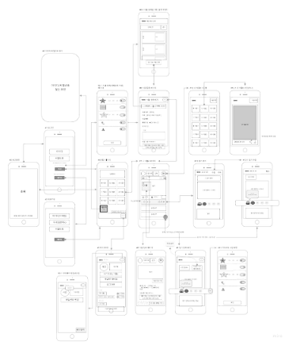

와.. 기획하고 세팅하고 하느라 이제 겨우 코딩에 들어갔다.

시간은 촉박한데 할 건 많다. 그래도 너무 조바심 갖지 않기로 하자.

하면 금방 할 수 있다~!


아래 사진은 일주일이 넘는 시간 동안 우리 팀이 한 것들 중 일부(프로토타입 UI/UX).



2주 프로젝트 때 나름 열심히 기획해놓고 코딩에 들어가니 작업 속도가 꽤 괜찮았었다. 의견교환에 드는 시간이 적었음.

그래서 이번에도 기획을 열심히 했는데 이번에는 좀 과했나 싶다. 2주때랑은 앱의 규모부터가 달라서 그런걸까.

뭐든 중간이 제일 어렵다.


# 할 것

* [x] ts 공부 
  * 열심히 삽질하던 중 팀원이 좋은 ts강의를 소개해줬다. > https://academy.nomadcoders.co/p/build-a-blockchain-with-typescript
* [x] app.ts 작성
* [ ] TypeORM으로 migration하기(TypeORM 공부하는 중)

---

* [ ] AWS EC2, RDS 보안설정
* [ ] RDS에 API검색용 DB구축
* [ ] EC2에 코드 올리기


# 공부한 것

# 1. TypeScript

> TypeScript-Handbook 한글 문서: https://typescript-kr.github.io/

개인적으로 typescript는 `javascript` + `C++`의 느낌이다.

모양만 다르지 변수 선언부터 배열까지 방식이 비슷하다. 추억이 새록새록.


**TypeScript 설치**

```
$ npm install -g typescript
```


## 1-1. Type annotations 타입 설정

변수의 타입을 설정한다. 변수에 설정한 타입 외의 값이 입력되면 ts컴파일 과정에서 걸린다.

```js
let a: number = 1;
a = 's'; //안 됨.
a = 10; //됨.
```


**TS의 타입들**

* boolean: true / false

```js
let isDone: boolean = false;
```

* number: 숫자

```js
let decimal: number = 6;
let hex: number = 0xf00d;
let binary: number = 0b1010;
let octal: number = 0o744;
```

* string: 문자열

```js
let color: string = "blue";
color = 'red';

// 백틱(``) 사용 가능
let fullName: string = `Bob Bobbington`;
let age: number = 37;
let sentence: string = `Hello, my name is ${ fullName }. I'll be ${ age + 1 } years old next month.`;
```

* array: 배열

```js
let list1: number[] = [1, 2, 3]; // 첫 번째 방식
let list2: Array<number> = [1, 2, 3]; // 두 번째 방식. 위 방식과 결과는 같다
```

* tuple: 고정된 개수의 요소 타입을 알고 있지만 반드시 같을 필요는 없는 배열

```js
// 튜플 타입 선언
let x: [string, number];
// 초기화
x = ["hello", 10]; // 좋아요
// 부정확한 초기화
x = [10, "hello"]; // 오류
```

* enum: 열거. 기본적으로 enums는 `0`부터 시작하는 자신의 멤버 번호를 매기기를 시작합니다.

```js
enum Color {Red, Green, Blue}
let c: Color = Color.Green;
```

* 더 상세한 내용은 ts핸드북에서 확인할 수 있다: [https://typescript-kr.github.io/pages/Basic%20Types.html](https://typescript-kr.github.io/pages/Basic Types.html)


## 1-2. Interface 인터페이스

https://typescript-kr.github.io/pages/Interfaces.html

정리 할 시간이 없어서 슬픈 인간


# 2. TypeORM

공식문서: https://typeorm.io/#/

공식문서 최고.


## 2-1. Entity

> https://typeorm.io/#/entities/

Sequelize에서 Model과 같다.

```js
import {Entity, PrimaryGeneratedColumn, Column} from "typeorm";

@Entity()
export class User {

    @PrimaryGeneratedColumn() // 자동으로 증가하는 Primary key column
    id: number;

    @Column() // 컬럼
    firstName: string;

    @Column()
    lastName: string;

    @Column()
    isActive: boolean;

}
```

위 엔티티는 아래의 테이블을 생성한다.

```
+-------------+--------------+----------------------------+
|                          user                           |
+-------------+--------------+----------------------------+
| id          | int(11)      | PRIMARY KEY AUTO_INCREMENT |
| firstName   | varchar(255) |                            |
| lastName    | varchar(255) |                            |
| isActive    | boolean      |                            |
+-------------+--------------+----------------------------+
```


### 1) Column types

사용법

```js
@Column("int")
age: number;

@Column({ type: "int" })
height: number;

@Column({ type: "int", width: 200 })
salary: number;

@Column("varchar", { length: 200 })
name: string;
```


**column types for mysql / mariadb**

```
bit, int, integer, tinyint, smallint, mediumint, bigint, float, double, double precision, dec, decimal, numeric, fixed, bool, boolean, date, datetime, timestamp, time, year, char, nchar, national char, varchar, nvarchar, national varchar, text, tinytext, mediumtext, blob, longtext, tinyblob, mediumblob, longblob, enum, set, json, binary, varbinary, geometry, point, linestring, polygon, multipoint, multilinestring, multipolygon, geometrycollection
```


### 2) Column options

컬럼에 옵션을 줄 수 있다.

```js
@Column({
    type: "varchar",
    length: 150,
    unique: true,
    // ...
})
name: string;
```


아래는 옵션의 리스트.

- `type: ColumnType` - Column type. One of the type listed [above](https://typeorm.io/#/entities/column-types).
- `name: string` - Column name in the database table. By default the column name is generated from the name of the property. You can change it by specifying your own name.
- `length: number` - Column type's length. For example if you want to create `varchar(150)` type you specify column type and length options.
- `width: number` - column type's display width. Used only for [MySQL integer types](https://dev.mysql.com/doc/refman/5.7/en/integer-types.html)
- `onUpdate: string` - `ON UPDATE` trigger. Used only in [MySQL](https://dev.mysql.com/doc/refman/5.7/en/timestamp-initialization.html).
- `nullable: boolean` - Makes column `NULL` or `NOT NULL` in the database. By default column is `nullable: false`.
- `update: boolean` - Indicates if column value is updated by "save" operation. If false, you'll be able to write this value only when you first time insert the object. Default value is `true`.
- `insert: boolean` - Indicates if column value is set the first time you insert the object. Default value is `true`.
- `select: boolean` - Defines whether or not to hide this column by default when making queries. When set to `false`, the column data will not show with a standard query. By default column is `select: true`
- `default: string` - Adds database-level column's `DEFAULT` value.
- `primary: boolean` - Marks column as primary. Same if you use `@PrimaryColumn`.
- `unique: boolean` - Marks column as unique column (creates unique constraint).
- `comment: string` - Database's column comment. Not supported by all database types.
- `precision: number` - The precision for a decimal (exact numeric) column (applies only for decimal column), which is the maximum number of digits that are stored for the values. Used in some column types.
- `scale: number` - The scale for a decimal (exact numeric) column (applies only for decimal column), which represents the number of digits to the right of the decimal point and must not be greater than precision. Used in some column types.
- `zerofill: boolean` - Puts `ZEROFILL` attribute on to a numeric column. Used only in MySQL. If `true`, MySQL automatically adds the `UNSIGNED` attribute to this column.
- `unsigned: boolean` - Puts `UNSIGNED` attribute on to a numeric column. Used only in MySQL.
- `charset: string` - Defines a column character set. Not supported by all database types.
- `collation: string` - Defines a column collation.
- `enum: string[]|AnyEnum` - Used in `enum` column type to specify list of allowed enum values. You can specify array of values or specify a enum class.
- `asExpression: string` - Generated column expression. Used only in [MySQL](https://dev.mysql.com/doc/refman/5.7/en/create-table-generated-columns.html).
- `generatedType: "VIRTUAL"|"STORED"` - Generated column type. Used only in [MySQL](https://dev.mysql.com/doc/refman/5.7/en/create-table-generated-columns.html).
- `hstoreType: "object"|"string"` - Return type of `HSTORE` column. Returns value as string or as object. Used only in [Postgres](https://www.postgresql.org/docs/9.6/static/hstore.html).
- `array: boolean` - Used for postgres and cockroachdb column types which can be array (for example int[])
- `transformer: { from(value: DatabaseType): EntityType, to(value: EntityType): DatabaseType }` - Used to marshal properties of arbitrary type `EntityType` into a type `DatabaseType` supported by the database. Array of transformers are also supported and will be applied in natural order when writing, and in reverse order when reading. e.g. `[lowercase, encrypt]` will first lowercase the string then encrypt it when writing, and will decrypt then do nothing when reading.

위 대부분의 옵션들은 RDBMS에 따라 다르며 몽고BD에서는 사용할 수 없음