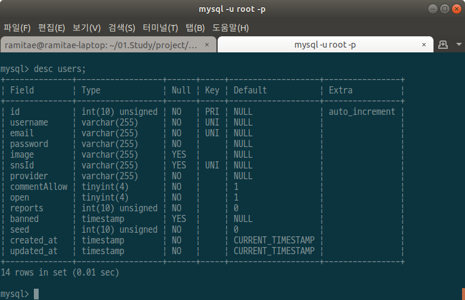
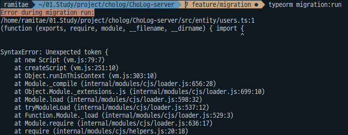
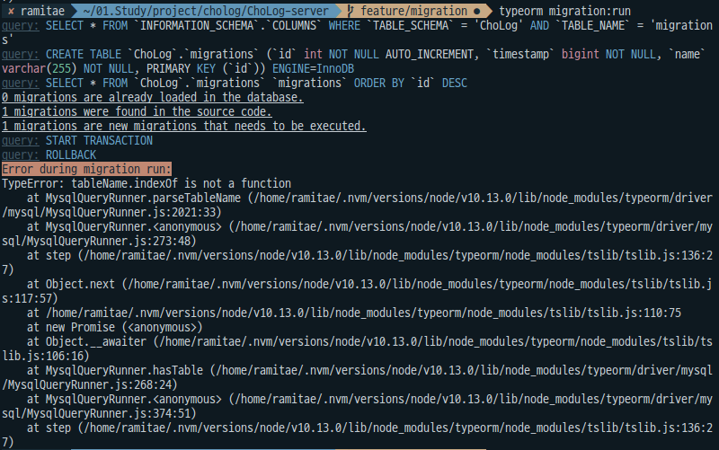
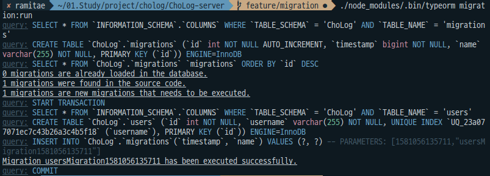
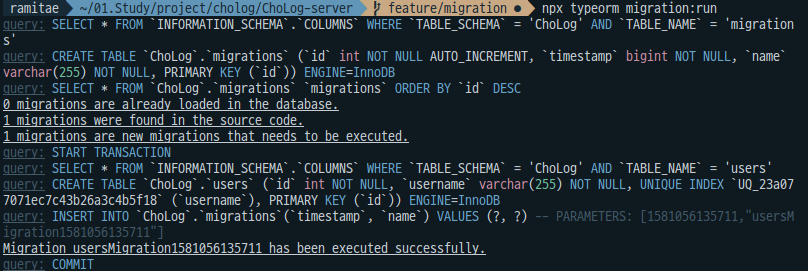

하루 종일 삽질한 끝에 TypeORM에 대해 좀 명확하게 이해하게 된 것 같다.

이제 TypeORM CLI로 마이그레이션 할 수 있다!


뿌듯! typeORM cli 마이그레이션으로 생성한 users 테이블!!!



하루 종일 공부하고 삽질해서 얻은 테이블이라 더 기쁘다.


# 할 것

* [x] TypeORM으로 users 테이블 migration하기

* [ ] AWS EC2, RDS 보안설정
* [ ] RDS에 API검색용 DB구축
* [ ] EC2에 코드 올리기


---

# 공부 한 것

# 1. TypeORM-Relations

> https://typeorm.io/#/relations

relation: typeORM에서 테이블 간의 조인 관계를 나타냄

- [one-to-one](https://typeorm.io/#/one-to-one-relations/) using `@OneToOne`
- [many-to-one](https://typeorm.io/#/many-to-one-one-to-many-relations/) using `@ManyToOne`
- [one-to-many](https://typeorm.io/#/many-to-one-one-to-many-relations/) using `@OneToMany`
- [many-to-many](https://typeorm.io/#/many-to-many-relations/) using `@ManyToMany`


## 1-1. Relation options

- `eager: boolean` - If set to true, the relation will always be loaded with the main entity when using `find*` methods or `QueryBuilder` on this entity
- `cascade: boolean | ("insert" | "update" | "remove")[]` - If set to true, the related object will be inserted and updated in the database. You can also specify an array of [cascade options](https://typeorm.io/#/relations/cascade-options).
- `onDelete: "RESTRICT"|"CASCADE"|"SET NULL"` - specifies how foreign key should behave when referenced object is deleted
- `primary: boolean` - Indicates whether this relation's column will be a primary column or not.
- `nullable: boolean` - Indicates whether this relation's column is nullable or not. By default it is nullable.


## 1-2. Cascade

```js
import {Entity, PrimaryGeneratedColumn, Column, ManyToMany} from "typeorm";
import {Question} from "./Question";

@Entity()
export class Category {

    @PrimaryGeneratedColumn()
    id: number;

    @Column()
    name: string;

    @ManyToMany(type => Question, question => question.categories)
    questions: Question[];

}
```

```js
import {Entity, PrimaryGeneratedColumn, Column, ManyToMany, JoinTable} from "typeorm";
import {Category} from "./Category";

@Entity()
export class Question {

    @PrimaryGeneratedColumn()
    id: number;

    @Column()
    title: string;

    @Column()
    text: string;

    @ManyToMany(type => Category, category => category.questions, {
        cascade: true
    })
    @JoinTable()
    categories: Category[];

}
```

```js
const category1 = new Category();
category1.name = "animals";

const category2 = new Category();
category2.name = "zoo";

const question = new Question();
question.categories = [category1, category2];
await connection.manager.save(question);
```


## 1-3. Cascade Options

cascade옵션은 boolean값이나 cascade 옵션(`"insert"`, `"update"`, `"remove"`)을 배열로 넣으면 된다.

relation에서 cascade의 기본 값은 false이다.

```json
@Entity(Post)
export class Post {

    @PrimaryGeneratedColumn()
    id: number;

    @Column()
    title: string;

    @Column()
    text: string;

    // Full cascades on categories.
    @ManyToMany(type => PostCategory, {
        cascade: true
    })
    @JoinTable()
    categories: PostCategory[];

    // Cascade insert here means if there is a new PostDetails instance set
    // on this relation, it will be inserted automatically to the db when you save this Post entity
    @ManyToMany(type => PostDetails, details => details.posts, {
        cascade: ["insert"]
    })
    @JoinTable()
    details: PostDetails[];

    // Cascade update here means if there are changes to an existing PostImage, it
    // will be updated automatically to the db when you save this Post entity
    @ManyToMany(type => PostImage, image => image.posts, {
        cascade: ["update"]
    })
    @JoinTable()
    images: PostImage[];

    // Cascade insert & update here means if there are new PostInformation instances
    // or an update to an existing one, they will be automatically inserted or updated
    // when you save this Post entity
    @ManyToMany(type => PostInformation, information => information.posts, {
        cascade: ["insert", "update"]
    })
    @JoinTable()
    informations: PostInformation[];
}
```


## 1-4. JoinColumn Options

`@JoinColumn` not only defines which side of the relation contains the join column with a foreign key, but also allows you to customize join column name and referenced column name.

When we set `@JoinColumn`, it automatically creates a column in the database named `propertyName + referencedColumnName`. 

```js
@ManyToOne(type => Category)
@JoinColumn() // this decorator is optional for @ManyToOne, but required for @OneToOne
category: Category;
```

This code will create a `categoryId` column in the database. If you want to change this name in the database you can specify a custom join column name:

```typescript
@ManyToOne(type => Category)
@JoinColumn({ name: "cat_id" })
category: Category;
```


## 1-5. JoinTable Options

`@JoinTable` is used for `many-to-many` relations and describes join columns of the "junction" table. A junction table is a special separate table created automatically by TypeORM with columns that refer to the related entities. You can change column names inside junction tables and their referenced columns with `@JoinColumn`: You can also change the name of the generated "junction" table.

```typescript
@ManyToMany(type => Category)
@JoinTable({
    name: "question_categories", // table name for the junction table of this relation
    joinColumn: {
        name: "question",
        referencedColumnName: "id"
    },
    inverseJoinColumn: {
        name: "category",
        referencedColumnName: "id"
    }
})
categories: Category[];
```

If the destination table has composite primary keys, then an array of properties must be sent to `@JoinTable`.


---

# 2. TypeORM migration errors

## 2-1. migration error 1



typeORM cli로 마이그레이션을 하려고 했더니 자꾸 위와 같은 에러가 발생해서 골머리를 앓다가 아래 링크를 통해 해결했다.

> https://stackoverflow.com/a/50375317/12857153


찾아보니 typeORM cli에서 entity를 쓰려면 그 entity가 js파일이어야 하는데

typeORM init 시 생성해주는 ormconfig의 entities설정이 .ts로 되어 있어서 해당 에러가 발생하는거였다..

typeORM를 ts로 작성하는데 cli가 왜 이렇게 작동하는지 의문이고,

init 시 생성되는 ornconfig.json 의 entities와 migrations의 기본 설정이 .ts 인 것도 이상하지만

typeORM은 아직 0.2.22버전이니까..

초기 개발중인 패키지를 사용하는 것이기에 어쩔 수 없는 일이라고 생각해야겠다.

빨리 정식 버전이 나오면 좋겠다!!

```json
//ormconfig.json
module.exports = {
  type: "mysql",
  host: "localhost",
  port: 3306,
  username: "user",
  password: "password",
  database: "database",
  synchronize: true,
  logging: false,
  entities: ["src/entity/**/*.ts"],
  migrations: ["src/migration/**/*.ts"],
  cli: {
    entitiesDir: "src/entity",
    migrationsDir: "src/migration",
    subscribersDir: "src/subscriber",
  },
};
```


그래서 위 코드를 아래와 같이 ormconfig에서 접근하는 entity의 위치를 ts빌드 완료 후의 위치로 변경해줬더니 에러를 해결할 수 있었다.

```json
//ormconfig.json
module.exports = {
  type: "mysql",
  host: "localhost",
  port: 3306,
  username: "user",
  password: "password",
  database: "database",
  synchronize: true,
  logging: false,
  entities: ["build/entity/**/*.js"], //수정한 부분
  migrations: ["build/migration/**/*.js"], //얘도 js로 바꿔줘야 함
  cli: {
    entitiesDir: "src/entity",
    migrationsDir: "src/migration",
    subscribersDir: "src/subscriber",
  },
};
```


후에 보니 공식홈페이지에는 js로 쓰여 있었다....

init 시 자동생성되는 파일에는 왜 ts로 적어둔거야...

> https://typeorm.io/#/migrations/creating-a-new-migration


+참고사항

ts빌드를 build디렉토리에다가 했기 때문에 `entities: ["build/entity/**/*.js"]` 라고 해줬지만

ts빌드를 다른 디렉토리에 하지 않거나 빌드하는 디렉토리의 위치가 다르면 수정 내용을 위와 같이 하면 안된다.

코드 상황에 따라 해결 방법의 디테일이 달라질 수 있기 때문에 문제 발생 원인을 아는 것이 중요하다고 생각함.

```json
//tsconfig.json
{
  "compilerOptions": {
    "lib": ["es5", "es6"],
    "target": "ES2015",
    "module": "commonjs",
    "strict": true,
    "esModuleInterop": false,

    "forceConsistentCasingInFileNames": true /* Disallow inconsistently-cased references to the same file. */,
    "moduleResolution": "node",
    "outDir": "./build", //ts compile했을때 생기는 js파일을 저장할 디렉토리
    "emitDecoratorMetadata": true,
    "experimentalDecorators": true,
    "sourceMap": true
  },
  "include": ["src/**/*"],
  "exclude": ["node_modules"]
}
```


## 2-2. migration error 2



위 에러의 해결 방법: 글로벌 typeorm을 사용한다..!

> https://github.com/typeorm/typeorm/issues/2450#issuecomment-402005655


**글로벌 typeorm을 사용하는 방법**

1. 주소 직접 입력

```
$ ./node_modules/.bin/typeorm migration:run
```




2. npx 사용

```
$ npx typeorm migration:run
```




1, 2번의 결과는 같다.


# 3. 기타사항

구글링 하다가 typeORM 공식 github레포의 내용을 검색할 수 있게 만들어 둔 사이트를 발견했다!!

> https://typeorm.delightful.studio/index.html

너무좋아!!!!!