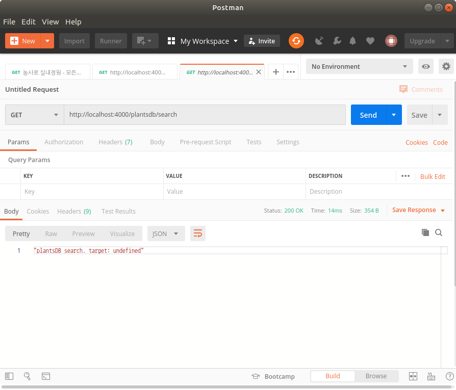

migration때문에 엄청 고생했는데 해결하니 후련하다.


요청에 대한 기본 응답을 완료했다.



이거 이 속도로 해가지고 언제 완성하나 싶은 생각이 들기는 하는데.. 하다 보면 속도가 붙...겠지???!!


# 할 것

* [x] entity 생성 후 migration
  * [x] plant
  * [x] family
  * [x] diary
  * [x] parameter
  * [x] state
  * [x] plantsDatabase
  * [x] API
* [x] 기본 서버 API 응답 작성
* [ ] API검색용 DB구축
* [ ] AWS EC2, RDS 보안설정
* [ ] EC2에 코드 올리기


# 공부한 것

# 1. TypeORM CLI

> https://typeorm.io/#/using-cli

**cli 설치**

npm 사용

```
$ npm install -g typeorm-cli
```

yarn 사용

```
$ yarn global add typeorm-cli
```


## 1-1. entity 생성

```
$ typeorm entity:create -n User
```

`User `자리에 원하는 엔티티 이름을 쓰면 된다.


## 1-2. migration 생성

```
$ typeorm migration:create -n UserMigration
```


## 1-3. 이미 존재하는 스키마 migration하기

```
$ typeorm migration:generate -n UserMigration
```

여태껏 migration 만들고 entity 만드는 쓸데 없는 이중노동을 했었는데 이걸 쓰면 그렇게 하지 않아도 된다... 씁쓸

자세히 보니 공식문서에서도 entity먼저 만들고 migration 하라는 말이 있었네.

그래도 열심히 삽질한 덕에 안까먹겠다ㅎㅎ... 애써긍정


* 스키마 로그 보기

```
$ typeorm schema:log
```

이걸로 원하는 스키마가 작성되는지 확인하고 migration:generate 하면 됨.


## 1-4. migration run / revert

**run**: migration 파일의 up 실행

```
$ typeorm migration:run
```


**revert**: migration 파일의 down 실행

```
$ typeorm migration:revert
```


# 2. TypeORM Relations

## 2-1. OneToMany - ManyToOne

```js
import {Entity, PrimaryGeneratedColumn, Column, ManyToOne} from "typeorm";
import {User} from "./User";

@Entity()
export class Photo {

    @PrimaryGeneratedColumn()
    id: number;

    @Column()
    url: string;

    @ManyToOne(type => User, user => user.photos)
    user: User;

}
```

```js
import {Entity, PrimaryGeneratedColumn, Column, OneToMany} from "typeorm";
import {Photo} from "./Photo";

@Entity()
export class User {

    @PrimaryGeneratedColumn()
    id: number;

    @Column()
    name: string;

    @OneToMany(type => Photo, photo => photo.user)
    photos: Photo[];

}
```


## 2-2. ManyToMany

```js
import {Entity, PrimaryGeneratedColumn, Column} from "typeorm";

@Entity()
export class Category {

    @PrimaryGeneratedColumn()
    id: number;

    @Column()
    name: string;

}
```

```js
import {Entity, PrimaryGeneratedColumn, Column, ManyToMany, JoinTable} from "typeorm";
import {Category} from "./Category";

@Entity()
export class Question {

    @PrimaryGeneratedColumn()
    id: number;

    @Column()
    title: string;

    @Column()
    text: string;

    @ManyToMany(type => Category)
    @JoinTable()
    categories: Category[];

}
```


생성되는 테이블

```sql
+-------------+--------------+----------------------------+
|                        category                         |
+-------------+--------------+----------------------------+
| id          | int(11)      | PRIMARY KEY AUTO_INCREMENT |
| name        | varchar(255) |                            |
+-------------+--------------+----------------------------+

+-------------+--------------+----------------------------+
|                        question                         |
+-------------+--------------+----------------------------+
| id          | int(11)      | PRIMARY KEY AUTO_INCREMENT |
| title       | varchar(255) |                            |
+-------------+--------------+----------------------------+

+-------------+--------------+----------------------------+
|              question_categories_category               |
+-------------+--------------+----------------------------+
| questionId  | int(11)      | PRIMARY KEY FOREIGN KEY    |
| categoryId  | int(11)      | PRIMARY KEY FOREIGN KEY    |
+-------------+--------------+----------------------------+
```


# 기타

> immersive 동기인 갓정민님께 typeORM사용 전 꼭 읽어보라고 추천받은 레퍼런스
>
> https://github.com/typeorm/typeorm/blob/master/docs/active-record-data-mapper.md
>