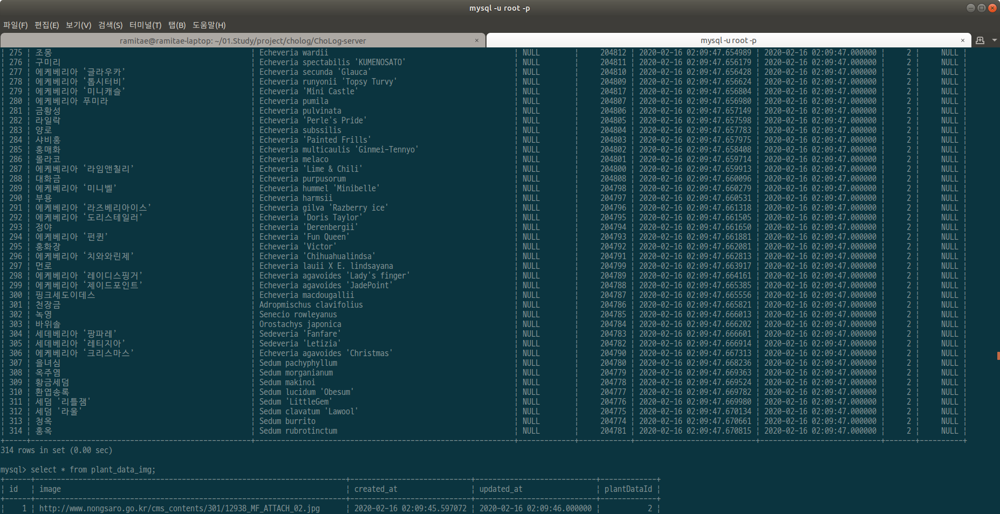
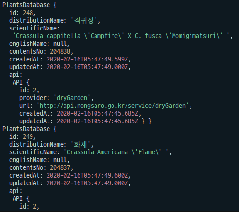
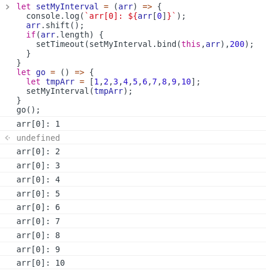
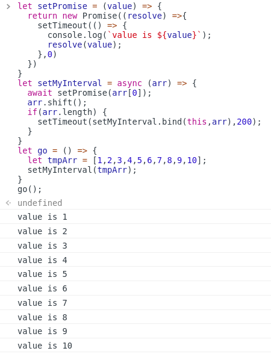
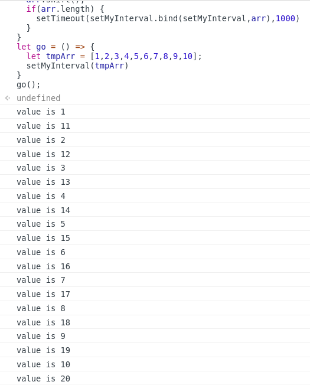

아.. 일주일째 이것만 하고 앉았네. 와 달력 보니 진짜네ㅋㅋㅋㅋㅋㅋ

빨리 끝내고 기능구현 완료하자 제발!

배포가 생각보다 만만치 않을 것 같은데 빨리 끝내고 배포에 대해서도 공부해봐야 한다.


좀 조급한 마음을 가지자. 이렇게 놀고 앉아있을 때가 아님.



휴 그래도 이제 식물검색용 DB구성 거의 끝났다.

조금만 더 하면 진짜 완료다!!


하지만... 외부API서버가..... 아프다.. 이건 내 잘못이다.. 아니... 공공API인데 용량을 작게 만든 API제공자의 문제일까?? 흑흑.. 결국 내일까지 이걸 끌고가야 한다..

그래도 이제 진짜 끝이다!!끝!!!!!


# 오늘 배운 것

migration:revert는 가장 최근에 run했던 migraion부터 하나씩 실행된다

* migration파일이 3개라면 revert를 3번 해야 초기상태의 DB가 됨.


entity에서 join테이블까지 가져오기.

* find에서 relations옵션 사용

```js
const getAll: PlantsDatabase[] = await PlantsDatabase.find({
    where: { detail: null },
    relations: ["api"],
  });
```




주기적으로 로직을 실행하는 함수 만들기

```js
let setMyInterval = (arr) => {
  console.log(`arr[0]: ${arr[0]}`);
  arr.shift();
  if(arr.length) {
    setTimeout(setMyInterval.bind(this,arr),200);
  }
}
let go = () => {
  let tmpArr = [1,2,3,4,5,6,7,8,9,10];
  setMyInterval(tmpArr);
}
go();
```



* 한 번 실행하면 중간에 멈추기 힘들다는 단점이 있다(더 좋은 방법 없을까..)

* 아래는 위 함수 안에 async await에서도 응용해서 사용할 수 있는지 확인을 위해 만들어 본 함수. 결론: 사용할 수 있다!

```js
let setPromise = (value) => {
  return new Promise((resolve) =>{
    setTimeout(() => {
      console.log(`value is ${value}`);
      resolve(value);
    },0)
  })
}
let setMyInterval = async (arr) => {
  await setPromise(arr[0]);
  arr.shift();
  if(arr.length) {
    setTimeout(setMyInterval.bind(this,arr),200);
  }
}
let go = () => {
  let tmpArr = [1,2,3,4,5,6,7,8,9,10];
  setMyInterval(tmpArr);
}
go();
```



* 테스트용2

```js
let setPromise1 = (value) => {
  return new Promise((resolve) =>{
    setTimeout(()=>{
      console.log(`value is ${value}`)
      resolve(value)
    },200)
  })
}
let setPromise2 = (value) => {
  return new Promise((resolve) =>{
    setTimeout(()=>{
      console.log(`value is ${value}`)
      resolve(value)
    },100)
  })
}
let asyncTest = async (value) => {
  await setPromise1(value);
  await setPromise2(value+10);
}
let setMyInterval = async (arr) => {
  await asyncTest(arr[0]);
  arr.shift();
  if(arr.length) {
    setTimeout(setMyInterval.bind(setMyInterval,arr),1000)    
  }
}
let go = () => {
  let tmpArr = [1,2,3,4,5,6,7,8,9,10];
  setMyInterval(tmpArr)
}
go();
```

