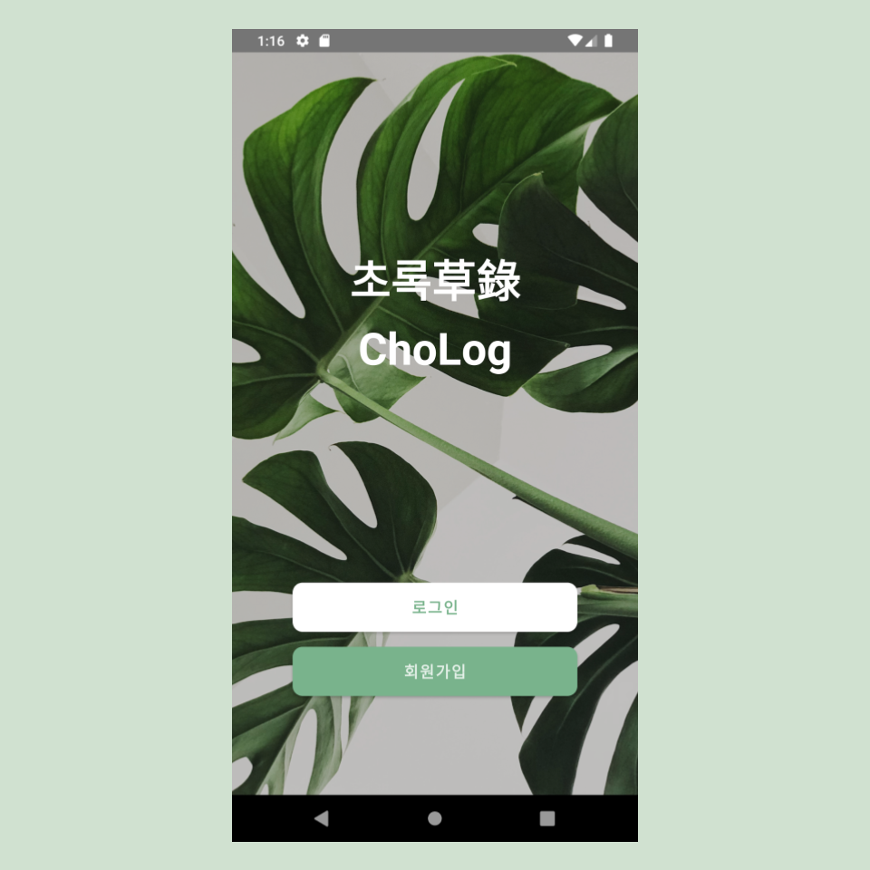
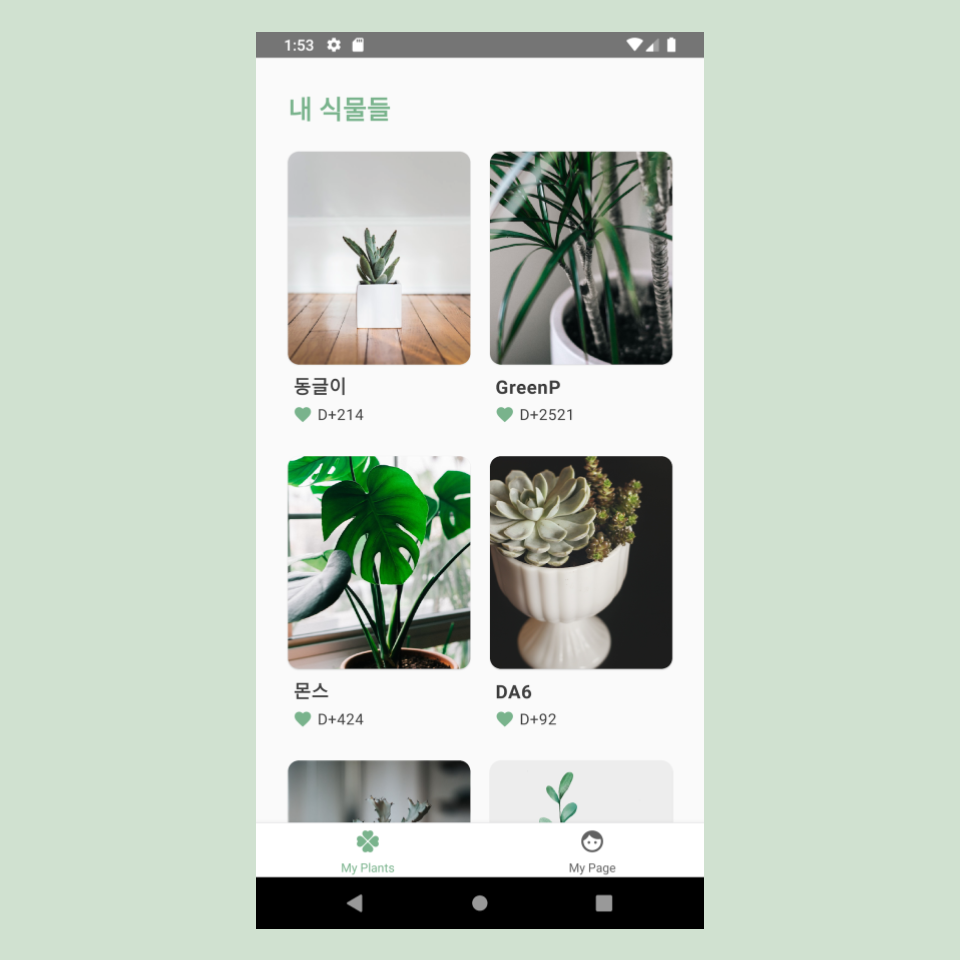
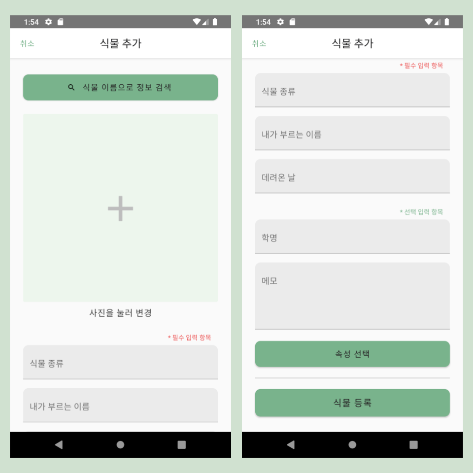
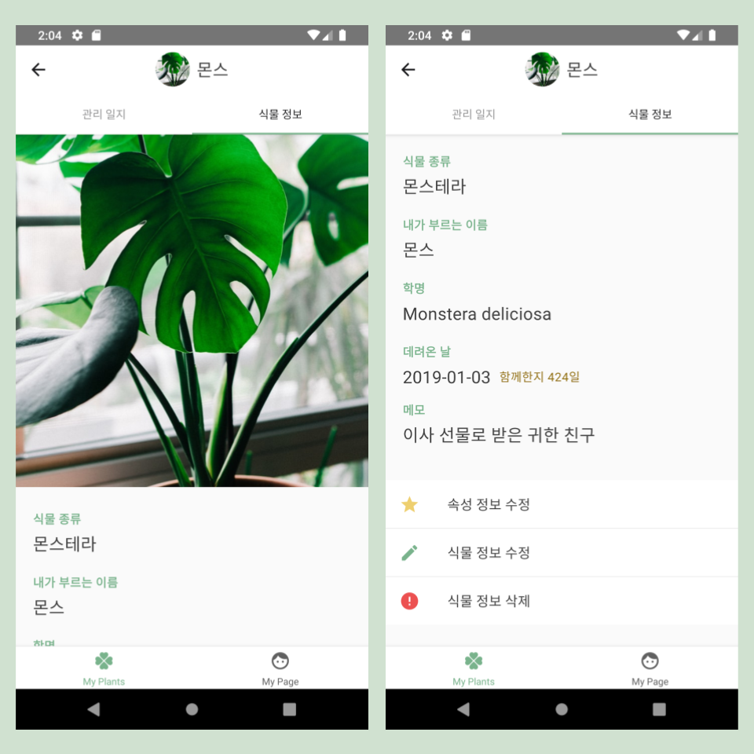
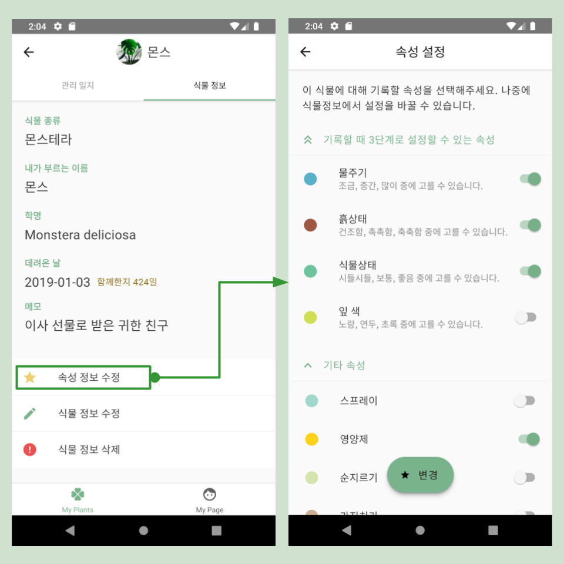
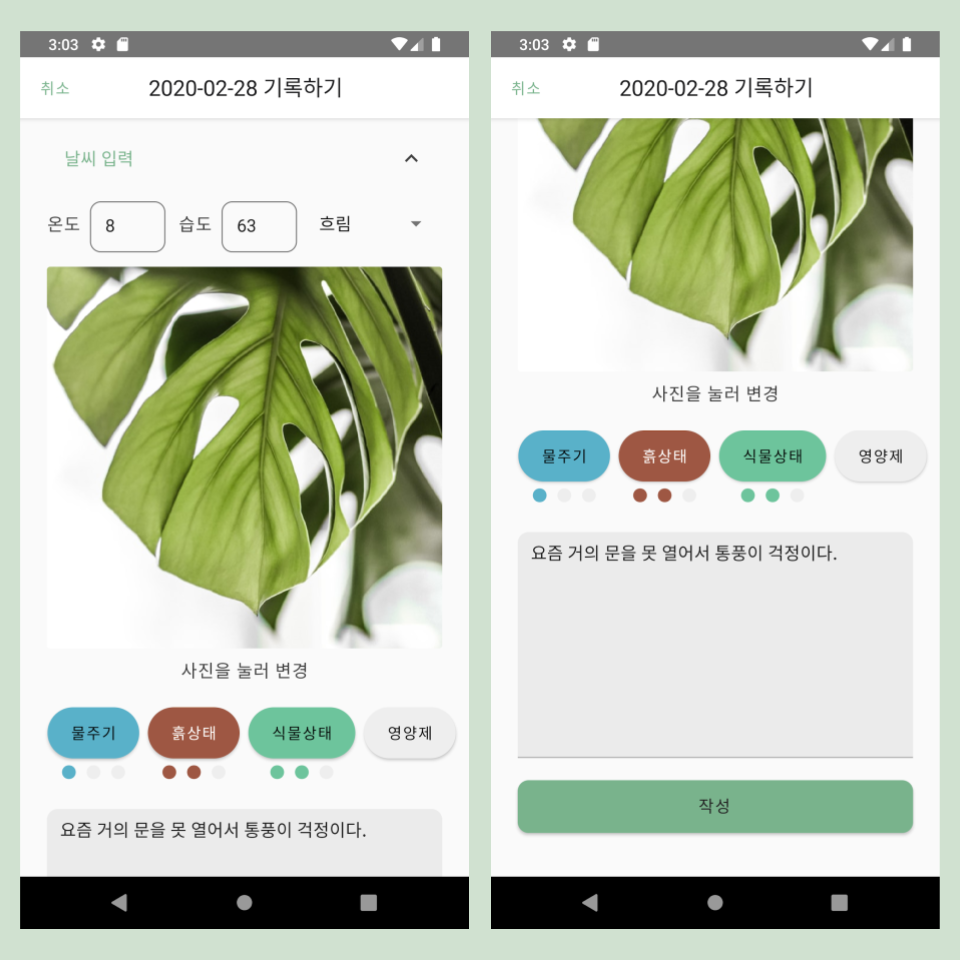
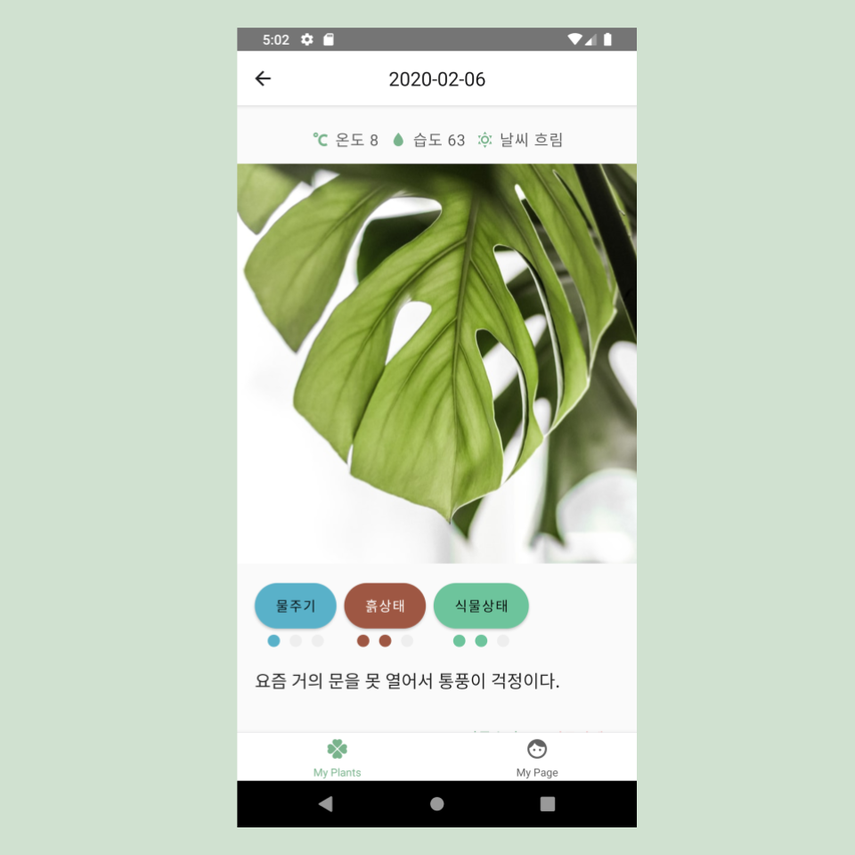
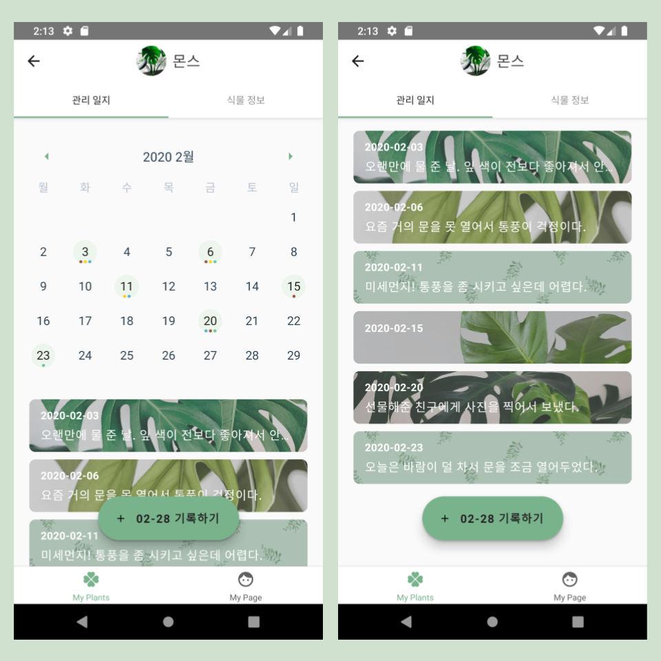
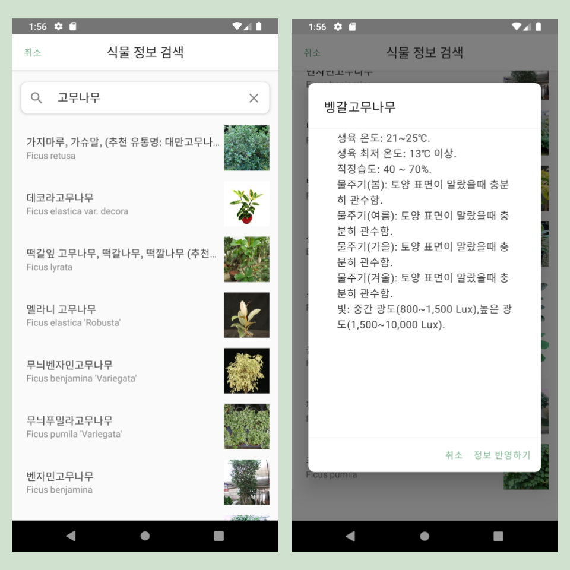

코드스테이츠 Immersive Course의 4주 프로젝트가 끝났고 코드스테이츠 이머시브 코스도 수료했다.

초록 프로젝트 자체는 배포도 해야 하고 커뮤니티 기능도 추가해야 하기 때문에 갈 길이 한참 남았지만 어쨌든 데모데이 발표도 끝냈고 이머시브코스 수료도 했다 보니 작은 관문 하나를 넘은 느낌이다.

*(수료와 프로젝트의 끝은 저번주였지만 초록 텀블벅준비 때문에 너무 바빠서 블로깅 할 시간이 안 생겼기 때문에 이제야 글을 쓴다.)*

초록 프로젝트를 진행하면서 블로그에 프로젝트에 대한 자세한 설명은 쓴 적이 없었던 것 같아 설명부터 하고 회고를 진행하려 한다.

# 프로젝트 설명

## 초록(草錄)은?

초록은 식물 관리 어플리케이션으로, 최근 식물을 키우는 사람들이 늘어났기 때문에 만들어보자 결심한 서비스이다.

## 기능 설명

* 메인 페이지 및 식물 목록 페이지

초록앱의 메인페이지이다.

로그인 후 나타나는 페이지. 입력한 식물들을 볼 수 있다.

- 식물 정보 등록 및 관리 기능

내 식물 정보를 등록하고 수정. 식물 정보 검색을 통해 공공 데이터베이스에서 검색한 정보를 바로 반영할 수도 있다.

식물정보 탭을 누르면 등록한 정보를 확인하고, 수정 및 삭제 가능.

- 식물 관리 항목 설정 기능

자주 기록하게 될 항목을 설정하면, 일지 입력 시 간단히 해당 버튼을 눌러 입력할 수 있다. 관리 항목은 식물마다 다르게 설정 가능.

- 식물 관리 일지 기록 기능

남기고 싶은 정보들을 골라 기록. 물주기, 흙상태 등 자주 기록할 항목은 버튼을 터치해서 간편하게 입력할 수 있다. 

저장된 기록 화면

- 한 눈에 관리 기록을 보여주는 달력 기능

관리 일지 탭을 누르면 달력과 그 달의 기록 목록이 나타남. 일지를 작성한 날과 일지에 기록된 속성들이 달력에 표시되어 기록 현황을 쉽게 파악할 수 있다.

- 상세 정보와 관리 팁을 제공하는 식물 정보 검색 기능

농촌진흥청에서 제공하는 공공 데이터에서 식물 정보를 검색하여, 식물에 대한 상세한 정보와 관리 팁을 확인할 수 있다. 검색한 정보 중 일부는 식물 정보에 바로 반영이 가능하다.

다음의 링크를 클릭하면 기능 별 gif이미지, 개발 시 사용한 스택들, 기능 Flow, 서버 API문서 등을 볼 수 있다. > [초록 프로젝트 문서](http://bit.ly/2TwXYsP)

다음 링크를 클릭하면 코드스테이츠의 최종프로젝트 서비스 발표 시간인 데모데이 때의 발표를 볼 수 있다. > [데모데이 발표 영상](https://youtu.be/lQgI9r0On2M?t=1253)

# 프로젝트 회고

## 좋았던 점

1. 2주 프로젝트는 여태껏 배웠던 것들을 사용해서 

## 아쉬웠던 점

## 개선할 방법

