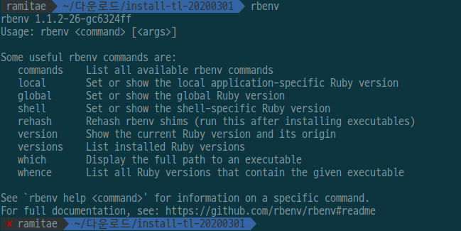
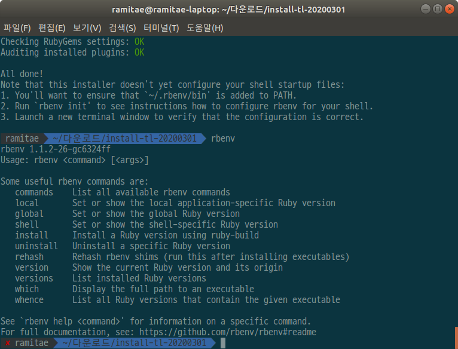
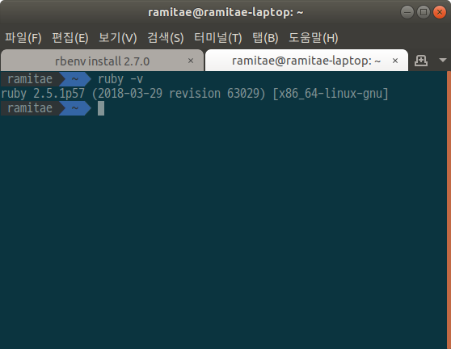
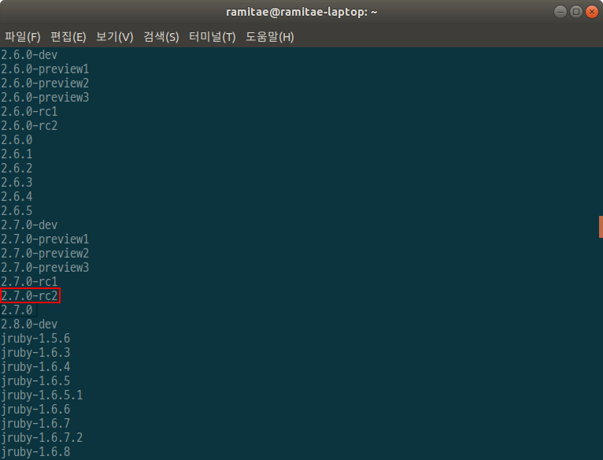
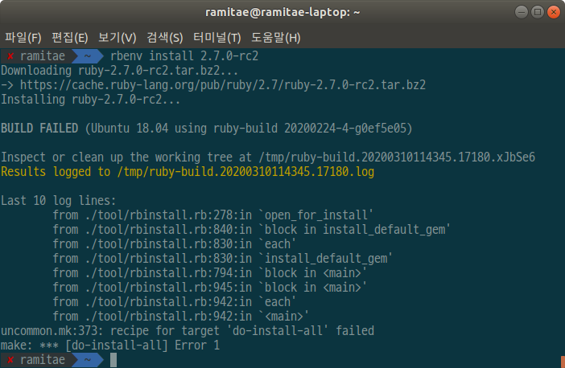
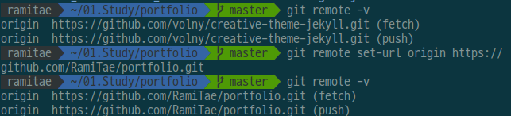
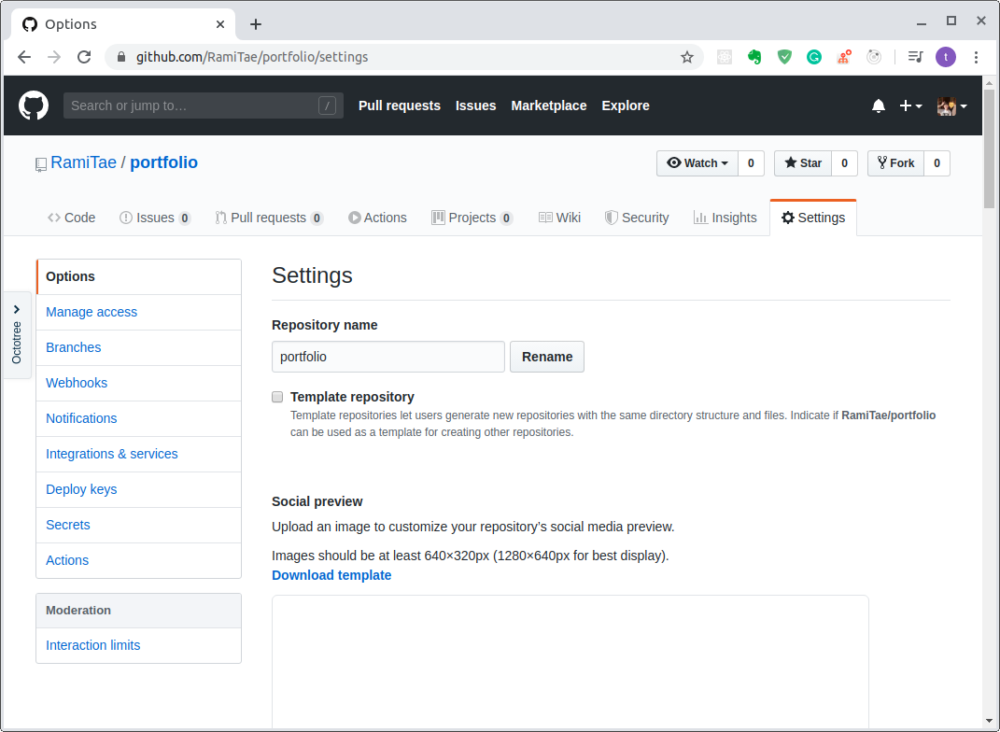
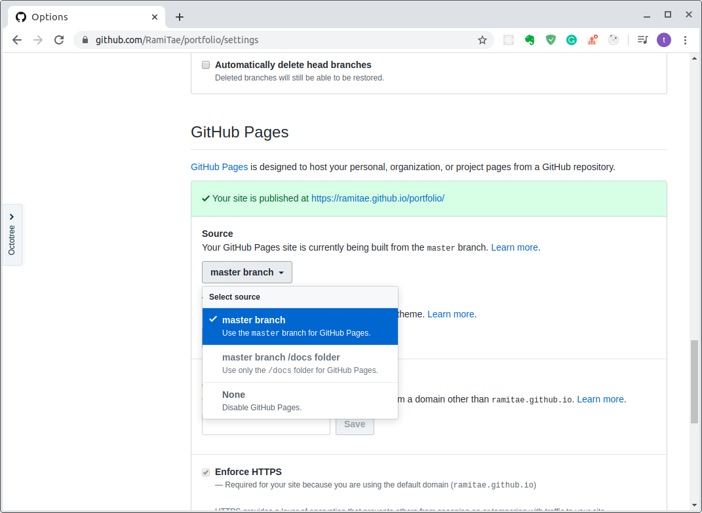

Jekyll을 사용해서 포트폴리오를 만들어보고자 한다.

> 아래 블로그 포스팅을 정말 많이 참고해서 만들었다b
>
> [jekyll 블로그 시작하기](https://nachwon.github.io/jekyllblog/)


# 1. Ruby 설치

## 우선 로컬 패키지 목록을 업데이트한다.

```
sudo apt-get update
```


## Ruby 설치

> [루비 공식 홈페이지](https://www.ruby-lang.org/ko/documentation/installation/)

```
sudo apt-get install ruby-full
```


## Ruby 버전관리 프로그램 rbenv 설치

```
git clone https://github.com/rbenv/rbenv.git ~/.rbenv
```


**rbenv 실행 환경변수 설정**

```
echo 'export PATH="$HOME/.rbenv/bin:$PATH"' >> ~/.bashrc
echo 'eval "$(rbenv init -)"' >> ~/.bashrc 
```


*`zsh` 를 사용하는 경우*

```
echo 'export PATH="$HOME/.rbenv/bin:$PATH"' >> ~/.zshrc
echo 'eval "$(rbenv init -)"' >> ~/.zshrc
```


환경번수 설정 후에는 터미널을 재시작하거나 아래 명령어를 입력해서 추가된 환경변수를 적용시켜야 한다.

```
source ~/.bashrc
```


*`zsh` 를 사용하는 경우*

```
source ~/.zshrc
```


환경변수 설정이 끝났을 경우 rbenv가 잘 설치되었는지 확인한다.

```
rbenv
```




방금 설치한 rbenv에는 install commends가 없기 때문에 rbenv-installer를 따로 설치해줘야 한다.

> https://github.com/rbenv/rbenv-installer#rbenv-installer

```
# with curl
curl -fsSL https://github.com/rbenv/rbenv-installer/raw/master/bin/rbenv-installer | bash

# alternatively, with wget
wget -q https://github.com/rbenv/rbenv-installer/raw/master/bin/rbenv-installer -O- | bash
```


설치 완료 후 터미널에 rbenv 입력 시 install commends를 볼 수 있다.


## ruby-build 플러그인 설치

설치된 Ruby 버전 확인

```
ruby -v
```




설치 가능한 Ruby 버전 확인

```
rbenv install -l
```




검색 시 나온 가장 최근 버전 Ruby 다운

```
rbenv install 2.7.0-rc2
```

하려고 했으나 자꾸 설치에 실패해서 그냥 2.5.1 버전을 쓰기로 했다.



설치 실패 이유는 다음에 알아봐야지...


# 2. Jekyll 에 필요한 Gem 설치

## bundler 설치

`gem`은 Ruby의 패키지를 뜻한다. gem은 기본적으로 `RubyGems` 에 의해 관리되지만 패키지 의존성 문제 때문에 `bundler` 라는 패키지 관리 프로그램을 사용한다.

아래 명령어로 `bundler` 를 설치한다.

```
sudo gem install bundler
```


## github-pages 설치

Jekyll 블로그는 `Github-Page` 라는 정적 웹 사이트 렌더링 서비스를 사용한다.
`github-pages` 는 Jekyll 블로그가 Github 상에서 잘 렌더링 되는데 필요한 의존성 패키지들이다.

```
sudo gem install github-pages
```


## jekyll 설치

```
sudo gem install jekyll
```


# 3. 로컬에서 Jekyll 테마 적용하기

> https://junhobaik.github.io/jekyll-apply-theme/
>
> fork하지 않고 테마를 적용하고 싶어서 위 포스트를 참조했다.

> 사용한 테마는 => https://github.com/volny/creative-theme-jekyll


## 테마 clone하기

```
git clone https://github.com/volny/creative-theme-jekyll.git
```


### 원하는 이름으로 디렉토리명 변경(안 해도 됨)

```
mv creative-theme-jekyll portfolio
```


## remote 변경

```
git remote set-url origin [내 레포지토리 주소]
```



변경 된 remote주소를 확인할 수 있다.


## 내 레포에 push

```
git push
```


# 4. 테스트

테스트도 쉽다. 지킬 최고

터미널에 아래 명령어만 치면 http://127.0.0.1:4000/ 에서 수정사항을 확인할 수 있다.

```
jekyll serve
```

뒤에 붙일 유용한 명령어들

- `--draft` 초안을 같이 표시
- `--livereload` 수정마다 새로고침*(매우 유용)*

 `_config.yml` 파일을 수정하는 것은 반영되지 않기 때문에 그럴 경우 다시 `jekyll serve` 를 실행해야 한다.


# 5. 깃헙 페이지 활성화

jekyll은 깃헙페이지로 배포할 수 있기 때문에 따로 도메인이 없어도 내 블로그나 포트폴리오를 만들 수 있다!


포트폴리오로 사용할 레포지토리로 가서 깃헙 페이지를 활성화해줘야 한다.

내 레포로 가서 `Settings` 클릭




스크롤을 내리다 보면 `GitHub Pages`를 볼 수 있는데 거기서 Source부분의 설정을 바꿔주면 깃헙페이지 주소가 생성된다.




이제 포트폴리오의 내용만 채우면 끝~


아직까지 프로젝트 부분을 어떻게 해야할지 고민중이라 미완성이지만 만들었으니 일단 배포!ㅎㅎ

[내 포트폴리오 배포 링크](https://ramitae.github.io/portfolio/)

수요일 중으로 완성할 예정이다.