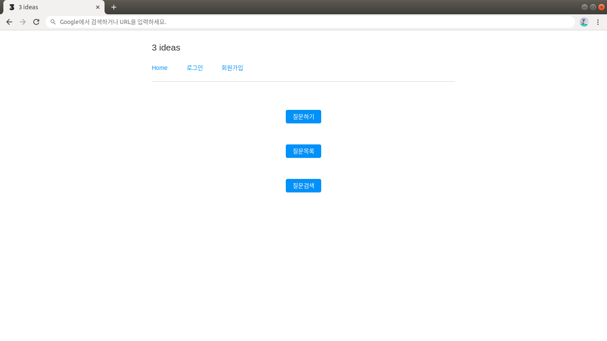

코드스테이츠 Immersive Course 에서 처음 진행했던 프로젝트인 3ideas에 대한 회고록을 작성하려고 한다.

벌써 2달 전인 2020년 1월에 진행했던 프로젝트지만 더 늦기 전에 회고를 쓰기로 마음먹었다. 다행히도 아직까지 기억하고 있다 :)

역시 프로젝트 소개부터.

---

# 3ideas?

3ideas는 질문을 올리고 답변을 받을 수 있는 간단한 소셜 Q&A서비스이다.

기존의 Q&A서비스는 주로

1. 질문자가 하나의 질문에 하나의 답변을 선택하는 방식
2. 달린 답변에 사람들이 추천한 순서대로 정렬

주로 위 두 가지의 방식을 사용해왔다.

하지만 우리 3ideas에서는

* 질문자의 마음에 드는 top3의 답변을 선택하게 함으로써 질문자의 선택의 폭을 넓혔다.
* 추천순으로도 정렬할 수 있게 하여 작성자가 선택한 답변과 추천을 많이 받은 답변의 차이를 비교할 수 있게 했다.

프로젝트 상세 설명 [문서](https://www.notion.so/Project-3-ideas-df56c48e56604be7a1973a6ce49a5af2)

---

# 기능 설명 및 기능 구현하면서 느낀 점

### 메인 페이지

### 로그인과 회원가입 실패 시 실패 이유에 따라 다른 메세지가 나타남

클라이언트가 보낼 수 있는 여러 입력값을 시뮬레이션하여 그에 해당하는 응답을 전송하도록 서버 API를 작성했다.

프론트엔드를 맡은 팀원이 그 덕에 실패 메세지를 띄우는 기능을 비교적 간단하게 구현할 수 있었다고 해줘서 뿌듯했다.

### 카테고리를 선택하여 질문글 작성가능

한 번에 여러 카테고리를 고를 수도 있다.

한 개의 글이 여러 카테고리를 가질 수 있고, 마찬가지로 하나의 카테고리도 여러 글을 가지고 있을 수 있다.

그렇기 때문에 질문글과 카테고리는 n:m관계이다.

질문글의 카테고리 row생성은 post요청과 동시에 이루어져야 한다.

Sequelize(ORM)에서 row생성은 비동기적으로 이루어지며 Promise형식을 return한다. 여러 비동기 실행을 한 번의 API요청에서 처리해야했기에 Promise.all에 익숙해질 수 있었다.

### 질문에 대한 아이디어를 답글로 작성

### 질문 작성자가 마음에 드는 세 개의 답글 선택

DB스키마를 어떻게 짜야할까 하고 좀 고민했던 기능이다.

일단 질문글 테이블에 questionFlag 컬럼으로 질문글의 상태를 저장한다(답변을 선택했는지 여부를 저장).

그리고 답변 테이블에 answerFlag 컬럼을 만들고 해당 답변이 몇 위인지의 상태를 저장한다.

어떤 질문에 대한 답변이 선택됐을 경우, 클라이언트에서 첫번째, 두번째, 세번째로 선택한 답변들의 id를 request에 담아 `/ask/selection/질문글id`에 대한 `PATCH`요청을 보낸다.

그러면 그 요청에 맞게 답변글들의 순위를 각각의 answerFlag 컬럼에 저장하고, 해당 질문글의 questionFlag상태를 false로 바꿔주는 방식으로 구현했다.

### 답변 정렬 기능

* 답글이 선택된 글에 들어가면, 선택된 답글만 보여짐. '모든 답글 보기' 버튼을 누를 경우 선택되지 않은 답글을 포함하여 '좋아요'가 많은 순서대로 답글이 보여짐

답변정렬기능의 경우 서버에서 어떤 처리를 하는 것은 아니고 클라이언트에서 처리한다.

답변선택을 완료한 질문글의 경우에는 질문자가 선택한 답글만 보내주도록 해도 괜찮았을텐데 하는 생각이 든다.

### 검색 기능

* 원하는 키워드를 검색창에 입력하면 키워드를 포함한 질문글 제목, 질문글 내용과 답글 내용이 검색됨. 검색 결과에는 마킹된 키워드와 키워드가 포함된 문장 일부가 표시됨.

검색 기능을 구현했을 때가 3idea진행 중 가장 뿌듯했던 순간이었다.

Sequelize의 기본만 알고 있는 상태에서 Sequelize.Op의 or, like를 사용하는 방법을 알아내서 적용해보고. 정말 재미있었다.

이 기능을 구현하면서 작성했던 [Devlog](https://ram-t.tistory.com/67).

지금 보니 미흡한 부분이 눈에 많이 띄지만 그만큼 내가 발전한 것이라고 생각해야지 ㅎㅎ

---

# 느낀점

1. 기획의 중요성을 뼈저리게 느꼈다. 주어진 시간이 짧다 보니 서비스 아이디어가 명확하지 않은 상태에서 성급하게 프로젝트를 진행해서 할 일을 정하는 것에 어려움을 겪었다. 그래서 4주 프로젝트때에는 기획을 탄탄하게 가져가자고 마음먹고 열심히 기획을 했더니 시간이 부족하더라.. 시간조절 정말 어렵지만 계속 노력하다 보면 익숙해지리라 믿는다!
2. 로그인 JWT 인증을 구현하며 express의 미들웨어를 처음 사용해봤다. 미들웨어가 뭔지 알고 있었는데 직접 사용해본 적은 처음이라서 참 신기하고 편했다. 뭐든지 알고 있는 것과 실제로 사용해보는 것에는 차이가 있다는 것을 깨달았다.
3. AWS를 사용해서 프로젝트를 배포했다. AWS S3 버킷의 정적 웹 사이트 호스팅 기능을 활용하여 클라이언트를 배포하고, EC2 인스턴스를 생성을 통해 서버를 배포. RDS로 MySQL 데이터베이스 생성후 EC2와 연결하는 방식으로 배포했다. AWS배포에 대한 건 스프린트 때 배웠으나 직접 0부터 100까지 만든 프로젝트를 배포하는 것과는 느낌이 많이 달랐다. 좋은 경험이었다.
4. 배포를 하며 아쉬웠던 점은, 다른 기능들은 다 잘 됐으나 쿠키 도메인 관련 설정을 잘못했는지 브라우저에 쿠키가 저장되지 않는 문제가 생겼다. 해결방법을 열심히 찾고 있다.

---

역시 프로그래밍을 빨리 배우는데 에는 프로젝트 만한 게 없다는 것을 느꼈다.

2주 라는 시간 내에 이만큼 성장할 수 있었던건 프로젝트를 하나 진행했기 때문이라고 생각한다.

요새 만년필에 빠져있기 때문에 그와 관련된 개인프로젝트를 하나 진행해볼까 싶다 :)